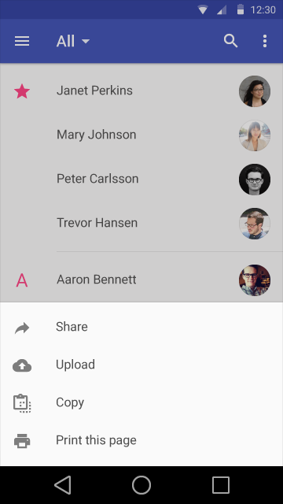
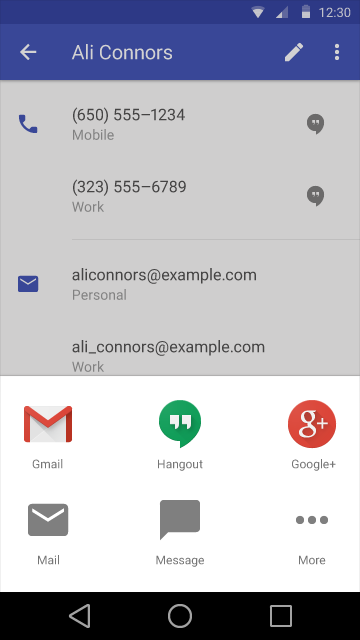

#Bottom Sheets

One way to present a set of actions to a user is with bottom sheets, a sheet of paper that slides up from the bottom edge of the screen. Bottom sheets offer flexibility in the display of clear and simple actions that do not need explanation.

---

## Usage

Bottom sheets are especially suitable when three or more actions are displayed to the user and when the actions do not require descriptive explanation. If there are two or fewer actions or detailed description is required, consider using a menu or dialog instead.

Bottom sheets can be list-style or grid-style. Grid layouts increase visual disambiguation.

You can use bottom sheets to show actions related to other apps or to allow entry points to other apps (via the app icon).

---

## Content

In a standard list-style bottom sheet, each action should have a text description and a left-aligned icon. When necessary, you can use separators to logically group actions. You can also use subheaders or titles to give context to the choices.

A scrollable grid-style bottom sheet can be used for a bottom sheet that contains icons for standard share actions.

---

## Behavior

When displaying a bottom sheet, it should animate upwards from the bottom edge of the screen. The previous content dims to give the user context of where they were previously and the modal nature of the choice. Tapping on the dimmed area dismisses the sheet, as does swiping down on the sheet. If the sheet contains more actions that can fit in the initial display, the sheet is scrollable. Scrolling should also pull up the sheet container and eventually cover the entire screen. When the action sheet covers the entire screen, add a dismiss button to the header, on the left hand side of the title.

---

## Specs

The following font and color specs and redlines are provided for mobile apps.

Redline for list-style sheet with header

Redline for grid-style bottom sheet that contains a standard set of actions for other apps

