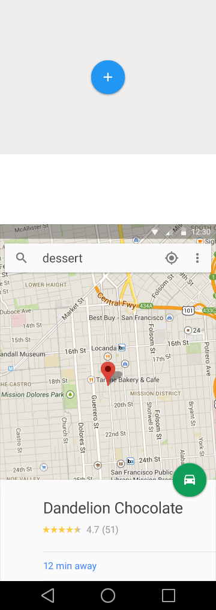
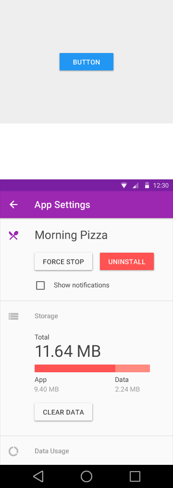
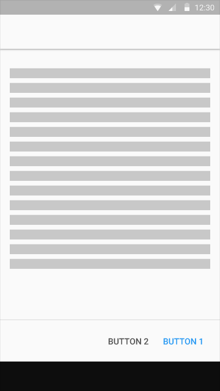
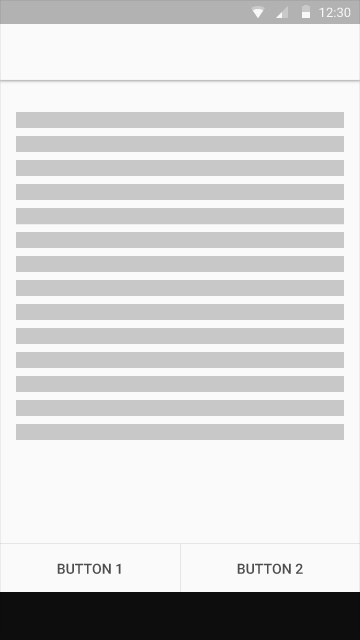
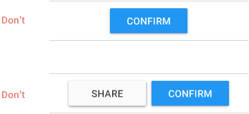
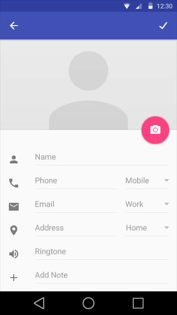
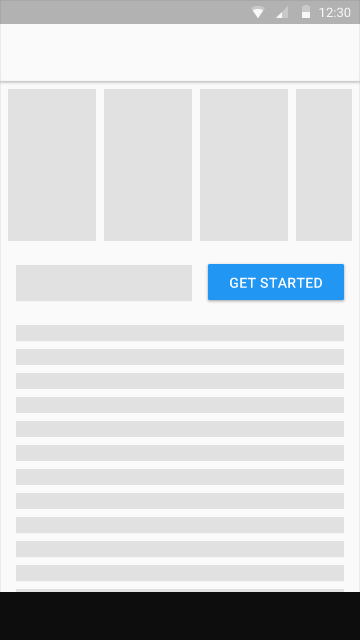
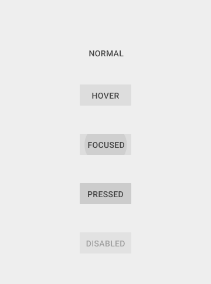
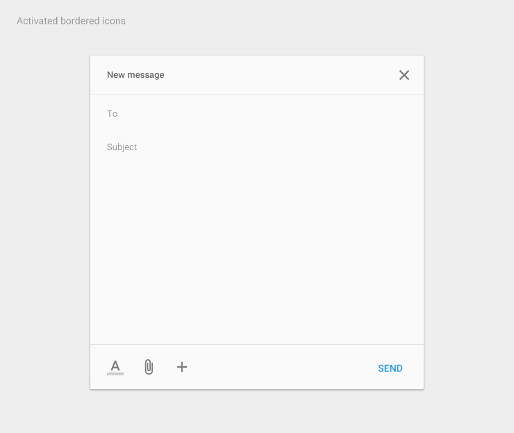

#Buttons

A button consists of text and/or an image that clearly communicates what action will occur when the user touches it.

Three types of main buttons are provided:

- Floating action button, a circular button made of paper that lifts and emits ink reactions on press.
- Raised button, a typically rectangular button made of paper that lifts and emits ink reactions on press.
- Flat button, a button made of ink that emits ink reactions on press but does not lift.

In addition, fully saturated icons in your design are generally always affordances—avoid using them as purely decorative objects.

Buttons should be designed in accordance with your app’s color theme.

> Usage

Floating action button

Raised button

Flat button

#### Main buttons

Choosing button type  for your main buttons depends on the primacy of the button, the number of containers on screen, and the overall layout of the screen.

First, look at the button function: is it important and ubiquitous enough to be a floating action button?

Next, choose raised or flat dimensionality depending on the container it will be in and how many z-space layers you have on screen. There should not be layers upon layers upon layers of objects on screen.

Finally, look at your specific layout. You should use one type of button primarily per container. Only mix button types when you have good reason to, such as emphasizing a raised function.

#### Buttons in dialogs

Use primarily ink buttons on dialogs to prevent too many layers of dimension.

#### Buttons inline

Choose raised or flat depending on your specific layout. Make sure to allow enough padding around flat unfilled buttons so the user can easily find them.

#### Persistent footer buttons

If your app requires actions to be persistent and readily available to the user, first consider using the floating action button. If it is an action that is not promoted but still needs to be easy to access, use persistent footer buttons.

Never use raised buttons within persistent button areas

With the addition of a divider, a persistent footer button can also be used for scrollable dialogs.

## Main buttons

### Floating action buttons

Floating action buttons are a special type of promoted action. They are distinguished by a circle icon floating above the UI and have special motion behaviors, related to morphing, launching, and its transferring anchor point.

For further information on using floating action buttons, see (TBD)

There are two sizes of floating action buttons: the default size and the mini size. The mini size should only be used to create visual continuity with other elements on the screen.

### Raised buttons

Raised buttons emphasize functions that would otherwise get lost on a busy or wide space. They add dimension to mostly flat layouts.

Do。
Correct use of raised buttons.

Don't.
Buttons are hard to see.

### Flat buttons

Use flat buttons for contexts such as toolbars, dialogs, and popovers to avoid gratuitous layering of paper.

Do.
Correct use of flat buttons.

Don't.
Raised buttons are too heavy.

### Flat and raised button states

Button states for mocks

Raised buttons behave like a piece of paper resting on another sheet—they lift and color upon press.

Flat buttons remain flush to the sheet and fill with color upon press.

Ink travels between buttons as they come into focus. Focus state animations emanate between the normal and pressed state.

When representing button states in mocks, you can use graphic rings to represent the animation. Note that focused states will always be in animation. (These images do not represent what the focused state should look like in implementation.)

Flat Light/Light color

Minimum width: 88 DP, Height: 36 DP

Hover: 20% #999, Pressed: 40% #999, Disabled: 10% #999

Flat Dark/Dark Color

Minimum width: 88 DP, Height: 36 DP

Hover: 15% #ccc, Pressed: 25% #ccc, Disabled: 10% #ccc

Raised Light/Light Color

Minimum width: 88 DP, Height: 36 DP

Raised Dark/Dark Color

Minimum width: 88 DP, Height: 36 DP

Normal: Color 500, Hover: Color 600, Pressed: Color 700,
Disabled: 10% #ccc

### Buttons in motion

<embed src="images/components/components-buttons-mainbuttons-buttons-motion1_large_xhdpi.webm" type="application/x-shockwave-flash" width="257" height="33" wmode="transparent"></embed>

Flat buttons

<video controls="" autoplay="" name="media"><source src="images/components/components-buttons-mainbuttons-buttons-motionraised_large_xhdpi.webm"> </video>

Raised buttons

## Other buttons

### Icon toggles

Icons are appropriate for app bars and toolbars and can be used as action buttons or as toggles.

Icon toggles can display bounded or unbounded ink press ripples beyond their touch target bounds. For more information, see [Surface Reactions.]() (TBD)

### Mobile dropdown buttons

#### Pulldown button

A pulldown button is a button that controls the state of a value; there may be two to many states. The button displays the current state and a down arrow icon—when interacted with, a menu flies out adjacent to and typically below the button with all of the state options. States may be represented within the pulldown menu as a list of strings, a palette, icons, or many other display options. Pressing one state changes the displayed state of the button. The pulldown shown here is the generic pulldown button with a list menu. Scrolling should behave like menus.

#### Generic overflow pulldown button

A type of pulldown button that does not have a displayed state but has an arrow or a generic menu button. When pressed, the menu flies out. Pressing an option on the menu generally navigates to further settings for that option.

#### Segmented pulldown button

A segmented pulldown has two sections: the current state and the dropdown arrow icon. Pressing the current state will cause that state’s action to fire within the screen. Pressing the dropdown arrow will display all the state options; selecting one will change the displayed state.

#### Editable segmented pulldown button

A segmented pulldown where the displayed state is text editable, such as a font size picker. Pressing the current state both causes that state’s action to fire and makes the displayed state editable. Pressing the arrow displays all the state options.

<video width="320" controls name="media"> <source src="images/components/components-menus-menus-textfield_dropdown_spec_large_xhdpi.webm" > </video>

#### Desktop dropdowns

Desktop app bar specs

---

> *翻譯：Weiju*