# 按鈕

按鈕是由文字 及/或 圖片所組成，而它能清楚地傳達出一種觸碰時會發生的動作。

在這裡提供三種主要的按鈕：

- 浮動式的按鈕：一種圓形按鈕，按下去時有具有墨水散開的反應以及升降的效果
- 凸起式的按鈕：一種典型的按鈕，按下去時具有墨水散開的反應以及升降的效果
- 扁平式的按鈕：一種一般的按鈕，按下去時具有墨水散開的反應，但是沒有升降的效果

此外，在您的設計中，完全飽和圖示是一般性的預設用途，避免讓它們變成一種單純的裝飾物件

按鈕的設計應該根據應用程式的佈景顏色

> 用法

> 浮動式的按鈕

> 凸起的按鈕

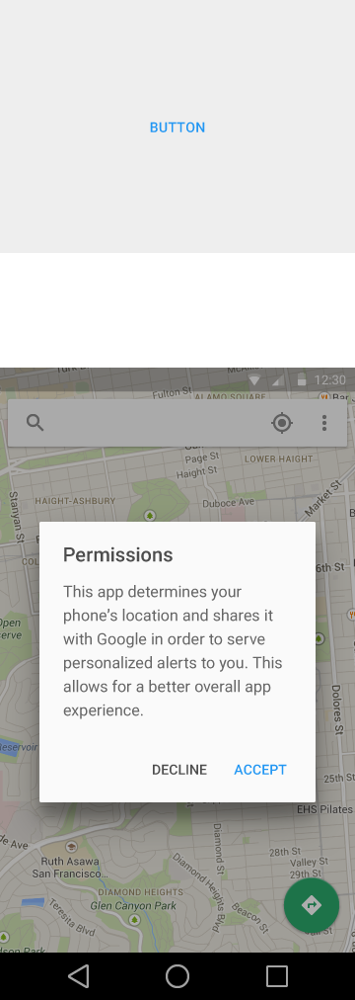

> 扁平式的按鈕

### 主要按鈕

按鈕類型是您在選擇按鈕時應將此考慮放在第一位，並且考量螢幕上的容器數量以及螢幕的整體佈局。

首先，看一下按鈕的功能：是否常態性出現以及重要的一種浮動動作按鈕？

接著．選擇凸起或扁平的按鈕，在將是根據這個螢幕上的容器裡面需要有多少的`z-space` 層。他們不應該在螢幕上層層疊起。

最後，看一下您的具體局。您應該在每一個容器使用主要的一種類型的按鈕，若您有更好的理由去使用混合型的按鈕，比如強調一個功能。

### 對話框的按鈕

在對話框上使用主要的油墨式的按鈕以防止太多層次。

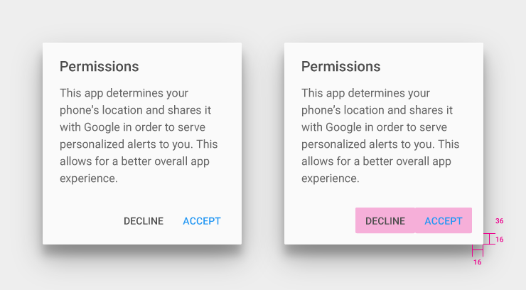

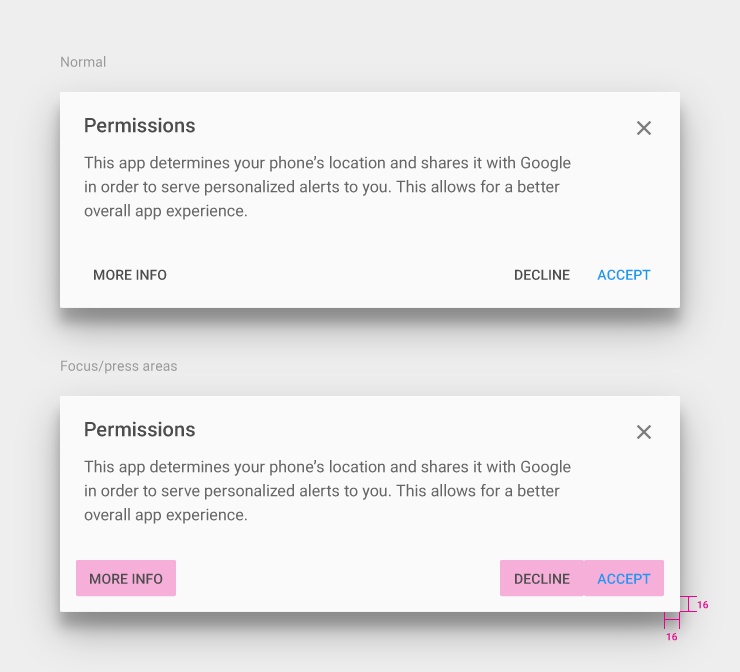

#### 內嵌式按鈕

選擇凸起或扁平的按鈕是根據您特定的佈局上。請務必保留足夠的位置擺放未放置的按鈕讓使用者能夠方便找到它們。

#### 永久性的頁尾按鈕

如果您的應用程式需要永久性且容易地使用者操作，首先要考慮的事使用浮動式的按鈕。如果這個動作並不會改變，但又仍然需要容易的操作，那麼請使用永久幸得頁尾按鈕。

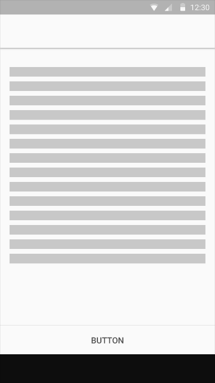

請不要在永久性按鈕的區域使用凸出的按鈕

另外一種分隔器的動作，永久性的頁尾按鈕也可以用在可滾動的對話框

## 主要按鈕

### 浮動的動作按鈕

浮動的操作按鈕是一種特殊的進階的技巧。它們是由一個圓圈圖示漂浮在 UI 上，並且與特殊的意向行為作為區隔，這涉及到變形，發射，以及傳遞錨點”。

如需要使用更多浮動的動作按鈕，請參考 (TBD)

這裡有兩種浮動動作按鈕尺寸：預設大小以及最小的尺寸。最小的尺寸應該只能用在建立與螢幕上其他元素的持續性的視覺。

### 凸起式按鈕

凸起按鈕是另一種在寬廣的空間或擁擠的地方丟失的強調性功能，他們多半在扁平的佈局建立。

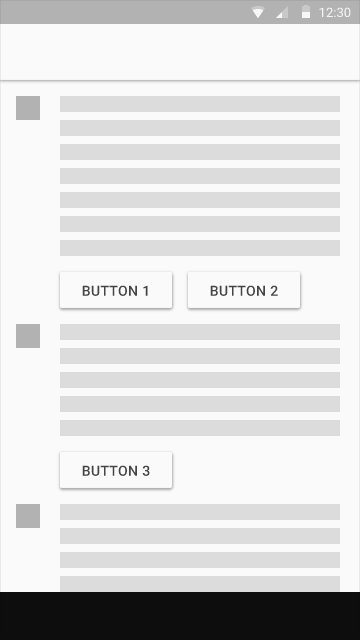

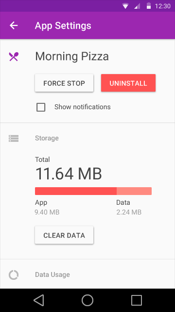

> 好的。
>
> 正確的使用凸起式按鈕

> 不好的。
>
> 按鈕很難被看見。

### 扁平式按鈕

使用扁平式按鈕是避免太多分層，就像是工具列，對話框和彈出區塊。

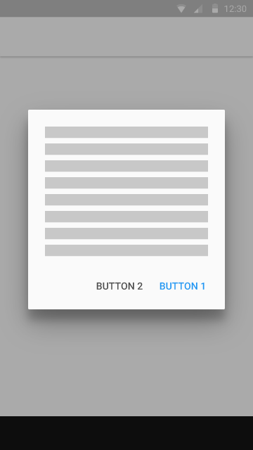

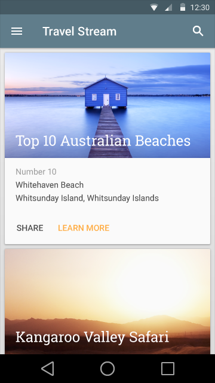

> 好的。
> 
> 正確的使用扁平式按鈕

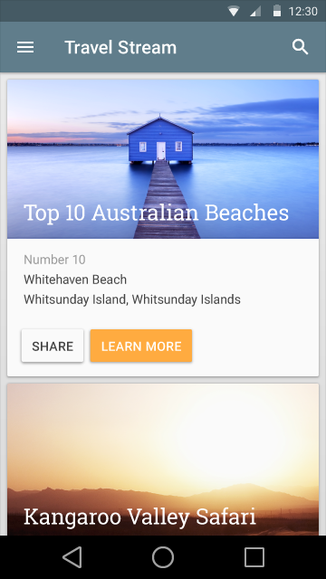

> 不好的。
>
> 凸起式按鈕太笨重了。

### 扁平及凸起按鈕的狀態

模擬按鈕狀態

凸起的按鈕就像一張紙放在另一張紙上面。他們在上方按下時的浮起及顏色。

扁平的按鈕保留著扁平面以及在上面按下時的飽和顏色。

按鈕當呈現墨水散開的樣式表示著目前正為聚焦的目標。
聚焦的狀態動畫是在正常狀態下與按下時之間的效果。

在模擬的方式解釋按鈕狀態，您可以使用圖形環來表示動畫。需要注意的是聚焦的狀態種是在操作按鈕的動畫中呈現。 （這些圖像並不代表聚焦狀態就應該呈現實作的樣子）

Flat Light / Light color

最小寬度：88 DP, 高度：36 DP

Hover: 20% #999, Pressed: 40% #999, Disabled: 10% #999

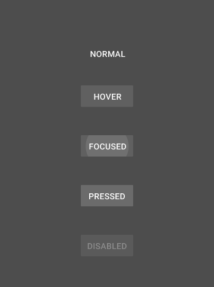

Flat Dark/Dark Color

最小寬度：88 DP, 高度：36 DP

Hover: 15% #ccc, Pressed: 25% #ccc, Disabled: 10% #ccc

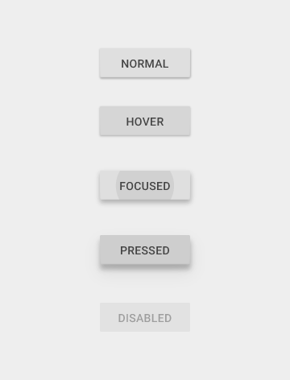

Raised Light/Light Color

最小寬度：88 DP, 高度：36 DP

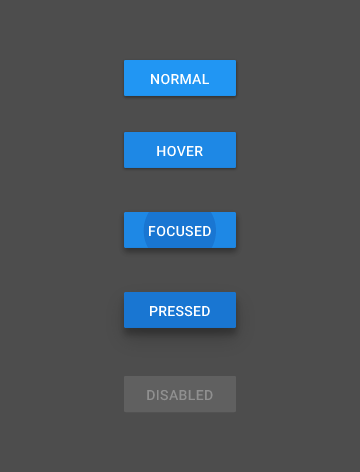

Raised Dark/Dark Color

最小寬度：88 DP, 高度：36 DP

Normal: Color 500, Hover: Color 600, Pressed: Color 700,
Disabled: 10% #ccc

### 按鈕效果

<embed src="images/components/components-buttons-mainbuttons-buttons-motion1_large_xhdpi.webm" type="application/x-shockwave-flash" width="257" height="33" wmode="transparent"></embed>

扁平式按鈕

<video controls="" autoplay="" name="media"><source src="images/components/components-buttons-mainbuttons-buttons-motionraised_large_xhdpi.webm"> </video>

凸起式按鈕

## 其他按鈕

### 圖示切換

圖示是用在應用程式列及工具列上，可以用來作為操作按鈕或切換按鈕。

圖示切換可以在觸碰到目標範圍時顯示有邊界或無邊界的區域。若想瞭解更多訊息，請參考 [Surface Reactions.]() (TBD)

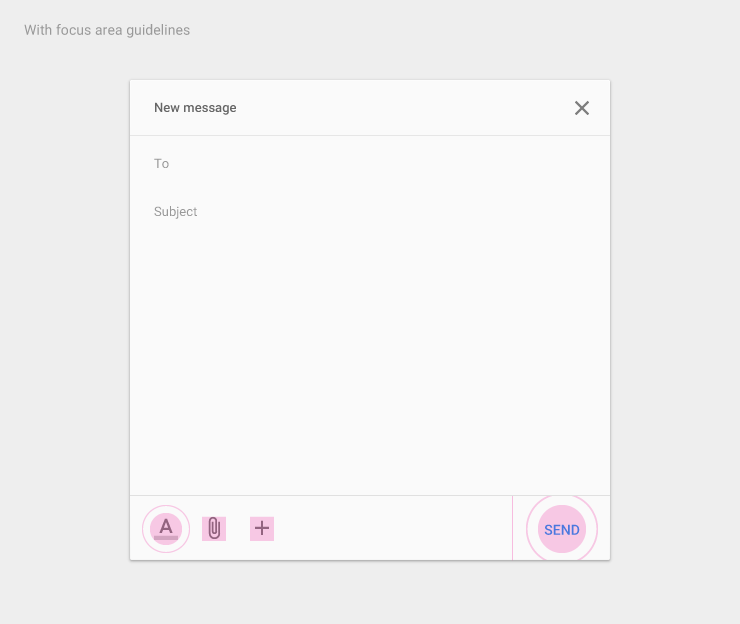

### 行動式的下拉選單

### 下拉式按鈕

下拉式按鈕是一個控制某一個控制項值的狀態;可能有兩個或多個狀態。該按鈕顯示目前的狀態以及向下箭頭的圖示，互動時會有個菜單緊鄰控制項飛出，並且通常呈現所有選項。狀態可能在下拉的菜單裡表示一個列表的字串，調色板，圖示，或是顯示其他的選項。

按下一個選項改變目前顯示的狀態。下拉的顯示呈現通常是列表清單。滾動的方式也應該像是菜單的樣子。

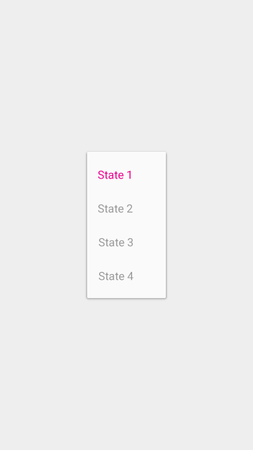

### 一般溢出的下拉選單

一個下拉選單通常在沒有顯示狀態但顯示一個箭頭或通用的菜單按鈕。當按鈕被按下時，該菜單將會飛出。按下選單時一般在菜單上會導覽更多設定的選項。

### 分段的下拉選單

分段的下拉選單有兩個部分：目前狀態及下拉箭頭圖示。按下目前狀態會在螢幕上出現變更狀態的動作。在按下下拉箭頭的圖式時，將顯示所有狀態的選項，並且可以選擇一個將要改變選項的狀態

### 可編輯的分段下拉選單

在分段的下拉選單顯示為可編輯的內文，就像是字體大小的選擇器。按下目前的狀態可以使狀態改變以及顯示目前編輯的狀態。按下按鈕顯示所有狀態的選項。

<video width="320" controls name="media"> <source src="images/components/components-menus-menus-textfield_dropdown_spec_large_xhdpi.webm" > </video>

### 桌面樣式的下拉選單

桌面應用程式列的規格

---

> *翻譯：[Weiju Tu](https://www.facebook.com/weiju516)*
