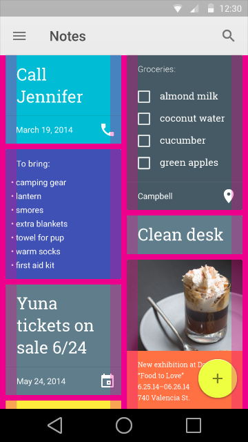
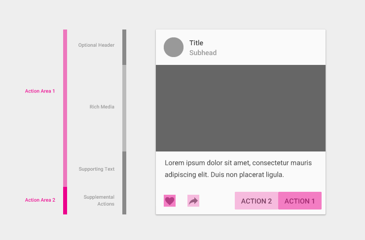
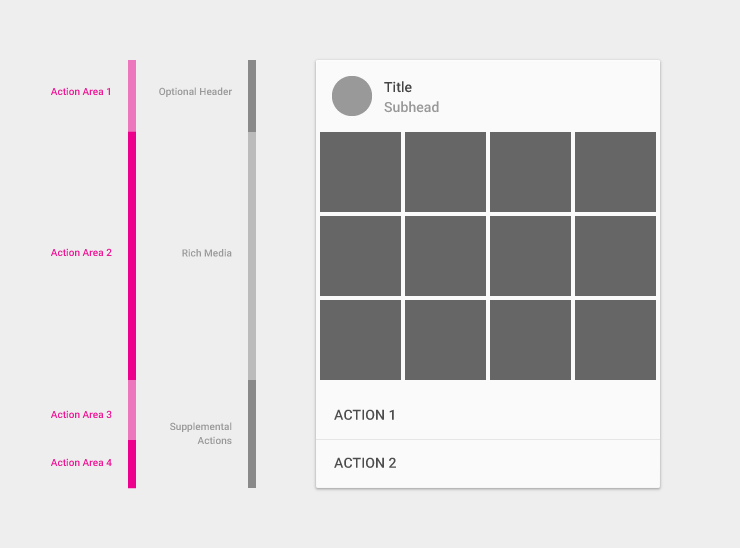

#卡片

卡片就像一張紙一樣，它包含了相關的資料以及由不同的資訊所組成的。舉例來說，一張照片，文字，以及並且連接著單一的主題。卡片通常是前往更複雜以及詳細資料的一個進入點。卡片有一個特定的寬度以及可變的高度。最大的限制高度是取決於平台上最適當的視圖，不過如果有必要也可以暫時性擴展（比如顯示一個註解的段落欄位）卡片不做翻轉去顯示背後的訊息。

內容
> 
> 用法
> 
> 內容
> 
> 動作
> 
> 行為

## 用法

卡片是一種很方便顯示不同類型所組成的內容。他們也非常適合呈現相似的大小或是支援操作的物件，像是具有可變長度的照片。

**備註**: 雖然在外觀上相似，而現在的卡片都要求不同子卡片俱有獨特的行為和格式。

卡片集是卡片佈局裡同一面的。

這些卡片都包含這一個獨特的資料集：含有操作的核選清單，含有操作的記錄說明，帶有照片的說明。

當顯示內容時使用卡片佈局：

- 作為一個集合，是由多種不同資料所組成的類型（例如：卡片系列包括照片，影片，文字，圖像）
- 不需要直接的對比 （使用者不需要比較圖片或文本字串）
- 包含高度可變長度的內容（比如：意見內容）
- Would otherwise be in a list but needs to display more than three lines of text
- Would otherwise be in a grid list but needs to display more text to supplement the image

好的做法.

1. 卡片有圓角的邊.

2. 卡片可以有許多操作.

3. 卡片可以被關閉以及重新排列.

不好的做法.

這是磚塊，不是卡片.

1. 磚塊有正方形的四角.

2. 磚塊無法有超過兩個以上的操作.

好的做法.

A quickly scannable list, instead of cards, is an appropriate way to represent homogeneous content that doesn't have many actions.

不好的做法.

The use of cards here distracts the user from being able to quickly scan. These list items are also not dismissable, so having them on separate cards is confusing.

好的做法.

Grid tiles are a clean and lightweight way to present a gallery of images.

不好的做法.

Cards are unnecessary in a gallery of images (homogeneous content).

### Card layout guidelines

#### Typography

Body type: 14 sp or 16 sp

Headlines: 24 sp or larger

Flat Buttons: Roboto Medium, 14 sp, 10 sp tracking

#### Card gutters on mobile

Padding from edge of screen to card: 8 dp

Gutters between cards: 8 dp

#### Content padding

16 dp

## 內容

Card content type and quantity can vary greatly depending on the content being expressed. Cards provide context and an entry point to more robust information and views; make sure not to overload cards with extraneous information or actions.

Place primary content at the top of the card. Use hierarchy to direct users’ attention to the most important information in the card.

## 動作

The primary action in a card is typically the card itself.

Supplemental actions can vary from card to card in a collection depending on the content type and expected outcome, for example, playing a movie versus opening a book. Within cards in a collection, position actions consistently.

### Supplemental actions

Supplemental actions within the card are explicitly called out using icons, text, and UI controls, typically placed at the bottom of the card.

UI controls placed inline with primary content can modify the view of primary content, for example, a slider to choose a day, stars to rate content, or a segmented button to select a date range.

Limit supplemental actions to two actions, in addition to an overflow menu.

### Overflow menu

An overflow menu (optional) typically is placed in the upper-right corner of cards, but it can be placed in the lower right if the placement improves content layout and legibility.

Take care not to overload an overflow menu with too many actions.

### Considerations

Inline links within text content are strongly discouraged.

Although cards can support multiple actions, UI controls, and an overflow menu, use restraint and remember that cards are entry points to more complex and detailed information.

## 行為

### Gestures

The swipe gesture on a per-card basis is supported. Card gesture behavior should be consistently implemented within a card collection.

The pick-up-and-move gesture is possible. However, consider whether it’s important for the user to be able to sort cards within the collection or if the content would be better experienced with programmatic filtering/sorting.

### Card collection filtering, sorting, and reorganization

Card collections can be programmatically sorted or filtered by date, file size, alphabetical order, or other parameters. The first item in the collection is positioned at the top left of the collection, and the order proceeds left to right and top to bottom.

### Scrolling

Card collections scroll vertically only. Card content that exceeds the maximum card height is truncated and does not scroll.

Cards with truncated content can be expanded, in which case the card height may exceed the maximum of the view. In this case, the card will scroll with the card collection.

### Card focus

For interfaces dependent upon sequential focus traversal for navigation (DPad, keyboard), individual cards should either have only a primary action or open a new view with the primary and supplemental actions available.