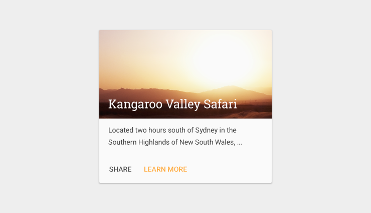
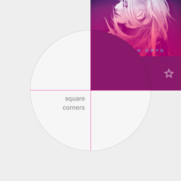
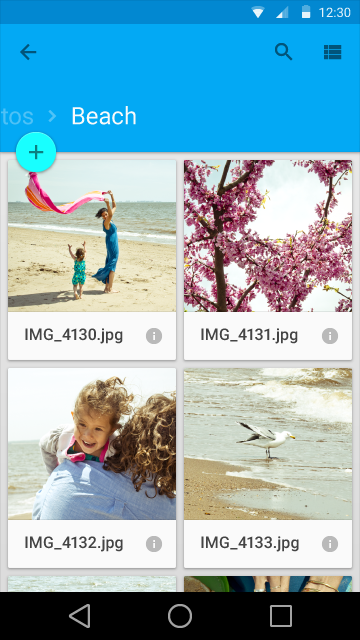
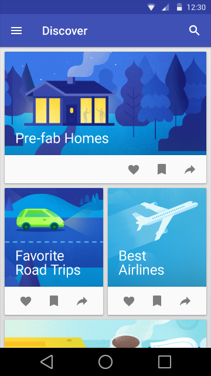
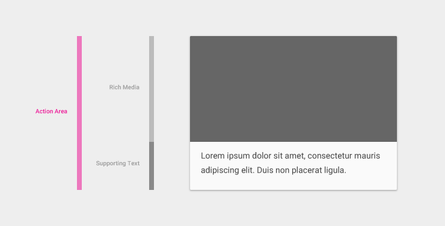

#卡片

A card is a piece of paper that contains a unique data set of related, heterogeneous information, for example, a photo, text, and link all about a single subject. Cards typically are an entry point to more complex and detailed information. Cards have a constant width and variable height. The maximum height is limited to what can fit within a single view on a platform, but it can temporarily expand as needed (for example, to display a comment field). Cards do not flip to reveal information on their back.

> 內容
> 用法
> 內容
> 動作
> 行為

## 用法

Cards are a convenient means of displaying content composed of different types of objects. They’re also well-suited for presenting similar objects whose size or supported actions can vary considerably, like photos with captions of variable length.

**Note**: Though similar in appearance, Now cards are a distinct subset of cards with unique behavior and formatting requirements.

A `card collection` is a coplanar layout of `cards`.

Each of these cards contains a unique data set: a checklist with an action, a note with an action, a note with a photo.

Use a card layout when displaying content that:

- As a collection, is comprised of multiple heterogeneous data types (for example, the card collection consists of photos, movies, text, images)
- Does not require direct comparison (a user is not directly comparing images or text strings)
- Includes supporting content of highly variable length, such as comments
- Consists of rich content or interaction, such as +1 buttons, sliders, or comments
- Would otherwise be in a list but needs to display more than three lines of text
- Would otherwise be in a grid list but needs to display more text to supplement the image

Do.

1. Cards have rounded corners.

2. Cards can have multiple actions.

3. Cards can be dismissable and rearranged.

Don't.

This is a tile, not a card.

1. Tiles have square corners.

2. Tiles have no more than two actions.

Do.

A quickly scannable list, instead of cards, is an appropriate way to represent homogeneous content that doesn't have many actions.

Don't.

The use of cards here distracts the user from being able to quickly scan. These list items are also not dismissable, so having them on separate cards is confusing.

Do.

Grid tiles are a clean and lightweight way to present a gallery of images.

Don't.

Cards are unnecessary in a gallery of images (homogeneous content).

### Card layout guidelines

#### Typography

Body type: 14 sp or 16 sp

Headlines: 24 sp or larger

Flat Buttons: Roboto Medium, 14 sp, 10 sp tracking

#### Card gutters on mobile

Padding from edge of screen to card: 8 dp

Gutters between cards: 8 dp

#### Content padding

16 dp

## Content

Card content type and quantity can vary greatly depending on the content being expressed. Cards provide context and an entry point to more robust information and views; make sure not to overload cards with extraneous information or actions.

Place primary content at the top of the card. Use hierarchy to direct users’ attention to the most important information in the card.

## Actions

The primary action in a card is typically the card itself.

Supplemental actions can vary from card to card in a collection depending on the content type and expected outcome, for example, playing a movie versus opening a book. Within cards in a collection, position actions consistently.

### Supplemental actions

Supplemental actions within the card are explicitly called out using icons, text, and UI controls, typically placed at the bottom of the card.

UI controls placed inline with primary content can modify the view of primary content, for example, a slider to choose a day, stars to rate content, or a segmented button to select a date range.

Limit supplemental actions to two actions, in addition to an overflow menu.

### Overflow menu

An overflow menu (optional) typically is placed in the upper-right corner of cards, but it can be placed in the lower right if the placement improves content layout and legibility.

Take care not to overload an overflow menu with too many actions.

### Considerations

Inline links within text content are strongly discouraged.

Although cards can support multiple actions, UI controls, and an overflow menu, use restraint and remember that cards are entry points to more complex and detailed information.

## Behavior

### Gestures

The swipe gesture on a per-card basis is supported. Card gesture behavior should be consistently implemented within a card collection.

The pick-up-and-move gesture is possible. However, consider whether it’s important for the user to be able to sort cards within the collection or if the content would be better experienced with programmatic filtering/sorting.

### Card collection filtering, sorting, and reorganization

Card collections can be programmatically sorted or filtered by date, file size, alphabetical order, or other parameters. The first item in the collection is positioned at the top left of the collection, and the order proceeds left to right and top to bottom.

### Scrolling

Card collections scroll vertically only. Card content that exceeds the maximum card height is truncated and does not scroll.

Cards with truncated content can be expanded, in which case the card height may exceed the maximum of the view. In this case, the card will scroll with the card collection.

### Card focus

For interfaces dependent upon sequential focus traversal for navigation (DPad, keyboard), individual cards should either have only a primary action or open a new view with the primary and supplemental actions available.