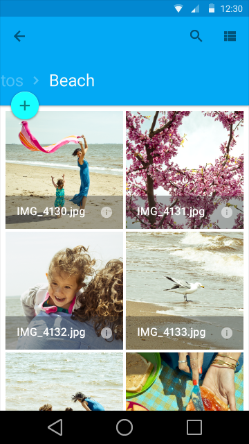
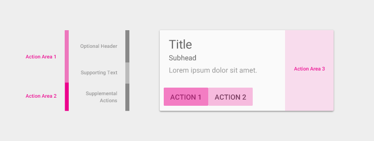

#卡片

卡片就像一張紙一樣，它包含了相關的資料以及由不同的資訊所組成的。舉例來說，一張照片，文字，以及並且連接著單一的主題。卡片通常是前往更複雜以及詳細資料的一個進入點。卡片有一個特定的寬度以及可變的高度。最大的限制高度是取決於平台上最適當的視圖，不過如果有必要也可以暫時性擴展（比如顯示一個註解的段落欄位）卡片不做翻轉去顯示背後的訊息。

內容
> 
> 用法
> 
> 內容
> 
> 動作
> 
> 行為

## 用法

卡片是一種很方便顯示不同類型所組成的內容。他們也非常適合呈現相似的大小或是支援操作的物件，像是具有可變長度的照片。

**備註**: 雖然在外觀上相似，而現在的卡片都要求不同子卡片俱有獨特的行為和格式。

卡片集是卡片佈局裡同一面的。

這些卡片都包含這一個獨特的資料集：含有操作的核選清單，含有操作的記錄說明，帶有照片的說明。

當顯示內容時使用卡片佈局：

- 作為一個集合，是由多種不同資料所組成的類型（例如：卡片系列包括照片，影片，文字，圖像）
- 不需要直接的對比 （使用者不需要比較圖片或文本字串）
- 包含高度可變長度的內容（比如：意見內容）
- 需要顯示超過三行的文字，否則不會在清單裡
- 需要顯示更多文字來描述圖片，否則不會在網格列表裡

好的做法.

1. 卡片有圓角的邊.

2. 卡片可以有許多操作.

3. 卡片可以被關閉以及重新排列.

不好的做法.

這是磚塊，不是卡片.

1. 磚塊有正方形的四角.

2. 磚塊無法有超過兩個以上的操作.

好的做法.

用卡片代替是相當適合在可快速閱覽的列表裡，因為他沒有太多的動作表達同值性的內容

不好的做法.

在這裡呈現各別快速閱覽且採用項目分隔的卡片．這些列表的項目裡面沒有可關閉的功能，所以在分散的卡片呈現裡是混雜的感覺。

好的做法.

網格磚塊是一種乾淨又輕量型的方式來呈現圖片集

不好的做法.

卡片式不需要做圖片集 （同質性的內容）

### Card layout guidelines

#### Typography

內文字: 14 sp or 16 sp

標題字: 24 sp or larger

扁平化按鈕: Roboto Medium, 14 sp, 10 sp tracking

#### Card gutters on mobile

卡片內距: 8 dp

卡片間距: 8 dp

#### Content padding

16 dp

## 內容

卡片的內容與數量取決于內容的表達可以做些改變。卡片提供上下文以及進入點以取得健全的資訊以及呈現。請確保不要載入無相關的訊息或操作

主要的內容的位置通常在卡片的頂部。使用層次的結構引導使用者的注意獲取卡片裡重要的資訊

## 動作

卡片裡主要的動作通常是卡片本身。

輔助性質的動作可以改變卡片到卡片的集合，取決於內容類型以及預期的結果。舉個例子，播放音樂與打開一本書之間，在集合的卡片裡面，操作的地位是相同的。

### Supplemental actions

輔助性的操作明確的指出使用圖示，文本，UI控制項是通常放置在卡片的底部。

UI 控制項內容內嵌入在主要內容裡面，以可修改的內容來看可以是，使用一個滑動功能來選擇日期，使用星星作為評分內容，或者分段按鈕選擇一個日期範圍

除了溢出的菜單控制項之外，都限制輔助性功能操作兩次動作

### 溢出菜單

溢出菜單（可選）通常被放置在卡片的右上角，但是假設放的位置可以增加內容的佈局及可讀性，那麼它也可以被放在右下角

請小心不要載入溢出的菜單有太多的動作

### 注意事項

本文內容嵌入的連結強烈阻止。

雖然卡片可以支援多個操作，UI 控制項，以及溢出菜單，請禁止放置更複雜及資料細節在上面，也請記住卡片切入點的原意

## 行為

### Gestures

The swipe gesture on a per-card basis is supported. Card gesture behavior should be consistently implemented within a card collection.

The pick-up-and-move gesture is possible. However, consider whether it’s important for the user to be able to sort cards within the collection or if the content would be better experienced with programmatic filtering/sorting.

### Card collection filtering, sorting, and reorganization

Card collections can be programmatically sorted or filtered by date, file size, alphabetical order, or other parameters. The first item in the collection is positioned at the top left of the collection, and the order proceeds left to right and top to bottom.

### Scrolling

Card collections scroll vertically only. Card content that exceeds the maximum card height is truncated and does not scroll.

Cards with truncated content can be expanded, in which case the card height may exceed the maximum of the view. In this case, the card will scroll with the card collection.

### Card focus

For interfaces dependent upon sequential focus traversal for navigation (DPad, keyboard), individual cards should either have only a primary action or open a new view with the primary and supplemental actions available.