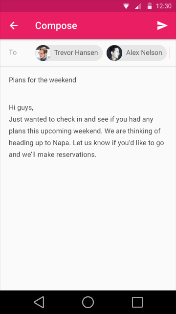
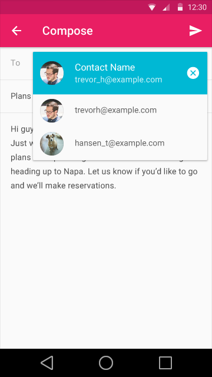
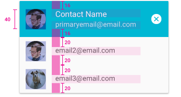

#Chips

Chips are small blocks that represent a complex entity, such as a calendar event or contact. They can contain a photo, short title string (truncated if necessary), and other brief information about the entity. Chips are easily manipulated through drag and drop. Pressing them can invoke the full entity view in a hovercard or full screen view or invoke a menu of options related to that chip’s entity. Animations invoking and invoked from chips should resize the chip paper between entity views for element persistence.

## Contact Chips

Contact chips represent people for whom the user has contact information. They are invoked and inserted into a text field (usually the “To” field) when the user starts typing a contact’s name, sees the contact’s addresses, and selects the correct address. Contact chips can be added directly to a text field from a menu of contacts.
 
Contact chips are useful as they let the user confirm they're sending a message to the correct person, and are space and operationally efficient.

### Closed Contact Chip

- The contact name text is Roboto Regular 14 sp.
- Upon focus, the chip rises. When pressed, it expands to shows alternative addresses for the contact.

### Open Contact Chip

- By default, the top field is activated and focused.
- The contact name text is Roboto Regular 16 sp.
- The address text is Roboto Regular 14 sp.
- Upon press, the contact chip closes.

