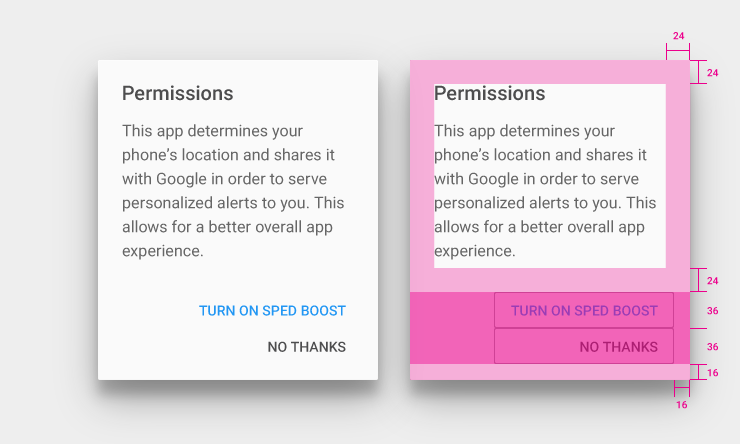

# 對話框

Dialogs prompt the user for decisions or additional information required to complete a task. Such requests range from simple Cancel/OK decisions to more complex layouts asking the user to adjust settings or enter text.

> 內容
>
> 使用
>
> 內容
> 
> 動作
> 
> 行為

## 使用

Dialogs are typically used to prompt users to make a specific decision as part of or before continuing with a task or process. They can be used to inform users about a specific issue, to confirm particularly important actions, or to explain significant ramifications of an action before allowing the user to proceed.

Complex operations, particularly decisions which require involved explanation, may not be appropriate as dialogs.

Dialogs contain an optional **title**, dialog content, and actions.

The title briefly describes the type of choice being made. The title is optional and should only be used when necessary.

**Content** describes the decision to be made.

**Actions** enable the user to proceed in their process by confirming a particular choice.

### Button width and padding guidelines

### Stacked full-width buttons

When text labels exceed the maximum button width, you can use stacked buttons to accommodate the text.

### Side-by-side buttons

Side-by-side buttons are recommended when the text of each label does not exceed the maximum button width, such as the commonly used OK/Cancel buttons.

---

## 內容

### 對話框標題

Dialog titles are optional, and can be used to clarify the decision being made, for example, by indicating what part of a process the dialog relates to or by identifying what will be affected by the decision, such as a setting.

Dialog titles should always be displayed in their entirety.

### 對話框內容

Dialog content can vary widely, but typically consists of text and/or UI control elements and is focused on a specific task or process, such as confirming item deletion or choosing a setting.

---

## 動作

### 對話框動作

Dialogs present a focused and limited set of actions, which are generally affirmative or dismissive.

Affirmative actions are placed on the right side and continue the process. Affirmative actions may be destructive, like Delete or Remove.

Dismissive actions are placed on the left side and return the user to the originating screen or step in the process.

Actions can be placed side by side or can be vertically stacked if more room is needed to accommodate longer button labels.

Dismissive and affirmative action text can be Cancel/OK or can be more specific active verbs or verb phrases that indicate the outcome of the decision.
 

--- 

## 行為

### 滾動

Dialogs are separate from the content on the parent paper and do not scroll with the parent paper.

When possible, content within a dialog should not scroll. Excessive scrolling may indicate the content would be better served with a different container or presentation. However, if content does scroll, make it obvious by cutting off text or UI components.

### 手勢

Touching outside of a dialog will dismiss the dialog.

### 對話框焦點

Dialogs are always fully on-screen. Dialogs always retain focus until they have been affirmed or dismissed or a required action has been taken (such as choosing a setting).

---

> *翻譯：[Weiju Tu](https://www.facebook.com/weiju516)*