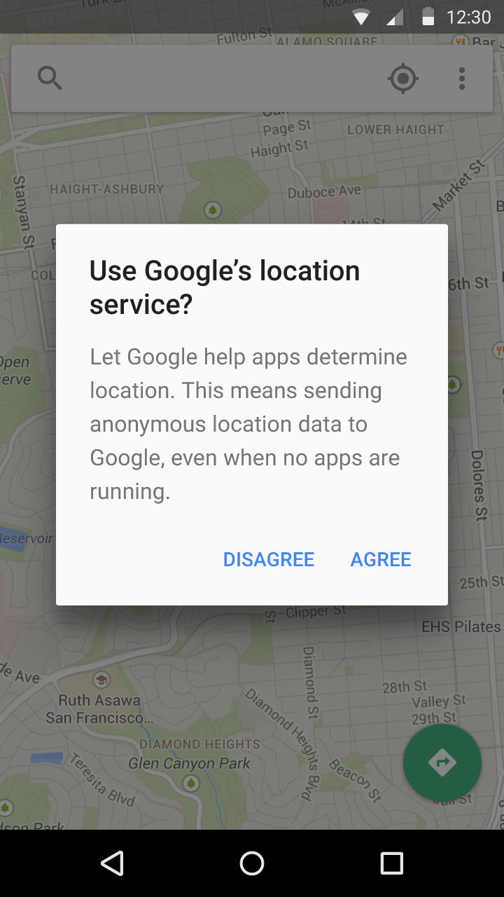
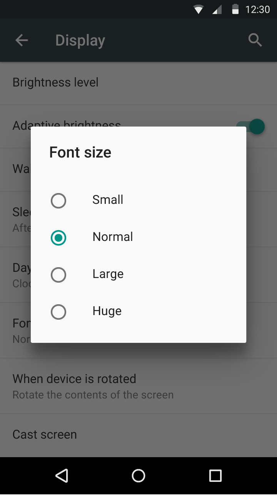
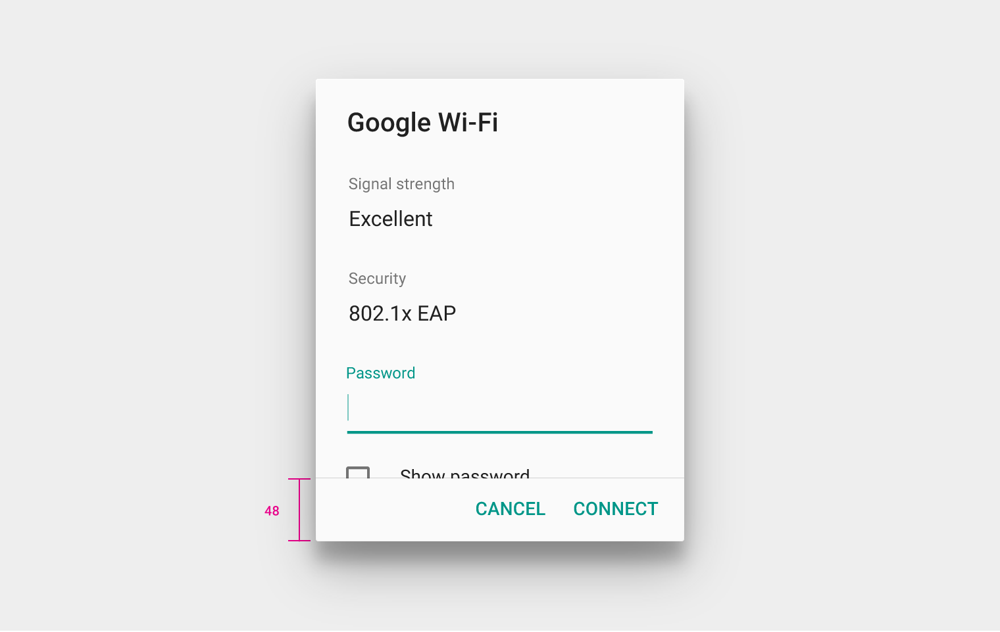
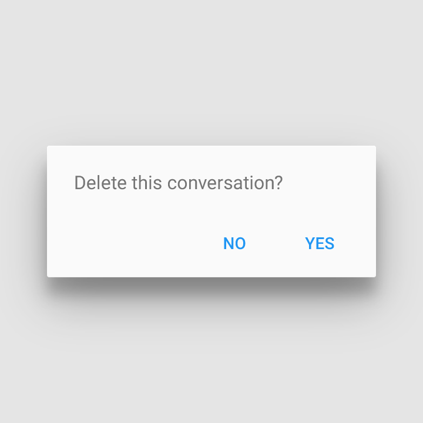
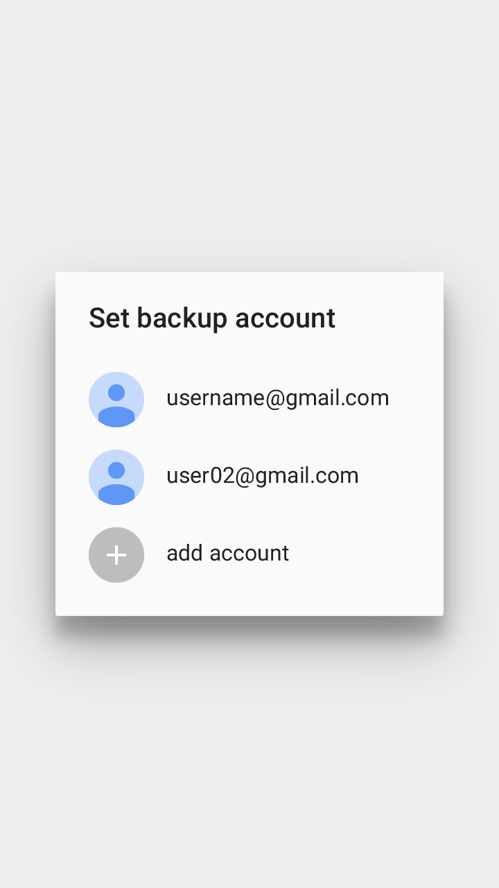
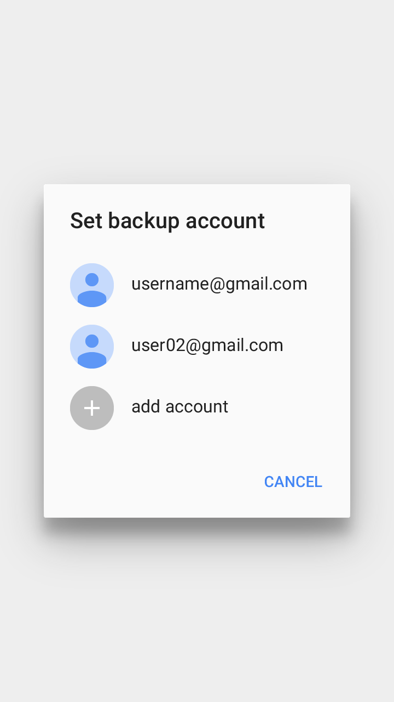
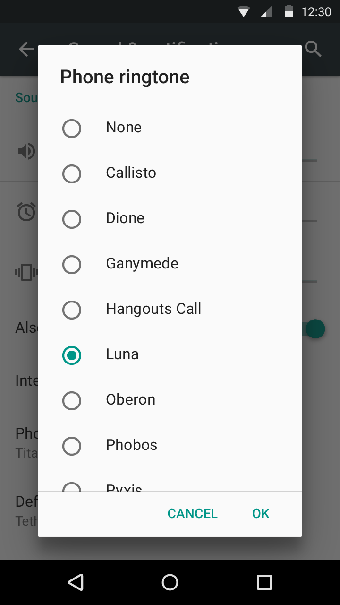
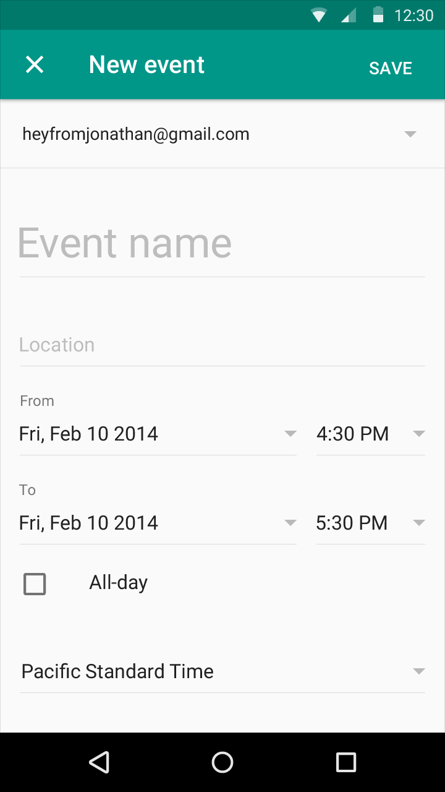
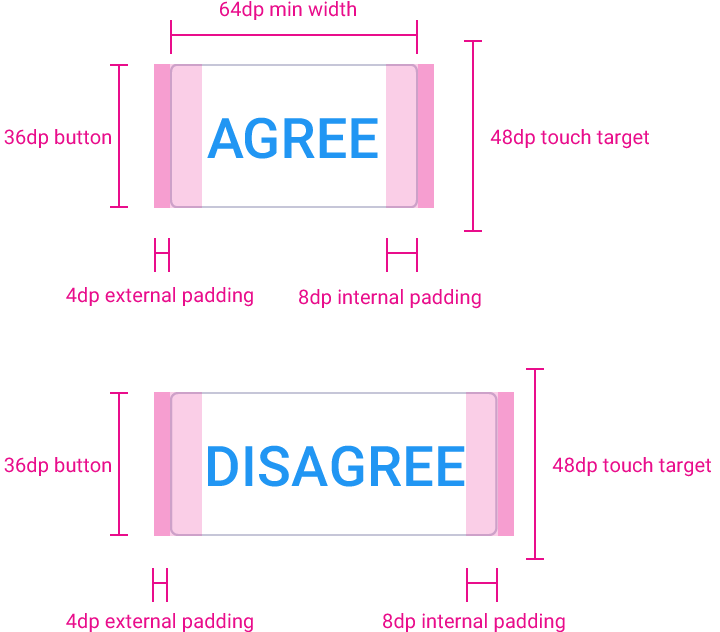
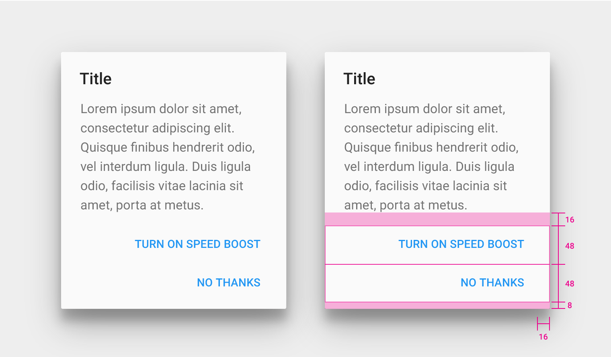

# 對話框

對話框是在告知使用者緊急的訊息，要求使用者做出決定，或者在一個分散的過程中包裝成多個任務。由於對話框是一種中斷性突然顯示並且停止使用者當前的任務和需要關注對話框裏的內容。並非每個選擇、設定或者細節都是像中途中斷或是明顯的方式。

可替代對話框的元件包含簡易的菜單或者當前內容區域內擴展內容。這兩種方法提供訊息或者同時保持當前內文與比較少破壞性的選擇。

## 內容

對話框的內容可以有廣泛的變化，不過典型的做法是通常包含內文或者 UI 控制元件在特定的任務或程序，就像確認項目的刪除或是選擇一種設定。

使用對話框的內容區域可揭露更多的訊息或者更進階的內容。避免從對話框裡面又打開對話框。

全螢幕的對話框可能會打開更多的對話框，比如顏色選取器，因為它們所設計的材料必須做為附加層，且不增加感知的 z 深度的應用或是增加視覺聲音。

避免產生有滾動式內容的對話框，特別是提示視窗。相反的，須考慮正在閱讀或者具有交互資料的大量內容，必要時使用替代性的容器或者佈局。

## 行為

對話框是獨立在基礎本體上並且不會與本體造成滾動。

某些類型的對話內容，自然需要一些滾動，比如較長的鈴聲。在這樣的情況下，將預設顯示滾動條明顯顯示資料內容。

對話框不應該被其他元素或是只出現部分在螢幕上所掩蓋。對話框總是保持明顯的關注，直到它們被確認或是反向的選擇行為。比如選擇設定。

## 警告

警告是用來通知使用者需要在繼續前進之前的一種確認或是確認狀況的行為。它們是基於在一個嚴重性與傳遞訊息且有外觀會有稍微不同。

警告是一種干擾性質與緊急迫切的，並且在做出決定之前防止使用者繼續進行下個階段。

**澄清：**相對於警告訊息，[Snackbars](components-snackbars-and-toasts.html) 目前是可選的，但是重要的訊息或者動作，通常會出現在一個操作之後。例如，使用警告確認刪除草稿。使用 Snackbars 呈現一個取消動作，因為操作是可以選的，使用者可以在無需採取動作下繼續的使用它們主要的任務。

**警告不包含標題欄位**

大部份的警告不需要使用標題欄位。通常的狀況下，決定不具有嚴重的影響，它是可以在一兩個句子簡潔的方式描述。內容區域可以詢問問題（例如：“刪除” 的對話）或者做出一個明確的描述，其操作的按鈕是容易明顯的。

> 建議的做法。
>
> 刪除的操作文本很清楚地表明決策的結果。

> 不建議的做法。
>
> 在否定動作文字 No 答案，不建議後面會發生什麼事。更好的操作是需要將取消以及刪除的按鈕一併做出明顯的顯示。

**警告包含標題欄位**

使用警告包含標題欄位時需謹慎使用。它們只用在高風險的情況下使用，例如資料有潛在的遺失或是資料連接或者有額外費用的訊息。

如果標題是必填的，那麼在內容區域的地方使用清楚的問題或是補充說明的陳述。例如，“是否刪除 USB 儲存？”

避免道歉狀況，以及模糊的陳述或者問題。例如。“警告！” 或者 “您是否確定？”

使用者應該能夠完全跳過內容，並且仍然根據標題及操作按鈕上的文字呈現一個清楚的概念提供使用者的選擇。

> 建議的做法。
>
> 這個對話筐提出了一個具體的問題，扼要的闡述影響並且提供一個明確的動作。

> 不建議的做法。
>
> 這個對話框構成了一個模稜兩可的問題以及不清楚的影響範圍。

## 簡易選單

簡易選單都使用在平板、行動裝置上的列表圖示，用來顯示特定的列表選項。簡易選單選擇後會立即提交選擇。可參考 [元件 > 選單 > 簡易選單](components-menus.html) 有更多細節關於簡易選單。

**澄清：**相對於簡易選單，簡易對話框能夠呈現選項的附加細節，或者是提供導航在主要流程中的相關選擇。雖然他們能夠顯示相同的內容，簡易選單更優於簡易對話框，因為簡易選單對於目前使用者的畫面破壞性較少。

## 簡易對話框

簡易對話框能夠提供附加的細節以及用於列表的選項，或是提供導航等其他相關的主要任務。舉例來說，簡易對話框能夠顯示頭像、圖示、相關的內文，或者是他們能夠讓使用者增加非目前列表上的一個帳戶。

選擇一個選項將立即被提交並且關閉選單。

點擊對話框的外部，或是倒退、取消將會關閉對話框。

簡易對話框比簡易選單更具有干擾性，應該謹慎使用。

簡易對話框沒有明確的接受及取消按鈕。

簡易對話框顯示在屏幕的垂直及水平中央。

對話框在距離邊緣的距離，左右最小為40dp，上下最小為24dp。

對話框的邊緣與內容之間的距離是24dp。

> 別這麼做

> 別這麼做

## 確認對話框

確認對話框，需要使用者明確確認他們的選擇在提交之前。舉例來說，使用者可以聽到許多的鈴聲，但只有點擊"OK"這個選擇才會被提交。

在確認對話框終點取消、倒退、取消動作、放棄修改並關閉視窗。

點擊確認對話框的外部將不會有任何動作；使用者必須明確的確認或是取消以關閉確認對話框。

> 在使用者在確認對話框選擇OK之前，鈴聲的選則是不會被設置的。

確認對話框能夠使用其他佈局，舉例來說一個日期的選取器，但他們仍然集中在一個特定的值(選個日期，但不包含時間)。

確認對話框提供一個明確的確認按鈕及一個明確的取消按鈕。明確的取消按鈕會表明離開確認對話框將會放棄所有變更，舉例來說，點擊取消或是按下倒退。

確認對話框應該避免彈出額外的簡易對話框或是選單。Material的額外圖層會增加應用程式Z軸深度，以及不必要的視覺複雜化。

如果需要額外的簡易對話框或是選單來完成任務或是進度，考慮使用全屏對話框取代確認對話框。

> 好的做法
>
> 提供一個明確的確認按鈕及明確的取消按鈕。

> 別這麼做
>
> 一個單獨的對話框按鈕在系統倒退功能造成模糊不清：這是倒退取消還是確認功能？

## 全屏對話框

**只有行動版**: 因為行動裝置的限制，對話框的顯示還有許多其他形式(平板、桌機等)，可能有更適合的方式來取代全屏對話框。

全屏對話框可以用來將複雜操作的任務群組化，這需要一個明確的指示，像是存擋或是創建、在變更前的提交或是放棄，舉例來說，創建立日期的輸入。

全屏對話框能夠將複雜的編排最小化顯示，以material方式層疊
(對話框上的對話框)，他增加了應用程式的Z軸深度。它們能夠獨立每個單獨的任務並彈出簡易的選單，或者是複雜操作的一部分。

當內容或是進度符合以下任何的條件，考慮使用全屏對話框。

- 對話框的內容包含元件，像是選取器(日曆)或是表單需要IME輸入。
- 當變更不會被即時儲存。
- 當應用程式沒有草稿的功能時。
- 當操作排程需要被依序改變提交時。

在這範例中，全屏的對話框提供一個簡易的對話框用來選取日期。全屏對話框沒有修改以及選擇，而是當被點擊時儲存。點擊"X"金會取消所有變更，並且離開全屏對話框。

> 全屏對話框

> 從全屏對話框打開日曆選取器

全屏對話框中，確認及取消動作在畫面的頂部。

確認動作是在螢幕的右上角，並使用正確的描述用語，像是"存檔"、"送出"、"增加"、"分享"、"更新"、"建立"*(原文:“save”, “send”, “add”, “share”, “update”, or “create”)*。

別使用模糊的詞像是"完成"、"好"、"關閉"*(原文: “done” or “ok” or “close” )*來表示確認動作。這些都與"X"的語意太相近了，且結果沒什麼不同。

在對話框中所有強制性的條件被滿足之前，確認功能是無效的。

放棄動作的功能，一個"X"在屏幕的左上方，關閉全屏對話框以及放棄所有更動。倒退按鈕相等於放棄的動作。

如果使用者有做任何的更動，他們會提示放棄更動的動作。

如果沒有任何更動，點擊"X"或是倒退會立即關閉對話框，也不會有放棄確認的需求。

> 別這麼做
>
> 別用模糊的用詞像是關閉在確認動作上。

"X"不同於向上的箭頭，它是使用在畫面狀態不斷的被儲存，或者是應用程式有儲存草稿或有自動儲存的功能。舉例來說，向上箭頭用在被應用在設定上，因為所有的改變都會立即的被提交。在這些情況下，倒退按鈕的導航及行為將會配合向上箭頭的功能，且沒有明確的確認或是取消的行為。

> 向上的箭頭在這例子中說明，任何的改變將會被立即儲存。 

> 點擊"X"在這設定的範例將會取消所有改變，只有在點擊"儲存"時才會被存檔。

## 規範

對話框包含了一個標題、內文、及互動元件。

這個標題簡單描述了需要選則的類型。標題應該總是顯示在整體之中，並應該在需要時使用。標題可以用來描述在正做出的決定。舉例來說：標題可以用來說明目前在對話框中的進度，這進度可能是在設置中的將受到的決定。

對話框的內容相當的廣泛，但一般來說內文或UI控制元素是集中在一個特定的任務或是進度，如確認項目的缺失或是選擇一個設置。

當需要時，動作被執行核定、駁回特定選擇、或是由對話框內容呈現進度。

#### 親和性的注意事項

為了確保對殘疾人們的可用性，請確保你的按鈕有36dp的最低高度，但可觸摸的的目標有48的最低高度

所有對話框的操作文字預設顏色是應用程式的主題強調色。總是確保操作文字顏色有[足夠的對比度](usability-accessibility.html)，且滿足親和性的規範。改變預設文字色彩當需要足夠的的對比。

對話框呈現一個集中和受到限制的一套動作，通常來說包含核定及取消。

核定的動作放置在右方，並且繼續流程。核定動作也可能是具破壞性的，像是刪除或是移除。

取消動作放置在核定動作的左方，並且返回使用原本的畫面或是到特定的流程中。

取消及核定動作文字可以是"Cancel/OK"或者是更具體的主動詞或片語，能夠表示決定的結果。

> 不好的做法
>
> 取消動作總是放置在核定動作的左方

### 按鈕寬度及內距指南

### 並排按鈕

在使用並排按鈕時，建議每個按鈕的文字不要超過按鈕的最大寬度，如常用的確認/取消按鈕。

用下面公式來計算對話框的按鈕最大寬度。

對話框按鈕的最大寬度 = **(Dialog width - 16dp - 16dp - 8dp) / 2**

舉例來說

寬度280dp對話框的按鈕最大寬度 = (280dp - 16dp - 16dp - 8dp) / 2 = 120dp

### 堆疊式全寬按鈕

當文字標籤超過了最大寬度，使用堆疊式按鈕容納本文。核定的按鈕會堆疊在取消的上方。

> *翻譯：[Weiju Tu](https://www.facebook.com/weiju516)*