# 對話框

Dialogs inform users about critical information, require users to make decisions, or encapsulate multiple tasks within a discrete process. Use dialogs sparingly because they are interruptive in nature—their sudden appearance forces users to stop their current task and refocus on the dialog content. Not every choice, setting, or detail warrants such interruption and prominence.

Alternatives to dialogs include simple menus or inline expansion within the current content area. Both approaches present information or options while maintaining the current context and are less disruptive.

## Content

Dialog content can vary widely, but typically consists of text and/or UI control elements and is focused on a specific task or process, such as confirming item deletion or choosing a setting.

Use inline expansion within the content area of dialogs to disclose additional information or content such as advanced options. Avoid opening additional dialogs from within a dialog.

Full-screen dialogs may open additional dialogs, such as pickers, because their design accommodates additional layers of material without significantly increasing the perceived z-depth of the app or increasing visual noise.

Avoid creating dialogs with scrolling content, particularly alerts. Instead, consider alternate containers or layouts that are optimized for reading or interacting with significant amounts of content.

## Behavior

Dialogs are separate from the underlying parent material and do not scroll with the parent material.

Certain types of dialog content naturally needs to scroll, such as a long list of ringtones. In these cases, make it obvious that content scrolls by displaying scroll bars by default.

Dialogs should never be obscured by other elements or appear only partially on screen. Dialogs always retain focus until they have been affirmed or dismissed or a required action has been taken, such as choosing a setting.

## Alerts

Alerts inform the user about a situation or action that requires their confirmation or acknowledgement before proceeding. They differ slightly in appearance based upon the severity and impact of the message conveyed.

Alerts are interruptive and urgent, and prevent users from proceeding until they make a decision.

**Disambiguation**: In contrast to Alerts, [Snackbars](components-snackbars-and-toasts.html) present optional but important information or actions and usually appear after an action. For example, use an alert to confirm discarding a draft. Use a snackbar to present an undo action, because the action is optional and the user can continue with their primary task without taking action.

**Alerts without title bars**

Most alerts don't need titles. Usually the decision doesn't have a severe impact and can be summed up succinctly in a sentence or two. The content area should either ask a question (such as "Delete this conversation?") or make a clear statement whose relationship to the action buttons is obvious.

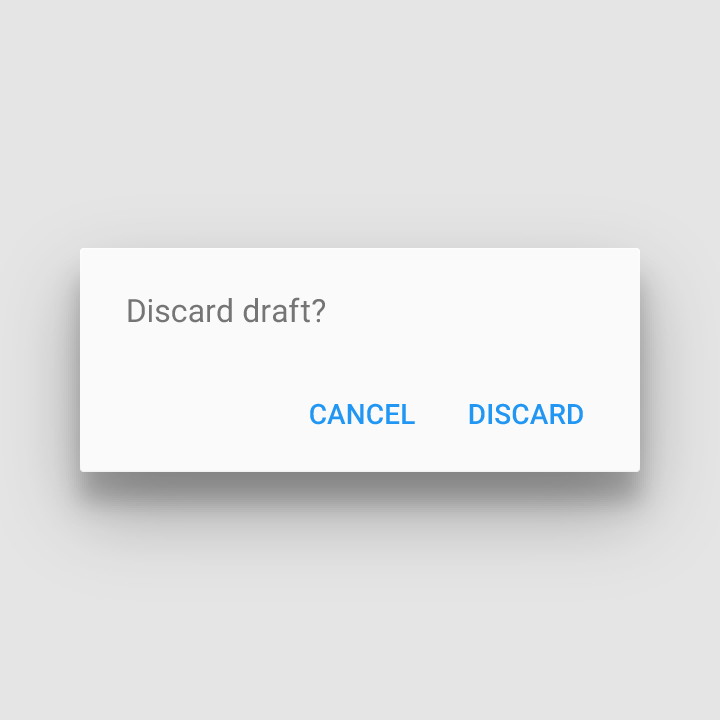

> Do.
>
> The affirmative action text Discard clearly indicates the outcome of the decision.

> Don't.
>
> The dismissive action text No answers the question, but does not suggest what will happen afterwards. A better action pair would be an explicit Cancel and Delete.

**Alerts with title bars**

Use alerts with title bars sparingly. They are appropriate only for high-risk situations, such as potential loss of data or connectivity, or extra charges.

If a title is required, use a clear question or statement along with some additional explanation in the content area. For example, "Erase USB storage?"

Avoid apologies and ambiguous statements or questions. For example, “Warning!” or “Are you sure?”

A user should be able to skip the content completely and still have a clear idea of what choices are available based on the title and the text of the action buttons.

> Do.
>
> This dialog poses a specific question, concisely elaborates on its impact, and provides clear actions.

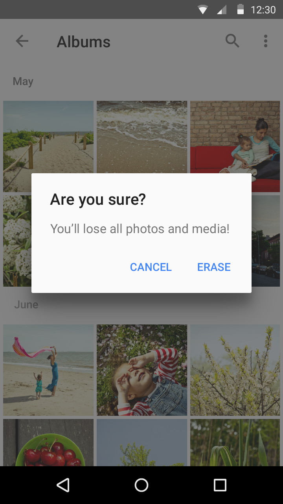

> Don't.
>
> This dialog poses an ambiguous question and its scope of impact is unclear.

## Simple menus

Simple menus are used in list views on tablet and mobile devices to display the options for a specific list item. Simple menus immediately commit choices upon selection. See [Components > Menus > Simple Menus](components-menus.html) for more details about simple menus.

**Disambiguation**: In contrast to simple menus, simple dialogs can present additional detail related to the options available for a list item or provide navigational or orthogonal actions related to the primary task. Although they can display the same content, simple menus are preferred over simple dialogs because simple menus are less disruptive to the user’s current context.

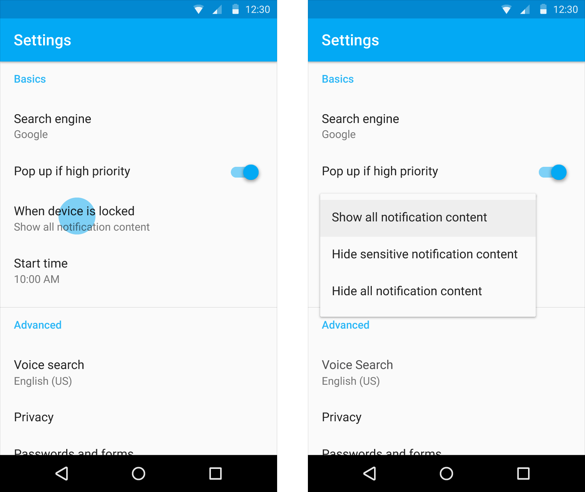

## Simple dialogs

Simple dialogs can present additional detail related to the options available for a list item or provide navigational or orthogonal actions related to the primary task. For example, simple dialogs can display avatars, icons, or clarifying subtext, or they can enable users to add an account that’s not currently listed as an option.

Choosing an option immediately commits the option and closes the menu.

Touching outside of the dialog, or pressing Back, cancels the action and closes the dialog.

Simple dialogs are more interruptive than simple menus and should be used sparingly.

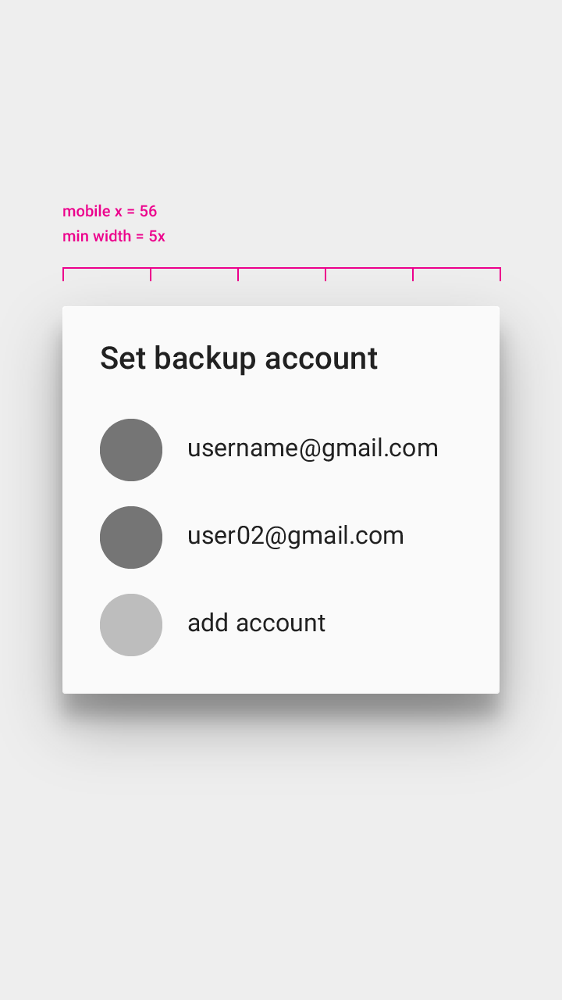

Simple dialogs do not have explicit buttons that accept or cancel the operation.

A simple dialog appears centered vertically and horizontally in the screen.

The distance between the edges of the screen and the edges of the dialog is minimum 40dp on the left and right, and minimum 24dp on the top and bottom.

The distance between the edge of the dialog and content is 24dp.

> Don't.

> Don't.

## Confirmation dialogs

Confirmation dialogs require users to explicitly confirm their choice before the option is committed. For example, users can listen to multiple ringtones, but only upon touching OK is the final selection committed.

Touching Cancel in a confirmation dialog, or pressing Back, cancels the action, discards any changes, and closes the dialog.

Touching outside of a confirmation dialog will not perform any action; the user must explicitly confirm or cancel to dismiss the confirmation dialog.

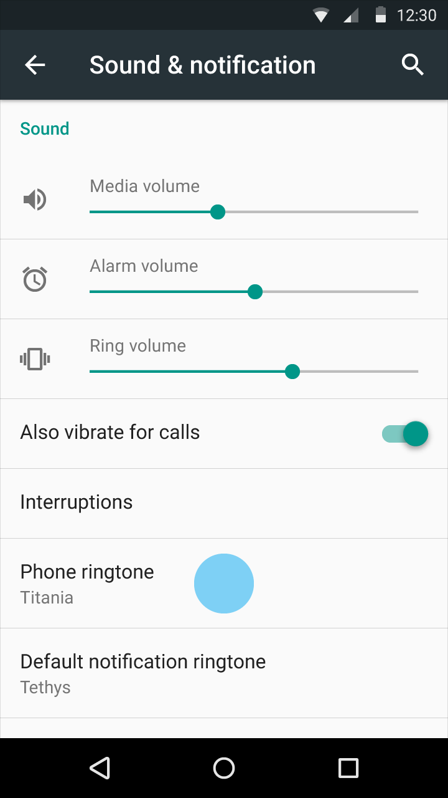

> The ringtone choice in the confirmation dialog will not be set until the user touches OK.

Confirmation dialogs can use layouts other than lists, for example a date picker, but they are still focused on specifying a single value (picking the date, but not picking the time & date).

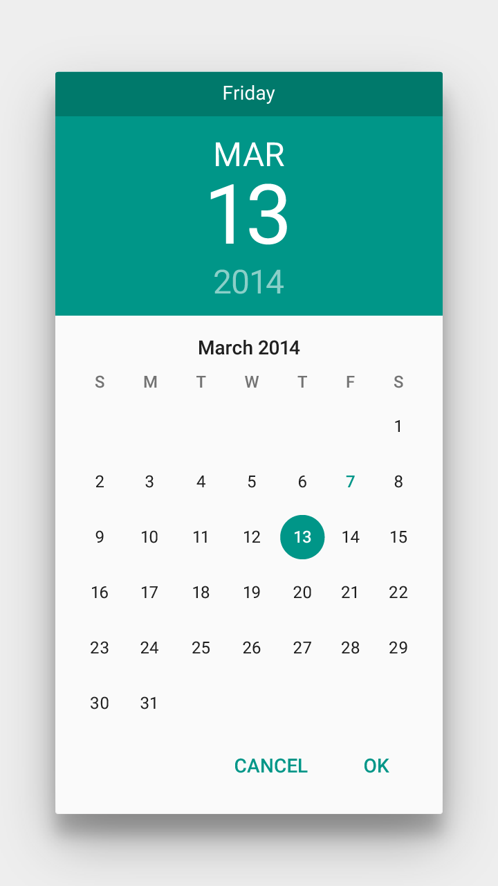

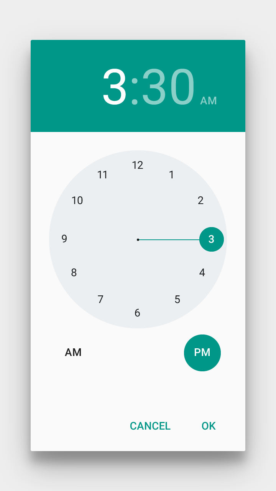

Confirmation dialogs provide both an explicit confirmation button and explicit Cancel button. The explicit Cancel button clarifies that leaving the confirmation dialog will discard changes, for example, by touching Cancel or pressing Back.

Confirmation dialogs should avoid launching additional simple dialogs or simple menus. The additional layers of material can increase the app’s perceived z-depth, and add unnecessary visual complexity.

If additional simple dialogs or simple menus are needed to complete the task or process, consider using a full-screen dialog instead of a confirmation dialog.

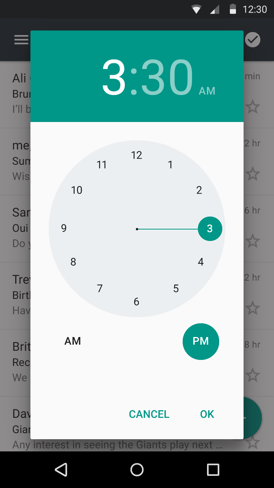

> Do.
>
> Provide an explicit confirmation button and explicit cancel button.

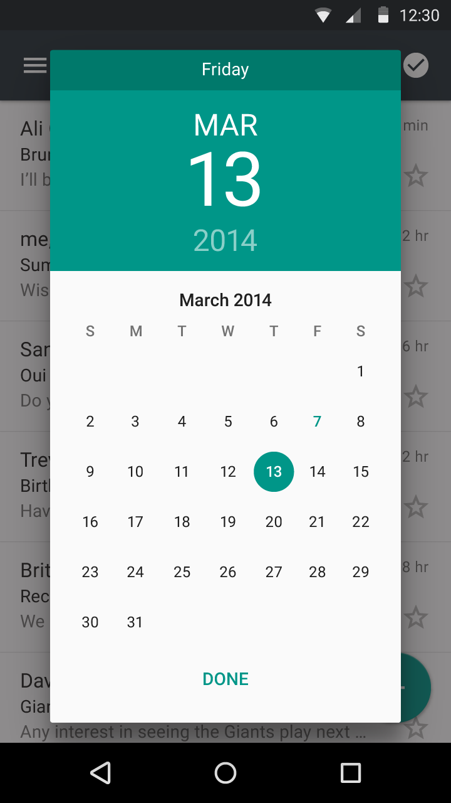

> Don't.
>
> A single dialog button makes the system Back action ambiguous: does Back cancel or confirm?

## Full-screen dialogs

**Mobile only**: Because of limited real estate on mobile devices, content that may appear as a dialog in other form factors (tablet, desktop, etc.) may be more appropriately presented in a full-screen dialog.

Full-screen dialogs can be used to group a set of tasks forming a complex operation that requires an explicit confirmation or action, such as save or create, before changes are committed or discarded, for example, creating a calendar entry.

Full-screen dialogs enable complex layouts, minimize the appearance of stacked sheets of material (dialogs above dialogs) and thus an increase in the app’s perceived z-depth. They enable individual tasks to launch simple menus or simple dialogs as part of the complex operation.

Consider using a full-screen dialog when the content or process meets any of the following criteria:

- The dialog’s content includes components like pickers or form fields requiring IME input
- When changes are not saved in real time
- When there is no draft capability in the app
- When performing batch operations or queuing changes prior to submitting them

In the example to the right, the full-screen dialog supports a simple dialog used to pick dates. No modifications and selections made in the full-screen dialog are saved until Save is touched. Touching the X will discard all changes and exit the full-screen dialog.

> Full-screen dialog

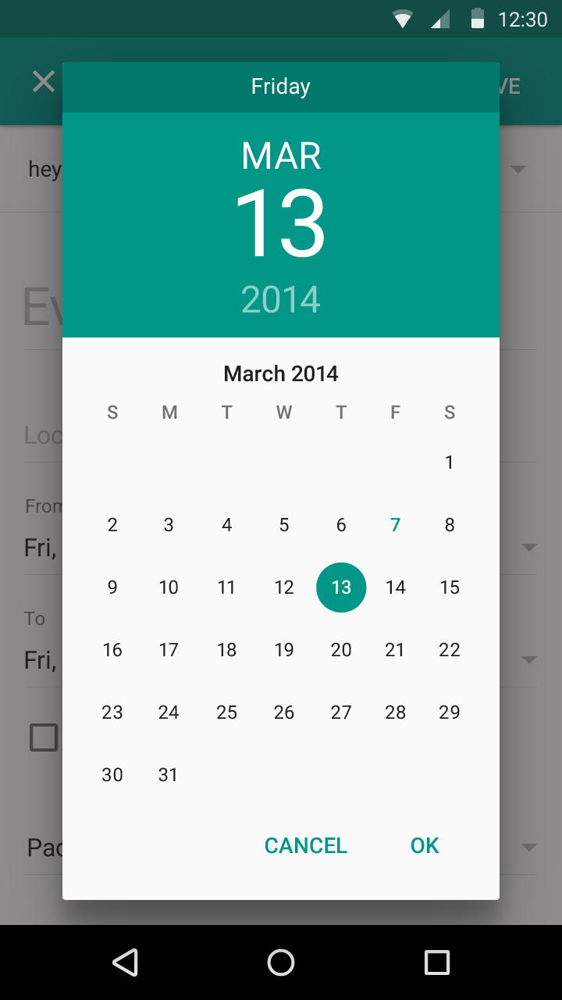

> Date picker opened from full-screen dialog

In full-screen dialogs, the confirmation and dismissive actions are at the top of the screen.

The confirmation action is at the top right of the screen and uses descriptive and accurate words, such as “save”, “send”, “add”, “share”, “update”, or “create”.

Don’t use vague actions such as “done” or “ok” or “close” for the confirmation action. They are too similar in meaning to the X and non-specific in their result.

The confirmation action is disabled until all mandatory criteria in the dialog are met.

The discard action, an X at the top left of the screen, closes the full-screen dialog and discards any changes. The Back button is equivalent to the discard action.

If the user has made any changes, they are prompted to confirm the discard action.

If no changes have been made, touching the X or Back immediately closes the dialog and no discard confirmation is required.

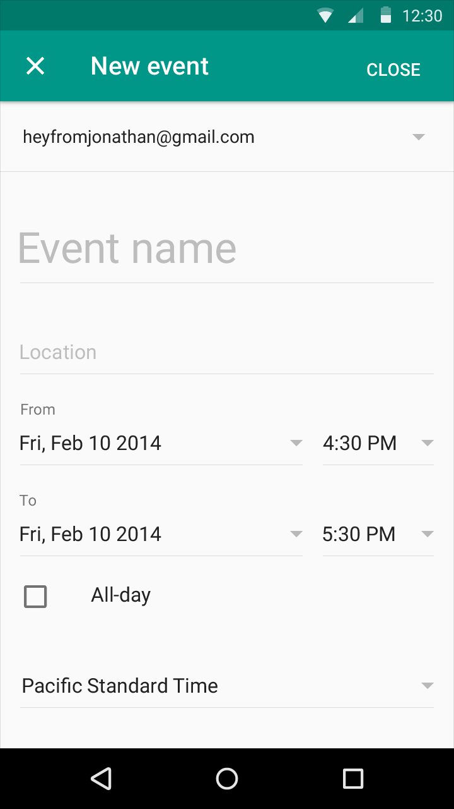

> Don't.
>
> Don’t use vague terms like Close for confirmation actions.

The X differs from an Up arrow, which is used when the view’s state is constantly being saved or when apps have draft or autosave capabilities. For example, an Up arrow is used in Settings because all changes are committed immediately. In these cases, the Back button navigation and action match the Up arrow functionality, and there are no explicit confirmation or cancel actions.

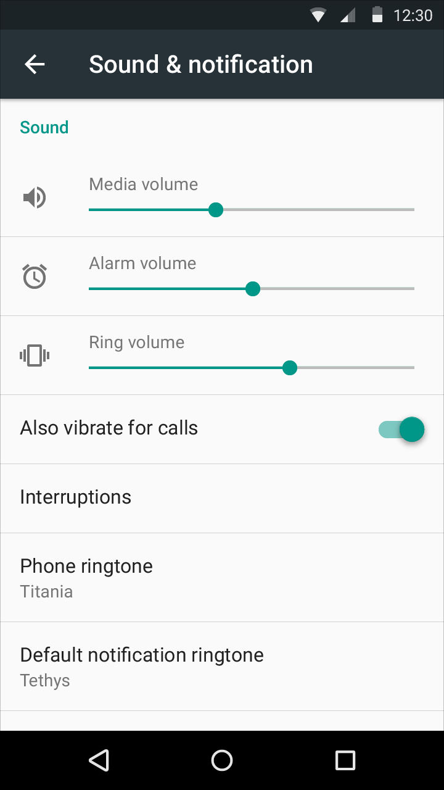

> The Up arrow in this Settings example indicates that any changes will be immediately saved upon selection.

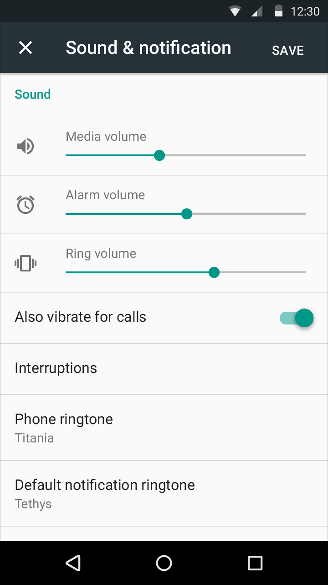

> Touching the X in this Settings example will discard all changes. Changes will be saved only upon touching Save.

## Specs

Dialogs contain an optional title, content, and actions.

The optional title briefly describes the type of choice being made. Titles should always be displayed in their entirety and should be used only when necessary. Titles can be used to clarify the decision being made. For example, a title may indicate what part of a process the dialog relates to or by identifying what will be affected by the decision, such as a setting.

Dialog content can vary widely, but typically consists of text and/or UI control elements and is focused on a specific task or process, such as confirming item deletion or choosing a setting.

When needed, actions acknowledge, affirm, or dismiss the particular choice or process presented by the dialog content.

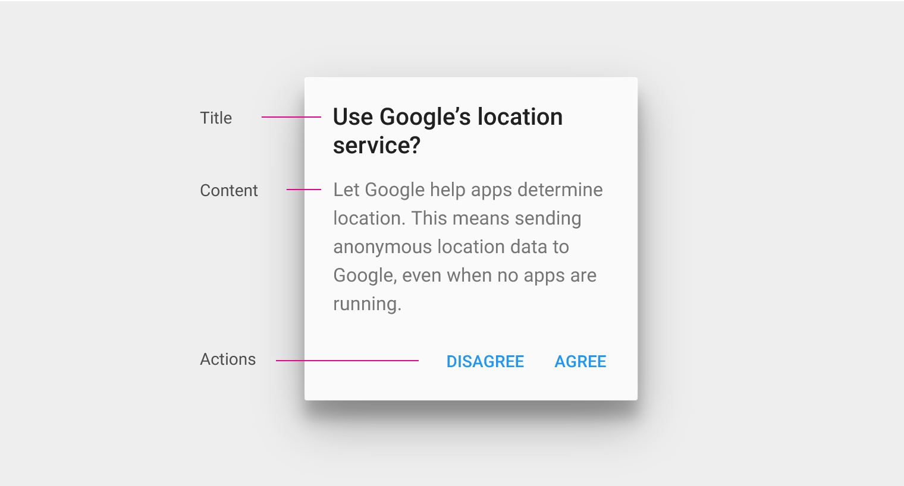

#### A note on accessibility

To ensure usability for people with disabilities, make sure that your buttons have a minimum height of 36dp, but that the touchable target has a minimum height of 48dp.

The default color of all dialog action text is the application’s theme accent color. Always make sure the action text color uses a [sufficient contrast ratio](usability-accessibility.html) to meet accessibility guidelines. Change the default text color as needed to create a sufficient contrast ratio.

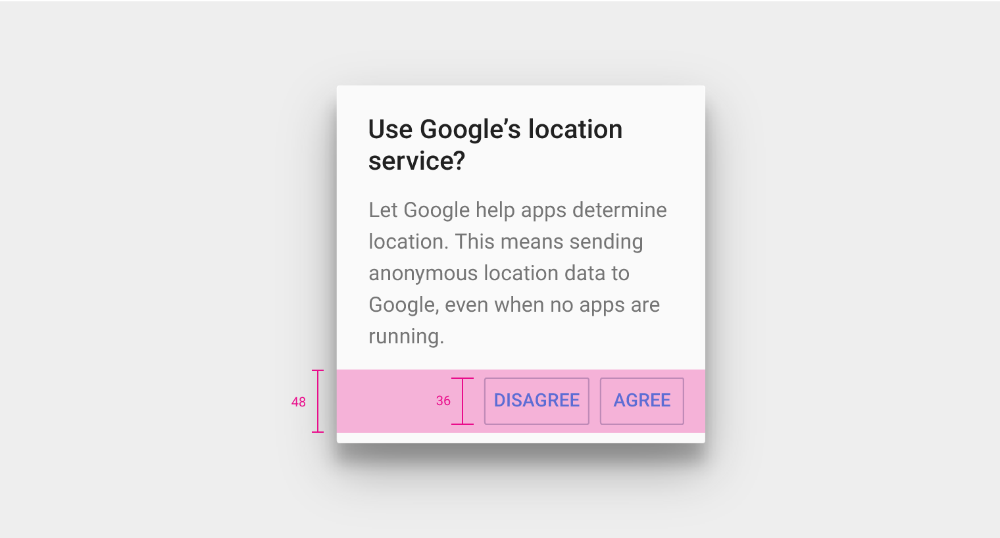

Dialogs present a focused and limited set of actions, which are generally affirmative or dismissive.

Affirmative actions are placed on the right side and continue the process. Affirmative actions may be destructive, like Delete or Remove.

Dismissive actions are placed directly to the left of affirmative actions and return the user to the originating screen or step in the process.

Dismissive and affirmative action text can be Cancel/OK or can be more specific active verbs or verb phrases that indicate the outcome of the decision.

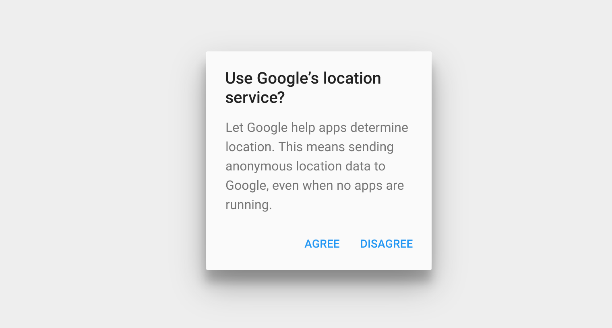

> Don't.
>
> Dismissive actions are always placed directly to the left of affirmative actions.

### Button width and padding guidelines

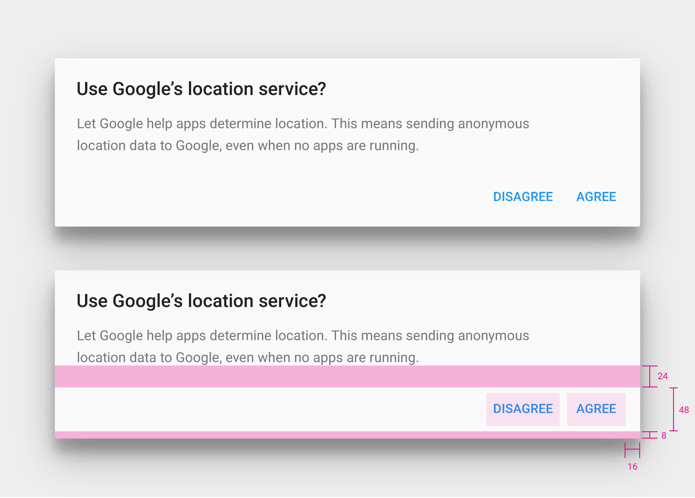

### Side-by-side buttons

Side-by-side buttons are recommended when the text of each label does not exceed the maximum button width, such as the commonly used OK/Cancel buttons.

Use the following formula to calculate maximum button width for a given dialog:

The maximum width for buttons in a dialog = **(Dialog width - 16dp - 16dp - 8dp) / 2**

For example:

The maximum width for buttons in a 280dp wide dialog = (280dp - 16dp - 16dp - 8dp) / 2 = 120dp

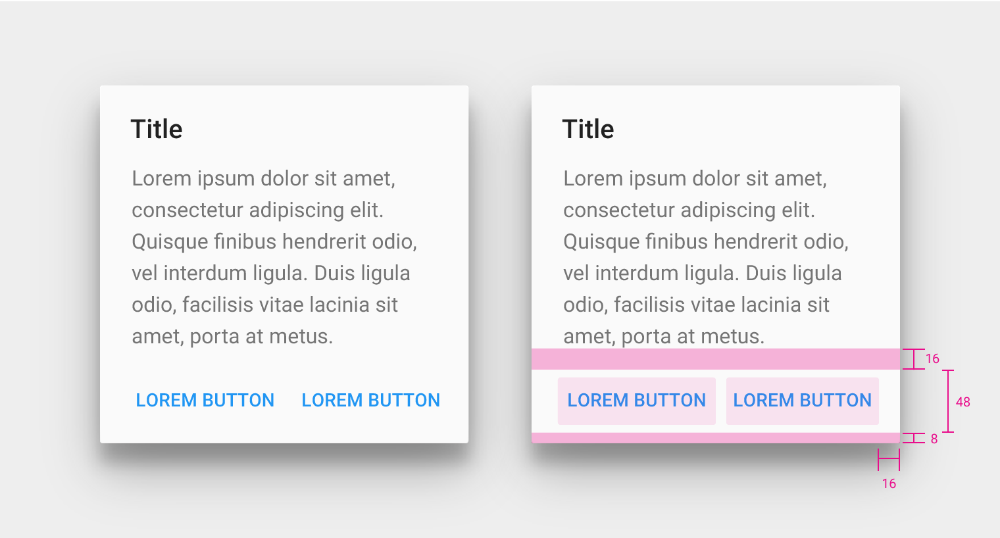

### Stacked full-width buttons

When text labels exceed the maximum button width, use stacked buttons to accommodate the text. Affirmative actions are stacked above dismissive actions

<!-- 以下為舊文，如果沒有用在翻譯完即會刪除 -->

## 使用

對話框通常用於提示使用者做出一個具體的決定或者一個任務或處理。它們可以用來通知使用者具體的問題，以確定重要的操作，或者允許使用者繼續之前所交代的事件。

若是有複雜的操作是需要有特別描述，可能就不適合使用對話框。

對話框包含一個可選的 **標題**，對話框內容以及動作。

標題需要簡要的描述目前被選擇的類型。標題是可選擇的，應該在必要時的時候使用它。

**內容** 作為可以做決定的描述。

**動作** 使用者能夠透過確認一個選擇並且繼續進行處理。

### 按鈕寬度及內距的指南

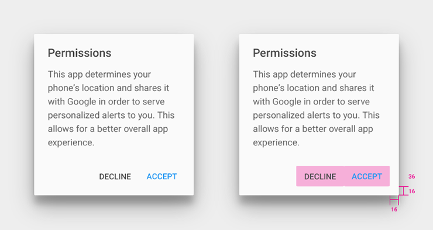

### 全寬按鈕的堆疊

當文字標籤在按鈕上超過最大寬度，您可以使用堆疊的方式將按鈕擺放以容納文字。

### 並排的按鈕

如果每一個文字沒有超過全寬的按鈕，那麼建議使用並排的方式排列，就像常用的確定/取消按鈕。

---

## 內容

### 對話框標題

對話框的標題是可選擇的，並且可以清楚地描述正在做的決定。例如，指示對話框或透過識別哪些將會受到的決定，例如，設定。

對話框的標題應該總是被顯示出來。

### 對話框內容

對話框的內容是可以廣泛的，不過通常包括本文 和/或 UI 控制元件，並且在特定的任務聚焦或者是處理的部分。就像是確認資料是否刪除或者選擇一個設定。

---

## 動作

### 對話框動作

對話框呈現出一種集中及有限度的一套動作。也就是一般在肯定或否定的選擇。

肯定的動作通常放在右側，並且是會持續的處理該過程。肯定的動作也可能是破壞性的，就像是刪除或移除。

否定的動作通常放在左側，並將使用者退回到過程中的初始化畫面或者前一個步驟。

動作可以是並排的方式擺放，或者如果需要更大的空間可以使用垂直的方式堆疊按鈕。

否定或是肯定動作的文字可以是 取消/確定，也可以是更具體的動詞或動詞詞組來表示決定的結果。
 

--- 

## 行為

### 滾動

對話框是主要文件的內容及沒有滾動的主要文件是分開的。

如果可能的話，在對話框中應該是不滾動的。過多的滾動可能表示內容會有與不同的容器及呈現上有更多的服務，不過如果內容不滾動，也代表著內文及 UI 元件是被切斷的。

### 手勢

手勢接觸到對話框的外部，將關閉對話框

### 對話框焦點

對話框總是完全在螢幕上。對話框總是保持的焦點的目標，直到被確認或是被否定的要求動作。（比如選擇一個設定）

---

> *翻譯：[Weiju Tu](https://www.facebook.com/weiju516)*