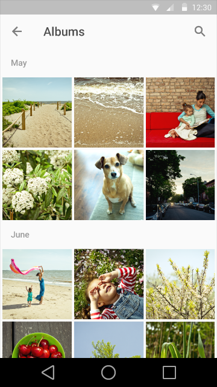
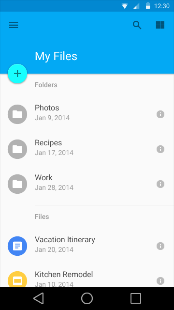

#Dividers

Dividers group and separate content within lists and page layouts using strong visual and spatial distinctions. The divider shown in the examples is a thin rule, lightweight enough to not distract the user from content.

---

##Usage

###Items without anchors

When lists don’t have an anchoring element such as an avatar or icon, spacing alone isn’t always enough to separate tiles. In this case, full-bleed dividers can help create rhythm and separate individual tiles. 

###Image-based content

Because the grid itself creates visual distinction, grid lists do not need dividers to separate subheaders from content. In this case, the white space and the subheaders separate the sections of content adequately.

---

##Types of Dividers

###Full-bleed dividers

Full-bleed dividers separate sections or different types of content in both lists and page layouts.

###Inset dividers

Use inset dividers when anchoring elements such as icons or avatars are present in the Title Key Line.

### Subheaders and Dividers

When using a divider with a subheader, place the divider above the subheader to reinforce the relationship between the subheader and the content.

