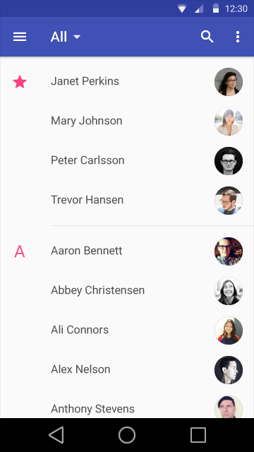

#分隔器

分隔器以及分隔內容使用了強烈的視覺和空間上的區以及頁面佈局中不同的內容。在這個例子將說明分隔器是一個輕量型的規則足以不分散使用者的內容。

---

##使用

###無鏈接項目

如果列表沒有固定的元素。例如頭像或者是圖示，單獨的間距是不夠分隔區塊。在這種情況下，全滿的分隔器能夠幫助建立韻律以及個別分隔區塊。

###基於圖示的內容

由於網格本身會造成視覺上的區隔，網格列表是不需要為副標題的內容分開。在這種情況下，空格及副標題就需要稍微分開一點。

---

##分隔線的類型

###全滿分隔線

全滿的分隔線是在分隔章節或不同類型的列表以及頁面佈局。

###插入分隔線

當在鏈接元素請使用插入分隔線，就像是圖示或標題上的主要線路。

### 副標題及分隔線

當副標題使用了一個分隔線，分隔線放在副標題的上方以強調副標題與內容之間的關係。

> *翻譯：[Weiju Tu](https://www.facebook.com/weiju516)*