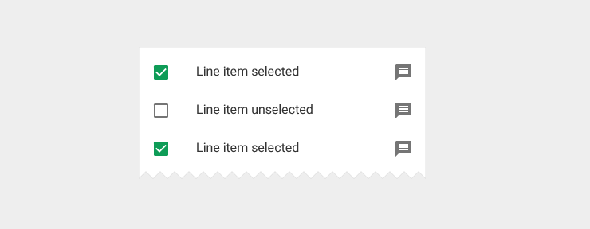
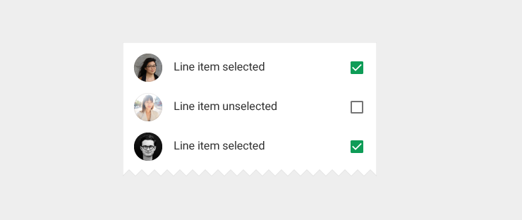
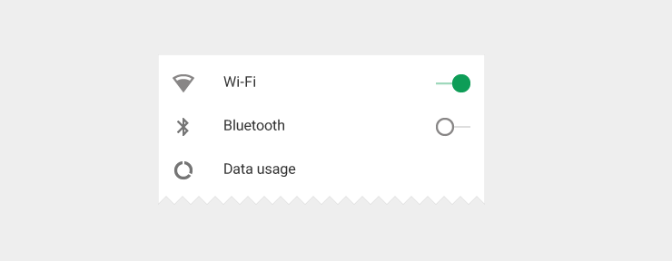
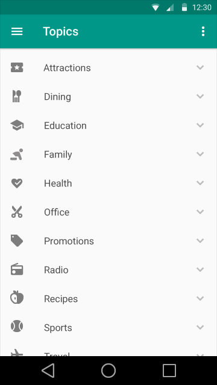
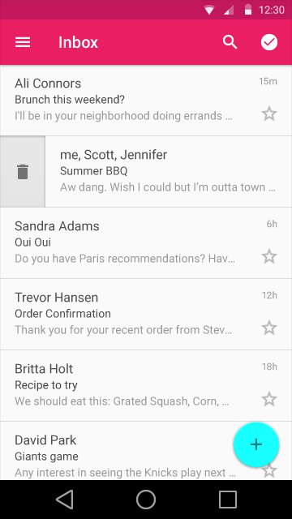
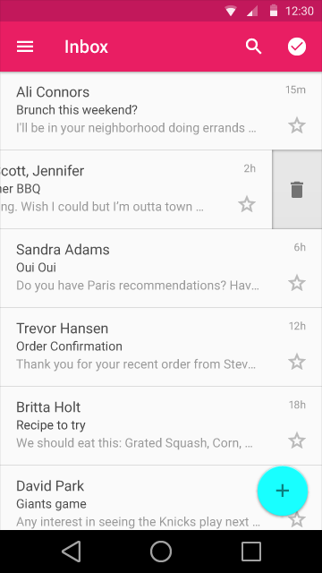
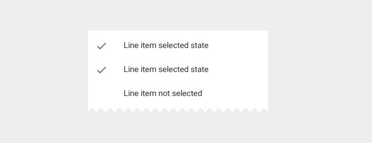

# 清單控制器

## 使用方式

清單控制器可分為四大類：

- 狀態
- 主要指令 (包含字串)
- 次要指令
- 次要訊息

清單的辨識元素
Distinguishing elements of list titles need to be first in read order, so states and primary actions are placed on the left side of a list title. Text within a list item should be considered part of the primary action target.

Don’t place two icons or actions next to one another, such as a checkbox next to an avatar.

If the primary action of the list item is navigational, don’t use an icon. The list item itself and its context should be sufficient to communicate the destination.

Secondary actions and Info should be placed on the right side of the title. Secondary actions are always a separate target from the primary action, as users increasingly expect every icon to trigger an action.

---

## Type of list controls
 
### Checkbox

A checkbox can either be a primary action or a secondary action.

Type: Primary Action/ State

### Separate target

Desktop on hover only.

> Checkbox is the primary action and the state indicator for the list item.

類型：次要指令

Separate target

When controlling a family of variables, instead of just one, consider using switches instead.

> Checkbox is the secondary action for the list item.

### Switch

Type: Secondary Action

Separate target

### Reorder

Type: Secondary Action

Usually a separate target, depending on mode list is in.

Allows dragging of list item to other locations within the list. Usually appears in list editing mode.

### Expand/Collapse

Type: Secondary Action

Separate target

Expands and collapses a list view vertically to show and hide existing list items.

### Leave Behinds

Type: Other

A leave-behind is an informative hint as to what swiping a list item away will do to that item. The leave-behind can transform into an action.

Swiping on a list item from either direction will reveal an icon indicating the action. After swiping, the action appears as a text button centered within the list item space.

 

### Discouraged: Navigational List Controls

一般來說，導覽只需透過文字清單，額外的glyph是不必要的。
Generally, navigation is implied through the text on the list item itself. An extra glyph is not necessary.

### See more

Type: Primary Action (along with the rest of the row)

Not a separate target.

Leads to more information related to the list item, usually in a new view or pane.

---

## Type of menu controls

### Check

Type: State

Not a separate target.

Menus only. Denotes if list item is selected through a different control.

### Inline Information

Type: Secondary Info

Not a separate target.

Menus only. Inline information is a small snippet of text related to the line title that can provide information or a tip, like a keyboard shortcut. It cannot be truncated.

