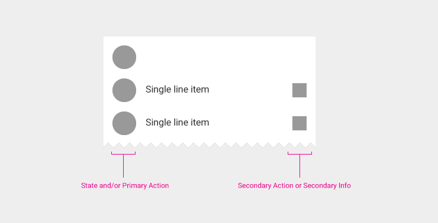
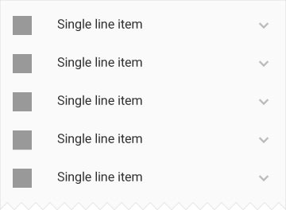
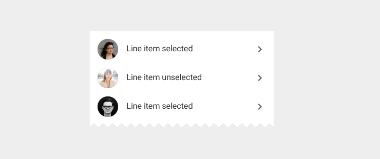

# 清單控制器

## 使用方式

清單控制器可分為四大類：

- 狀態
- 主要指令 (包含字串)
- 次要指令
- 次要訊息

清單的辨識元素

辨識元素的清單標題應該要率先被閱讀，因此，「狀態」與「主要指令」應該被置放於清單標題的左側。
而清單內含的文字也應該被視為指令的一部份。

不要把兩個圖示或指令放在一起，像是把選擇框跟使用者的縮圖並排。

如果清單的目的是導覽用的，請勿使用圖示，清單本身的文字與內容就足以讓使用者了解目標。

次級指令與資訊必須放置在標題的右側，
次級指令與主要指令必須分開，因為使用者傾向預期一個圖示會出發一個指令。

---

## 清單控制器的類型
 
### 選擇框

選擇框可以是主要指另，也可以是次要指令。

類型：主要指令/ 狀態

### 分離標的

滑鼠滑過的動作僅使用於桌上型電腦。

> 選擇框能作為主要指令，也能顯示清單的狀態。

類型：次要指令

分離標的

如果你要控制一系列的變因，而不是單一的變因時，考慮以開關的方式代替。

> 選擇框能最為清單項目的次要指令。

### 開關

類型：次要指令

分離標的

### 重新排列

類型：次要指令

隨著清單的模式而不同，通常是分離的標的。

通常用在清單的編輯模式，透過拖拉改變清單項目的順序。

### 延展與合併

類型：次要指令

分離標的

透過垂直的分散與合併，顯示或隱藏清單中的項目。

### 遺留式

類型：其他

當我們試著用滑動手勢去除清單項目時，可以利用遺留式資訊，以動畫的方式進入畫面，提供此手勢對於該項目所下指令的資訊。

沿著特定方向對清單項目滑動時，可叫出象徵指令的圖示。當滑動之後，指令會以文字按鈕的方式出現，並排列於清單空間的中央。

 

### 不建議這麼做：導覽性的清單控制器。

一般來說，導覽只需透過文字清單，額外的圖像化是不必要的。

### 更多資訊

類型：主要功能（排列於欄位剩下的空間）

非分離性的標的

可導至該清單更多相關的資訊，通常會另開視窗或分頁呈現資訊。

---

## 清單控制器的類型

### 選擇框

類型：狀態

非分離性的標的

僅使用於選單。被選擇的項目要以不同的記號標記出來。

### 行內資訊

類型：次級資訊

非分離的標的

只用在選單中。行內資訊是一段小文字，它提供提示或相關訊息，像是鍵盤熱鍵。行內資訊不可被截掉。

> *翻譯： Peter*