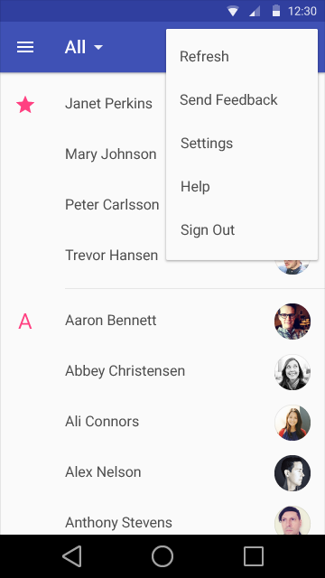
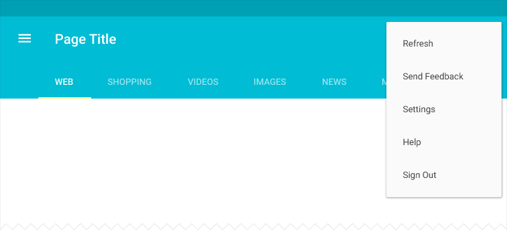
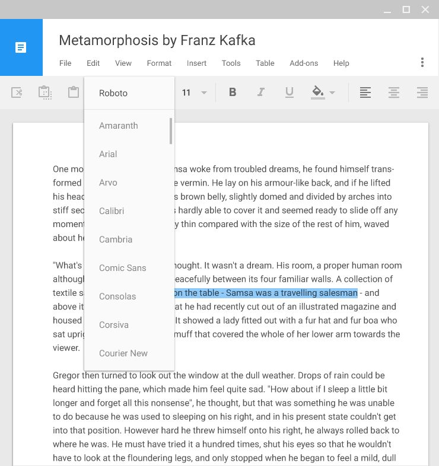
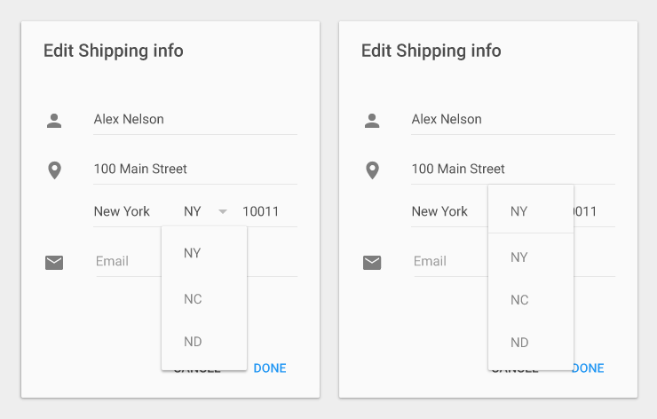
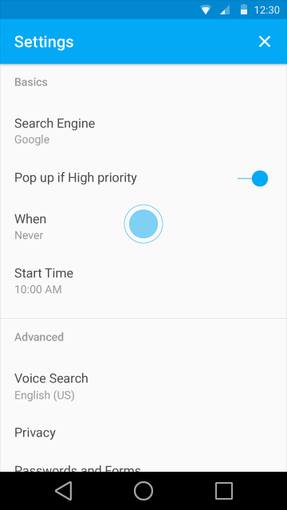
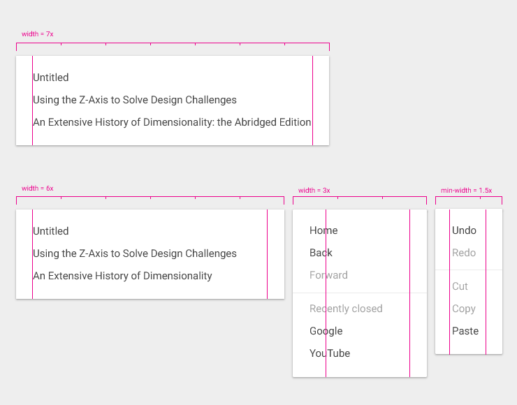
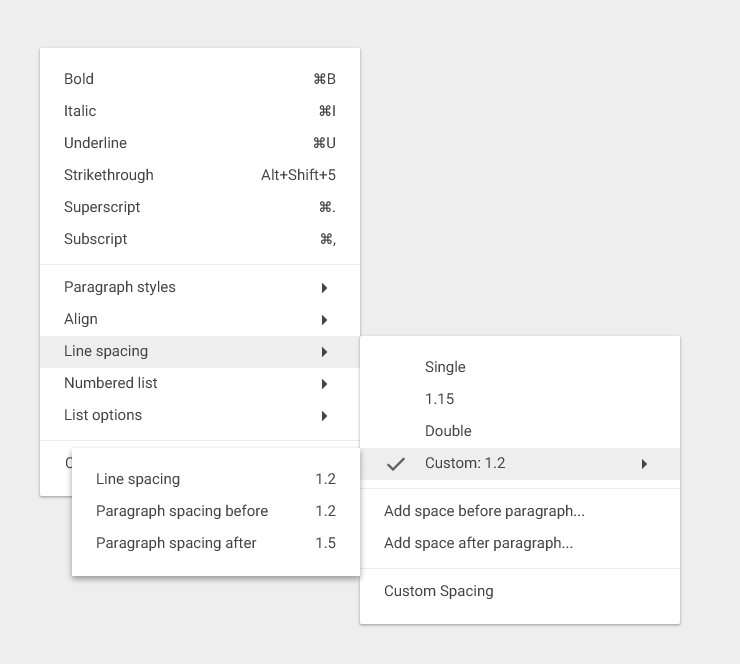

# Menus

---

## Usage

A menu is a temporary piece of paper emitted from a button, an action, a pointer, or another control that contains at least two menu items.

Each menu item is a discrete option or action that can affect the app, the view, or selected elements within a view.

Menus should not be used as a primary method for navigation within an app.

The label of an emitting button or control concisely and accurately reflects the menu items contained within the menu. Menu bars typically use single words as labels, like “file”, “format”, “edit”, and “view”, while other contexts may have more verbose labels.

Menus display a consistent set of menu items, each of which may be enabled or disabled based on the current state of the application.

Contextual menus dynamically change their available and enabled menu items based on the current state of the application.

Generally, remove menu items that are irrelevant to the current context, and disable menu items which are relevant but need certain conditions to be met (for example, Copy becomes enabled when text is selected).

Certain application states may result in a contextual menu containing only a single menu item. For example, when highlighting text on a web page, Android reveals only Copy, since users cannot cut or paste text.

Reposition menus vertically and horizontally based on their proximity to screen edges.

If the height of a menu prevents all menu items from being displayed, the menu can scroll internally. One example is when viewing a menu on a phone in landscape orientation.

A menu can also cascade.

These animations show scrolling and cascading menus in action.

<video width="739" height="762" src="http://material-design.storage.googleapis.com/videos/components-menus-menus-textfield_toolbar_large_xhdpi.webm" controls=""></video>

> Drop down 

<video width="740" height="555" src="http://material-design.storage.googleapis.com/videos/components-menus-menus-cascading_dropdown_spec_large_xhdpi.webm" controls=""></video>

> Cascading drop down

---

## Menu Items

Each menu item is limited to a single line of text that describes the action it will perform when selected.

The text is generally a single word or short phrase, but it can include icons and helper text, like keyboard shortcuts, as well as controls like checkmarks to indicate multiple selected items or states. See also [List Controls](components-listcontrols-en.html).

Menus with static content should have the most frequently used menu items placed at the top of the menu.

Menus with dynamic content may have other behavior, such as placing previously used fonts at the top of the menu. The order can change based on user actions.

Menu items can reveal nested submenus. Try to limit nesting to one level deep, as it can be difficult to navigate multiple nested submenus.

Displaying actions as disabled, rather than removing them, lets the user know they exist under the right conditions.

For example, Redo is disabled when there is nothing to Redo. Cut and Copy are disabled until content is selected.

---

## Behavior

Menus appear above all other in-app UI elements.

Dismiss a menu by tapping outside of the menu, or by tapping the emitting button (if visible)

Generally, selecting a menu item will also dismiss the menu. An exception is when a menu allows for multiple items to be chosen, for example, by using checkmarks.

Menus are positioned over their emitting elements such that the currently selected menu item appears on top of the emitting element.

Do not display a duplicate of the selected menu item.

Do.

Don't.

Menus do not horizontally align based on touch location.

Do.

Do.

Don't.

Don't.

---

## Metrics

Metrics are provided for various sizes and types of menus and for different platforms.

### Mobile

### Various widths

### Cascading menu

### Cascading redlines

