# 菜單

### 菜單讓用戶可以從一個暫時開啟，新的material表單的列表中以選擇的方式執行一個動作。

>內容
>
>[用法](#usage)
>
>[菜單項目](#menuitems)
>
>[行為](#behavior)
>
>[簡單菜單](#simplemenus)
>
>[規格](#specs)

## <h2 id='usage'>使用</h2>

菜單是一種從一個按鈕，一個動作，或者包含至少兩個菜單控制項，所觸發時出現暫時性的一張紙。

每個菜單項目是一個零散的選項或者動作，而這可能會影響到應用程式，檢視或者被選擇的元素中的呈現。

菜單不應該在應用程式上被用作一個頁面導航上的主要功能。

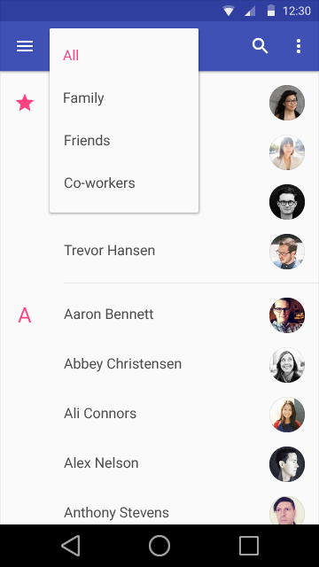

觸發按鈕的文字或者控制項的標籤，準確的反映出包含菜單裡的菜單項目。菜單列通常使用單字作為標籤，例如“文件”，“格式”，“編輯”，“檢視”，而其它情況下可能會有更詳細的標籤文字。

菜單是顯示一組相近菜單項目，其中每一個可以被啟用或者應用程式上當前狀態應該被禁止。

好的做法

不好的做法

根據應用程式的當前狀態上下文菜單動態改變其現有的和已啟用菜單項。

一般情況下，不放一些與當前上下文無關的內容的菜單項目，以及雖然是相關但是需要滿足某些特定條件的菜單項目。（例如：複製功能是當文字被選擇時會被啟用的）

某些應用程式的狀態下可能會導致內文菜單只包含單一菜單項目。例如：在網頁上凸顯文字，Android 只顯示複製文字，因為使用者不能剪下或貼上文字。

依據菜單靠近螢幕邊緣的程度將將菜單垂直地與水平地重新定位。

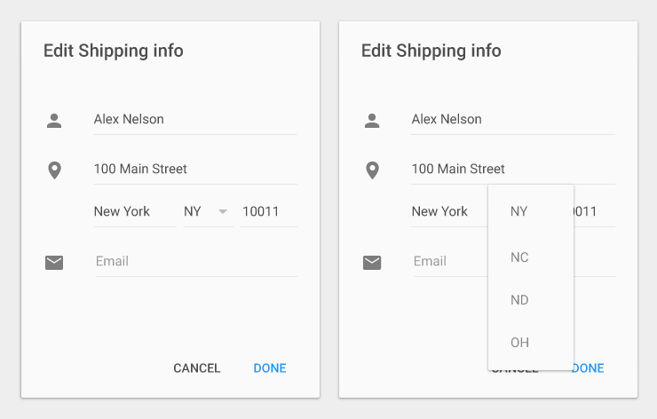

如果菜單的高度阻擋了所有菜單項目的顯示。那麼菜單可以使用內部的滾動方式。舉一個例子是，在橫向的手機顯示上檢視菜單時。

菜單也可以是層疊的。

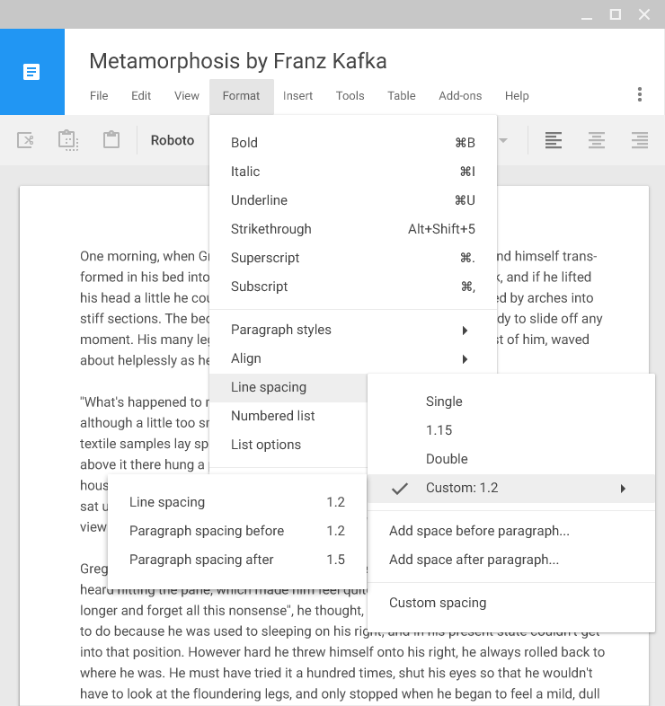

這些動作會顯示滾動以及層疊菜單。

<video width="739" height="762" src="http://material-design.storage.googleapis.com/videos/components-menus-menus-textfield_toolbar_large_xhdpi.webm" controls=""></video>

下拉式

<video id="whatismaterial-materialprop-physicalprop-020201_PaperShadow_Dont_xhdpi_007" width="360" height="402" controls="">
<source src="//material-design.storage.googleapis.com/publish/v_2/material_ext_publish/0B0NGgBg38lWWX2VYY3Vnd1J2cTQ/components-menus-usage-061001_Textfield_Dropdown_xhdpi_003.webm" type="video/webm">
<source src="//material-design.storage.googleapis.com/publish/v_2/material_ext_publish/0B0NGgBg38lWWcF9Ndmt1RTZoWk0/components-menus-usage-061001_Textfield_Dropdown_xhdpi_003.mp4" type="video/mp4">
</video>

文字下拉式

<video id="whatismaterial-materialprop-physicalprop-020201_PaperShadow_Dont_xhdpi_007" width="360" height="640" controls="">
<source src="//material-design.storage.googleapis.com/publish/v_2/material_ext_publish/0B2wX4iIvu8L6YVh1eDYzUTdLNVU/components-menus-usage-061001_Appbar_Dropdown_xhdpi_002.webm" type="video/webm">
<source src="//material-design.storage.googleapis.com/publish/v_2/material_ext_publish/0B2wX4iIvu8L6d3BWRGNFMEdWUnM/components-menus-usage-061001_Appbar_Dropdown_xhdpi_002.mp4" type="video/mp4">
</video>

應用程式下拉式

<video width="740" height="555" src="http://material-design.storage.googleapis.com/videos/components-menus-menus-cascading_dropdown_spec_large_xhdpi.webm" controls=""></video>

層疊下拉式

## <h2 id='menuitems'>菜單項目</h2>

每個菜單項目都限制在一個本文內，說明這個動作將在被選擇時會被執行。

本文通常是一個單字或者很短的語句，不過它可以包含圖示以及幫助本文。例如鍵盤的快捷鍵，和控制項。就像是複選方塊來表示多個項目或狀態。請詳見 [控制項列表](components-listcontrols-en.html).

靜態內容的菜單應該放在菜單上方作為最常用的項目。

動態內容的菜單包含可能有其他行為，例如：以前在菜單上選擇字體時，會根據使用者動作而改變。

菜單項目可以顯示巢狀式的子菜單。試著限制使用一層的巢狀式的方式，因為它會讓多重嵌入的巢狀式子菜單變得更難以控制。

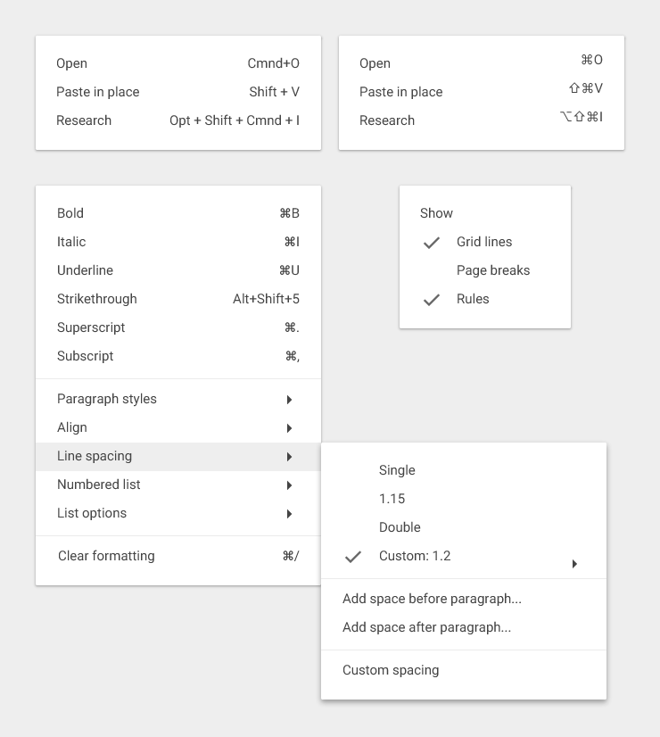

當顯示動作為禁止時，而不是要將它們移除，需要讓使用者知道必須在適當的情況下，這些被禁止的動作才能啟用。

例如：重做的功能是當這個動作不需要再重做時，此時這個按鈕是被禁止的。剪下以及複製是在內容被選擇的時候才會出現的功能。

---

## <h2 id='behavior'>行為</h2>

菜單顯示上述所有其他在應用程式的 UI 元素。

菜單的消失，可以透過點選菜單以外的區域，或者在觸發按鈕上點選。

一般的情況下，選擇一個菜單項目也會將菜單消失。當菜單允許多個項目選擇的時候，這時將是屬於例外情形。例如：使用複選方塊控制項。

菜單被定位在觸發菜單的元素上面，使得當前選擇菜單顯示在觸發元素的上方。

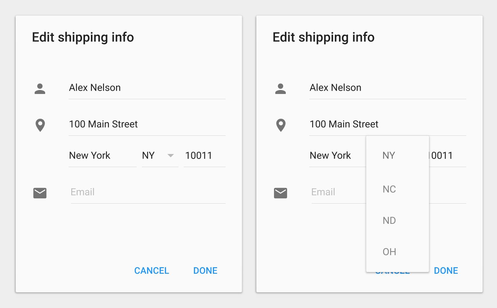

好的做法

不要顯示一個重複的菜單項目

不好的做法
菜單被定位在觸發菜單的元素下面使得菜單和內文分離。

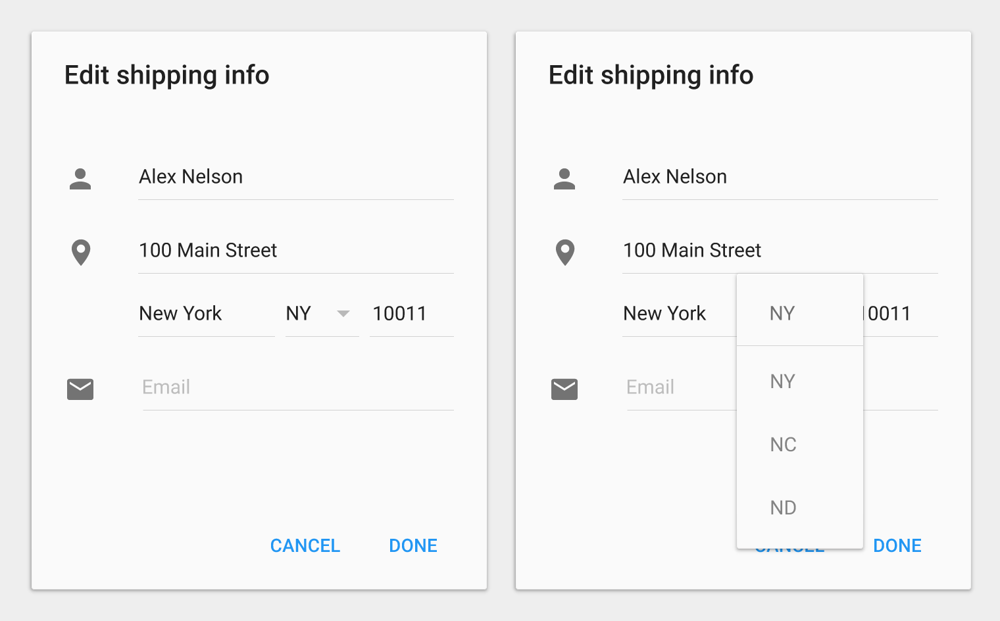

---

## <h2 id='simplemenus'>簡單菜單</h2>

簡單菜單是用在平板電腦上顯示列表以及在行動裝置上顯示一個特別列表物件的選項。

去除不明確性：與簡單菜當相反，簡單對話框可以顯示更多和一個列表項目可選擇選項的相關細節或者提供導航或與主要工作相關的動作。雖然它們可以顯示同樣的內容，因為簡單菜單對於用戶當下所在的內文造成較小的干擾，所以在簡單對話框上偏向使用簡單菜單。

使用簡單菜單在列表上來顯示特定列表項目的各種選項。

選擇一個選項立即送出選擇並且關閉菜單。

點擊在菜單之外或點擊上一頁會取消動作和關閉菜單。

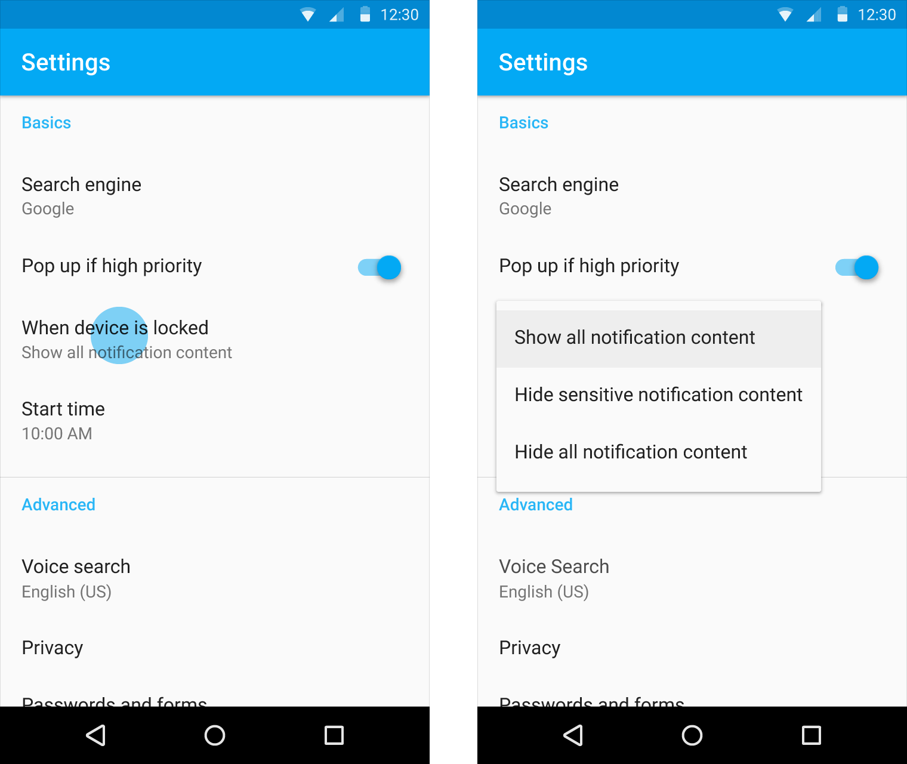

當開啟時，簡單菜單嘗試將列表項目垂直對齊於選取的菜單項目。

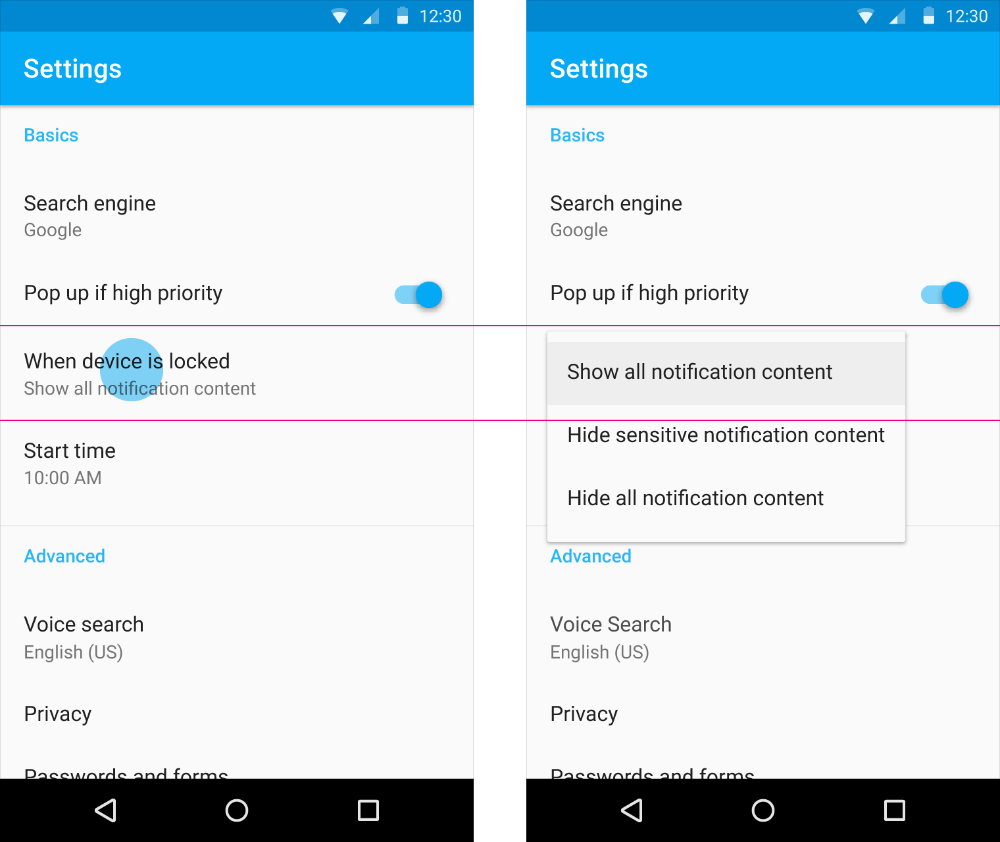

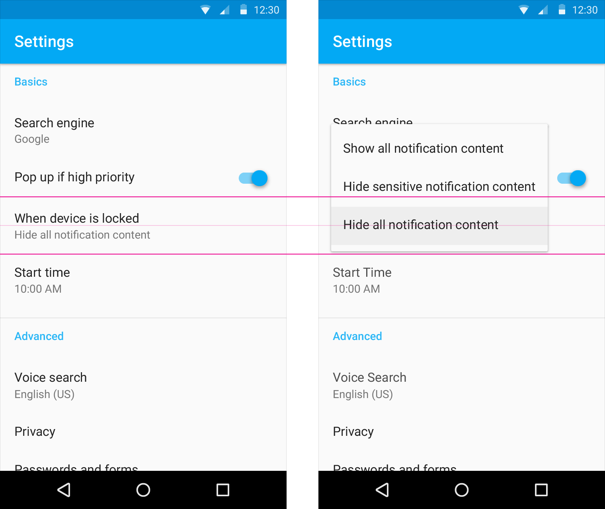

當靠近畫面邊緣時，簡單菜單改變它們的垂直位置以便讓所有菜單項目都可被見到。

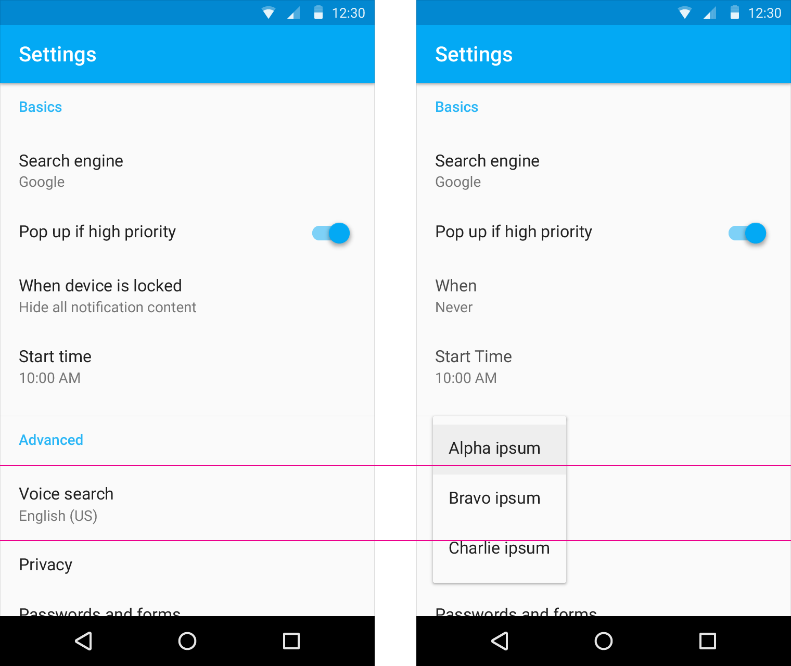

好的做法

不要任意地將第一個菜單項目置於列表項目上。

不好的做法

簡單菜單顯示在投射菜單的元素的上方，而不是下面。

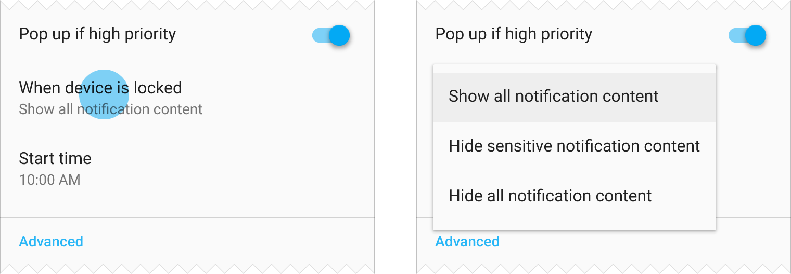

好的做法

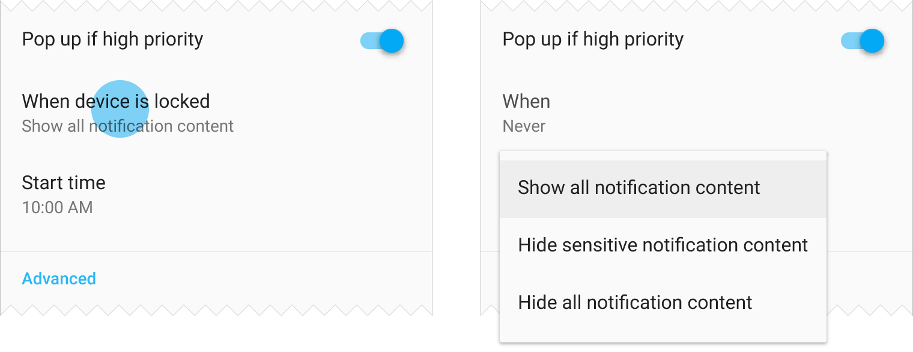

不好的做法

菜單寬度依據字串長度不同而變化。

簡單菜單在畫面左邊以及右邊永遠保持一個16dp的邊緣（手機上）或者24dp的邊緣（平板電腦上）。

當內容是可捲動時，菜單顯示一個一致的捲軸。

好的做法
有可捲動的內容時預設顯示捲軸。

不好的做法
沒有捲軸的話就無法清楚表達還有其他菜單項目可選擇。

不要複製以選取的菜單項目。

好的做法

不好的做法
不要重複顯示已選取的元素。

簡單菜單永遠和列表項目文字對齊，而且不會依據點擊地點而水平地改變位置。

好的做法
簡單菜單不論點擊地點在何處都置左。

不好的做法
簡單菜單不依據點擊地點來改變位置。

---

## <h2 id='specs'>規格</h2>

規格是提供給不同尺寸與類型的菜單以及給不同平台的。

### 行動

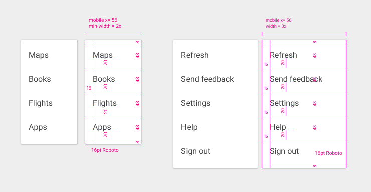

### 各種寬度

### 層疊菜單

### 層疊紅線

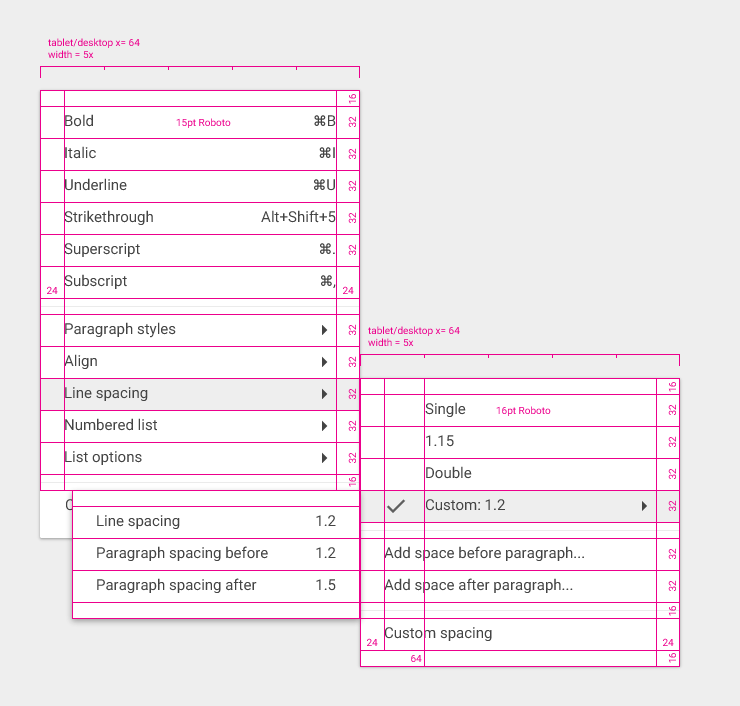

---

*翻譯：[Weiju](http://weijutu.blogspot.tw/)*
*修訂：[Sean Chen](https://www.facebook.com/shihneng.chen)*
