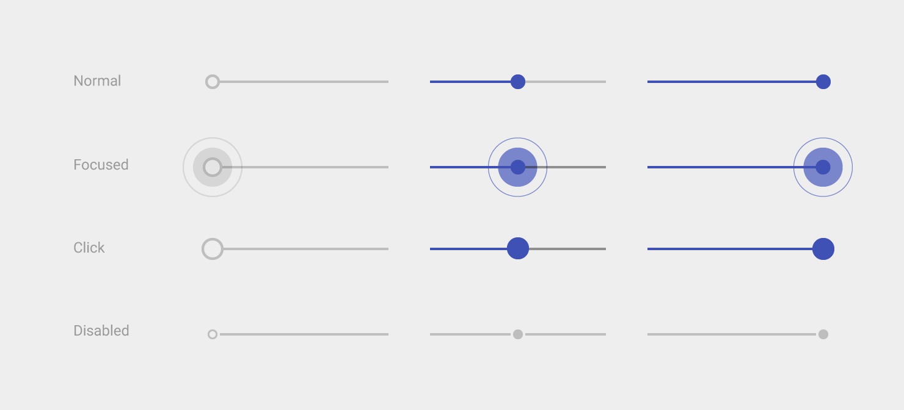
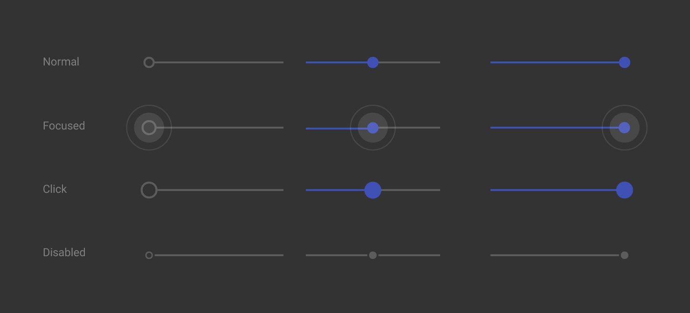
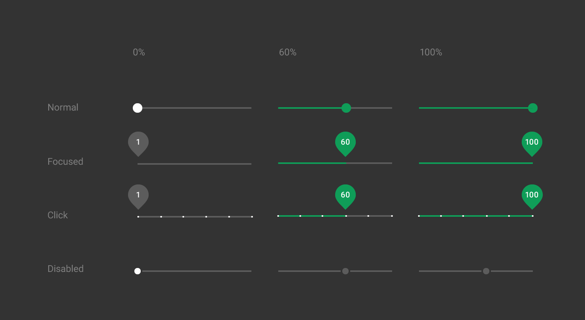

# 滑軌

讓使用者透過移動滑軌的方式，從連續或不連續的一段範圍值中選取當中的一個值。
最小值在左邊，最大值在右邊。
滑軌的左右邊可以用圖示來表示值的大小。
移動滑軌這種自然的互動方式來調整音量，亮度，顏色飽和度等等的設定值是一種很不錯的選擇。

## 連續性滑軌

用來作為主題設定，使用者不需要一個有著明確意義的數值。

> Light Theme

> Dark theme

<video id="components-sliders-continuous--1"  width="370" height="301" controls>
<source src="//material-design.storage.googleapis.com/videos/components-sliders-continuous_large_xhdpi.webm" type="video/webm">
<source src="//material-design.storage.googleapis.com/videos/components-sliders-continuous_large_xhdpi.mp4" type="video/mp4">
</video>

滑軌上的左邊或/和右邊圖示和滑軌間的空格

### 可編輯的數字

用來給使用者設定精確的數值，在數字上點一下，就會變成可編輯。

## 不連續滑軌

在滑軌上有著平均間隔的數字標示，可以讓使用者選擇代表明確意義的數字。
每個標示，會隨著滑動到不同位置，讓使用者可以清楚分辨目前所調整的等級。
這些數值都是事先所定義好，使用者是無法編輯的。

### 有數字的標籤

用來讓使用者可以明確知道目前所設定的數字是多少

> Light theme

> Dark theme

<video id="components-sliders-discrete--1"  width="360" height="305" controls>
<source src="//material-design.storage.googleapis.com/videos/components-sliders-discrete_large_xhdpi.webm" type="video/webm">
<source src="//material-design.storage.googleapis.com/videos/components-sliders-discrete_large_xhdpi.mp4" type="video/mp4">
</video>

> *翻譯：[Mkdodos](https://www.facebook.com/mkdodos)*

