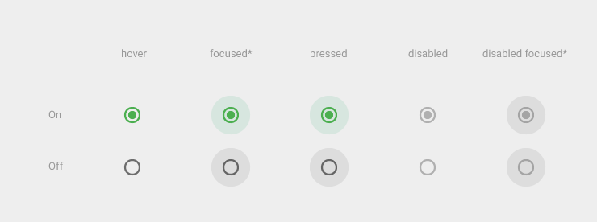
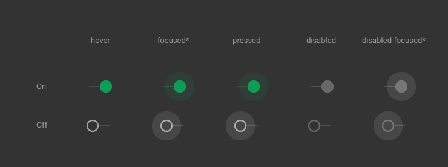

# 開關

Switches allow the user to select options. There are three kinds of switches: checkboxes, radio buttons, and on/off switches.

Note: The graphic rings illustrated in the following examples represent animation and do not represent what buttons should look like in implementation.

開關提供選項讓使用者選擇。有三種類型的開關：核取方塊、選項按鈕和 on/off 開關。

注意：在接下來的例子中的圓形(譯註：半透明的)是代表一個(操作)動畫，並非按鈕實際的外觀。

---

## 核取方塊

Checkboxes allow the user to select multiple options from a set.

If you have multiple on/off options appearing in a list, checkboxes are a good way to preserve space.

If you have a single on/off option, avoid using a checkbox and use an on/off switch instead.

By actively transforming from a box into a checkmark, the action of checking something off feels more fulfilling and directly manipulated.

Checkboxes use animation to communicate focused and pressed states.

<video width="360" height="640" src="http://material-design.storage.googleapis.com/videos/components-switches-checkbox-spec_checkbox_large_xhdpi.webm" controls=""></video>

> Checkbox motion

---

## 選項按鈕

Radio buttons allow the user to select one option from a set. Use radio buttons for exclusive selection if you think that the user needs to see all available options side-by-side.

Otherwise, consider a pulldown, which uses less space than displaying all options.

Radio buttons use animation to communicate focused and pressed states.

<video width="360" height="640" src="http://material-design.storage.googleapis.com/videos/components-switches-radiobutton-spec_radio_large_xhdpi.webm" controls=""></video>

> Radio motion

---

## 切換開關

On/off switches toggle the state of a single settings option. The option that the switch controls, as well as the state it’s in, should be made clear from the corresponding inline label. Switches will take on the same visual properties of the radio button.

Switches use animation to communicate focus and pressed states.

The on/off slide toggle with the words “on” and “off” baked within the asset is deprecated. Use the switch shown here instead.

<video width="360" height="640" src="http://material-design.storage.googleapis.com/videos/components-switches-switch-switches_spec_03_large_xhdpi.webm" controls=""></video>

Use the outer radial expansion only on form factors that favor finger touch, where interaction may obstruct the element completely. For desktop usage with a mouse, you do not need this extra indication.

