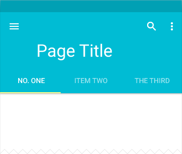
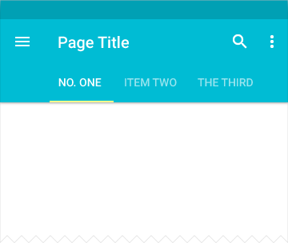
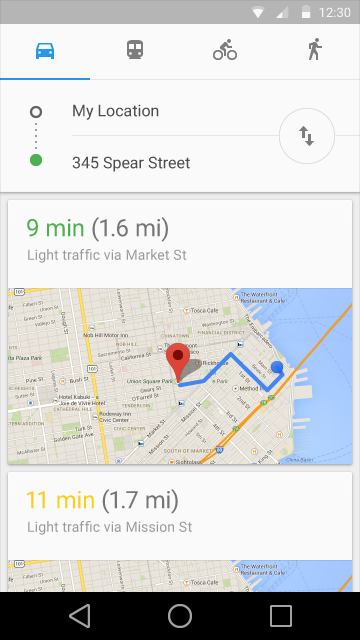
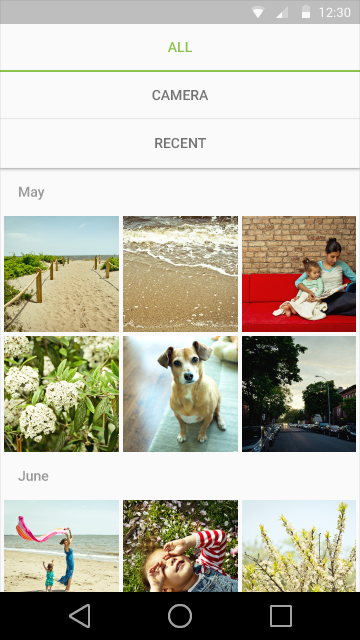
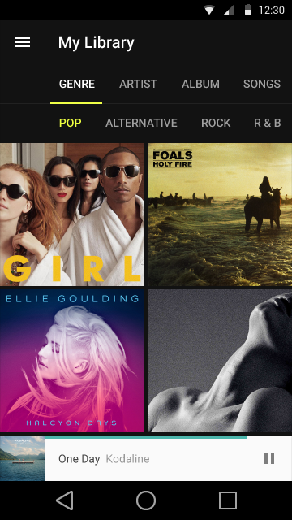
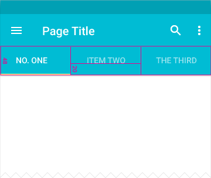

# Tabs

Tabs make it easy to explore and switch between different views or functional aspects of an app, or to browse categorized data sets.

---

## Usage

A tab provides the affordance for displaying an associated grouping of content. A tab label succinctly describes the tab’s associated grouping of content.
 
### Mobile Tabs

> Extended app bar + tab bar

> Inset search + app bar + tab bar

> Default app bar + tab bar

 
> Default app bar + scrollable tab bar
 
 

> Text color same as tab indicator

 
 
> Tab bar locked on scroll

### Desktop tabs

 
> Default app bar + tab bar

> Addition of “More” overflow dropdown menu

> Tab overflow pagination, Step 1
 

 
> Menu expanded

> Tab bar centered

### When to use

Use tabs to divide large amounts of related data or options into more digestible, focused groups with the goal of aiding content navigation or content organization, without the need to navigate away from the current context.

Although tabbed content may be navigational in nature (e.g., map route options that change a map view, search results leading to other sites), tabs are not themselves used for navigation.

Tabs are also not used for carousels or pagination of content (for example, swiping between pages of apps).

 
> Do.
 

> Don't.

### Tab characteristics

Tabs are presented as a single row.

Tabs should not be nested. That is, content in a tab should not consist of another set of tabbed content.

A set of tabs contains at minimum a pair of tabs and no more than six tabs.

Tabs control the display of content in a consistent location.

The tab corresponding to the visible content is highlighted.

Tabs are grouped together and the group of tabs are in turn connected with their content.

Keeping tabs adjacent to their content helps maintain the relationship between the two, as too great a separation can introduce ambiguity.
 

> Do.

 
> Don't.

 
> Do.

 
> Don't.

---

## Content

Tab content

Content presented in tabs can vary widely, even between tabs. For example, different years within a tabbed portfolio or different types of settings.

All content within a set of tabs should be related under a larger organizing principle (e.g., Settings, Directions), with each tab’s content mutually exclusive of the others.

Tab labels should provide meaningful distinctions that logically organize associated content.

Tab labels may be icons or text, and must not be truncated.

Avoid the need for cross-tab comparison of content; significant cross-tab comparison may indicate the content would benefit from a different organization or presentation.

---

## Types of Tabs

Depending on platform and context of use, tabbed content can be presented as either fixed tabs or scrollable (swipeable) tabs.

### Fixed tabs

Fixed tabs display all tabs concurrently and are best used with content that benefits from quick pivots between tabs (e.g., switching transportation methods for directions in Maps).

The maximum number of tabs is effectively limited by the view’s width. Fixed tabs have equal width, based on the widest tab label. To navigate between fixed tabs, touch the tab or swipe the content area left or right.

### Scrollable tabs

Scrollable tabs display a subset of tabs at any given moment, and can contain longer tab labels and a larger number of tabs. They are best used for browsing contexts in touch interfaces when users don’t need to directly compare the tab labels.

To navigate between scrollable tabs, touch the tab, swipe the tabs left or right, or swipe the content area left or right.

---

## Specs

### Fixed and full-screen width

Tab Width: 1/3 of screen 

Tab Indicator: 2 dp height 

Text: 14 sp Roboto Medium 

Text is centered in the tab cell 

Active text color: #fff or secondary color 

Disabled text color: #fff 60%

### Scrollable

Tab Width: 12 dp + Word length + 12 dp 

Tab Indicator: 2 dp height 

Text: 14 sp Roboto Medium 

Active text color: #fff or secondary color 

Disabled text color: #fff 60%

### Desktop/Tablet

Tab Width: 24 dp + Word length + 24 dp 

Tab Indicator: 2 dp height 

Text: 14 sp Tablet, 13 sp Desktop Roboto Medium 

Active text color: #fff or secondary color 

Disabled text color: #fff 60%

### Tab touch target animation

<video width="456" height="115" src="http://material-design.storage.googleapis.com/videos/components-tabs-spec-tabtouch-example_large_xhdpi.webm" controls=""></video>