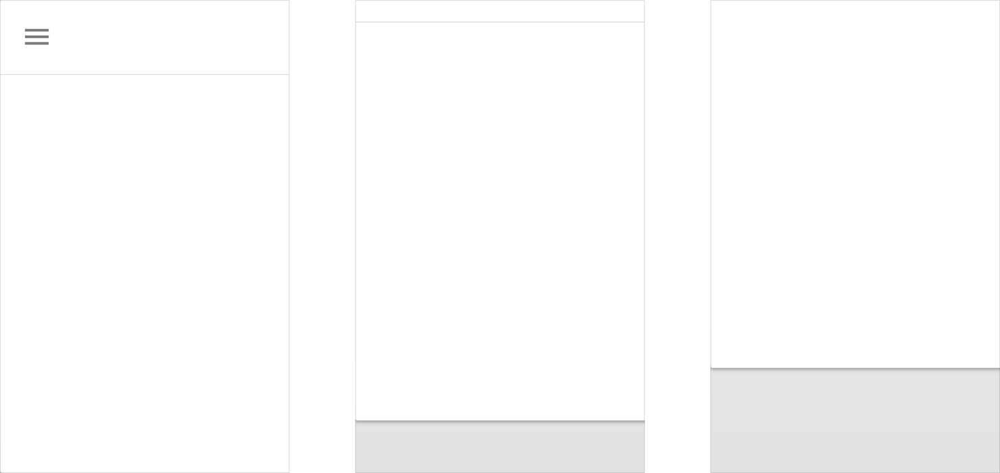
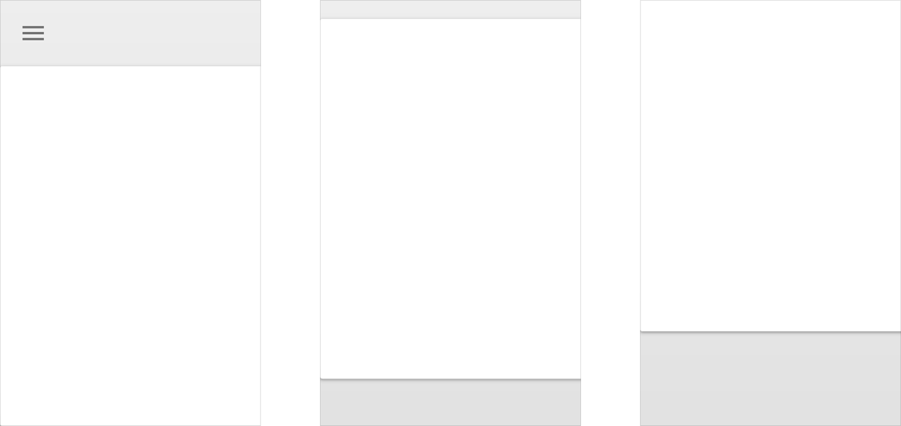
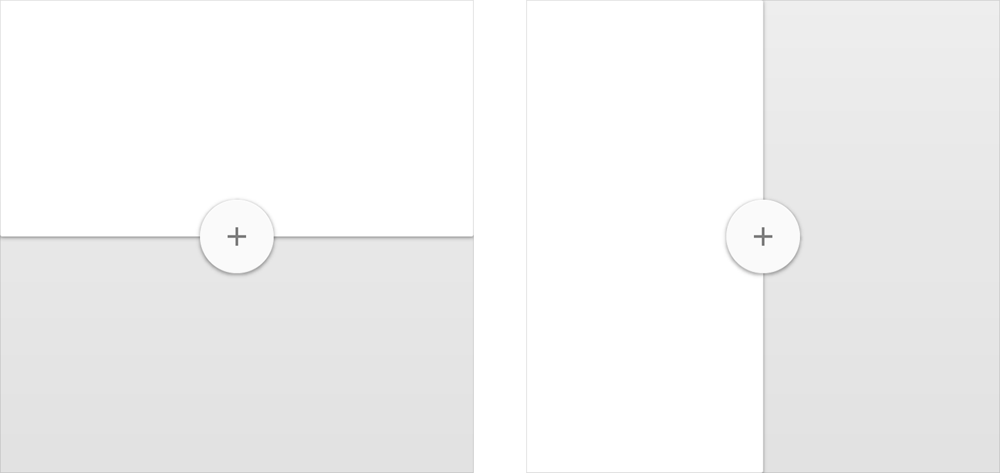
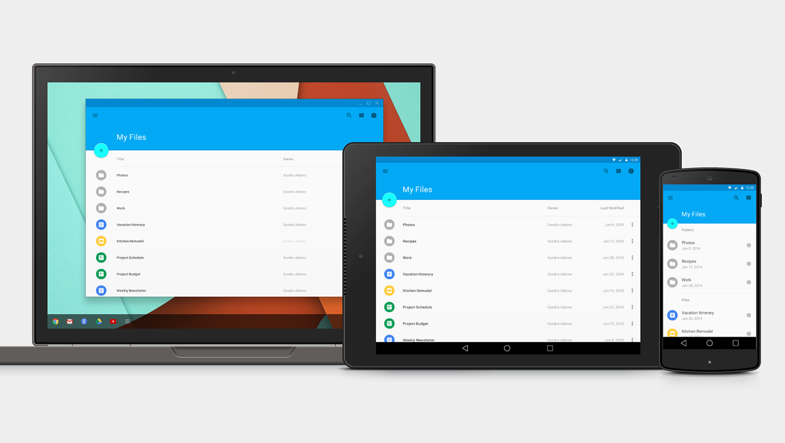
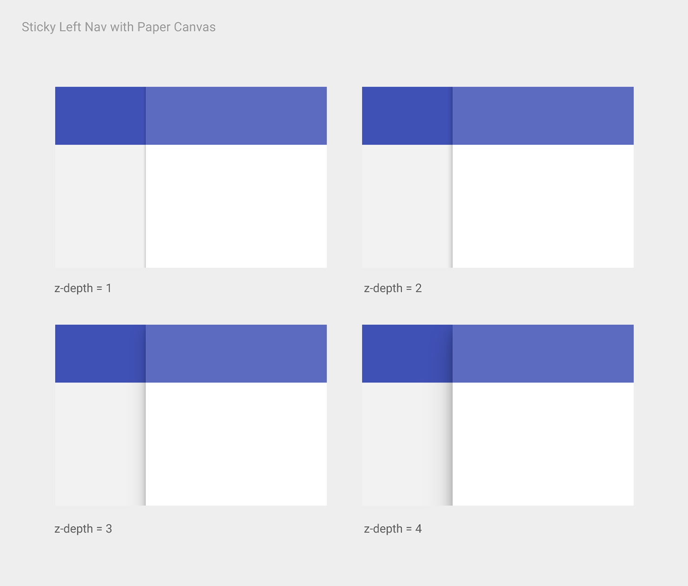

# Principles

Material design utilizes fundamental tools that have come from the world of print design, like baseline grids and a common set of structural grids that works across various pages. The layout is designed to scale across different screen sizes and will help facilitate UI development and ultimately help you make scalable apps.

The layout guidelines also encourage apps to have a consistent look and feel by using the same visual elements, structural grids, and general spacing rules across platforms and screen sizes. Structural and visual consistency creates an environment for the user that is recognizable across products, which facilitates usage by providing users with a high level of familiarity and comfort.

Before delving into layout details, consider again what material design is: a design based on the qualities of paper. Understanding the rules of how paper behaves and is crafted is important.

---

## Paper Craft

**In material design, every pixel drawn by an application resides on a sheet of paper.** Paper has a flat background color and can be sized to serve a variety of purposes. A typical layout is composed of multiple sheets of paper.

The system may draw pixels for elements such as status or system bars, which don’t reside on paper. It’s helpful to think of such system elements as being printed on the back side of the display’s glass, on a surface that is separate from the app content beneath.

### Arranging Paper

**Seams** are created when two sheets of paper share the full length of a common side. Two sheets of paper joined by a seam will generally move together.

**Steps** are created when two sheets of paper with different z-order positions overlap and thus typically move independently of each other.

### Paper Toolbars

A **toolbar** is a strip of paper focused on presenting actions. These actions usually cluster at the left and right edges of the toolbar. Actions related to navigation (a drawer menu, an up arrow) appear at the left, while actions that apply to the current context are at the right.

The left and right actions in a toolbar are never split by another sheet of paper. However, a toolbar can constrain its width to less than the full length of its paper.

> **Do.**
>
> Constrain width to less than the full length of its paper.

> **Don't.**
>
> Never allow a sheet of paper to be split by another sheet of paper.

Toolbars frequently form a step above another sheet of paper that displays the content the toolbar’s actions relate to. As that paper scrolls beneath the toolbar, the toolbar clips that paper at the point of entry, preventing it from passing through to the opposite side.

A toolbar can also be initially presented as seamed with a second paper, but then lift to form a step. This variant of clipping is called **waterfall**.

Alternately, the toolbar can maintain its seam, **pushing** off the screen as the two papers move together.

Finally, the second paper can cover the toolbar as it moves.

Toolbars have a standard height, but can be taller. When taller, the actions can pin to either the top or the bottom of the toolbar.

Toolbars can change height dynamically once they become pinned. When resizing, they snap (thresholding with hysterisis) between their maximum and minimum (standard) heights.

### Floating Actions

A **floating action** is a circular paper separate from a toolbar.

A floating action represents a single promoted action for its context. A floating action can straddle a step if it relates to the content of the paper creating that step.

A floating action can straddle a seam if it relates to the content of both of the papers creating that seam.

Never introduce a decorative seam merely to provide an anchoring point for an action.

---

## Responsive Pricipples

When building layouts across devices, we combine fixed, sticky, and fluid strategies for grid behavior.

Here are a few simple guidelines to follow:

1. Respect Human Constants.
2. Larger Screen ≠  Larger cognitive capacity.
3. Line lengths should be digestible.
4. Account for angular distance.
5. Pull the furniture off the walls: allow whitespace, and don't restrict yourself to anchored toolbars.

Use strategies at multiple levels of hierarchy, like at screen level and card level.

The Desktop Template demonstrates a few responsive screens with all of the grid rules applied.

> [Desktop Template](http://material-design.storage.googleapis.com/downloads/Layout_Desktop_Whiteframe.ai)

---

## Dimensionality

Depth in is measured in dps, just like the X- and Y-axis. However, it is more useful to think of the **priority** of elements within Z-space rather than in terms of absolute, fixed positions.

### A conceptual model

At a high level, each app can be considered to live in a distinct space or container.

This means that pieces of paper in one app do not interleave in z-space with paper in another app.

It also means that actions and items are isolated to an app: for example, swiping to dismiss a list item in one app will not cause that list item to traverse the space of another unrelated app.

Containers allow multiple apps to be in view simultaneously, for example, in multiple browser tabs.

Within a specific app, most elements are relatively positioned according to major and minor steps along the Z-axis. For example, a button’s focus state is a minor step, while its pressed state is a major step.

Other elements have a fixed priority within the app’s z-space, meaning they always appear above or below other elements, regardless of those items’ relative position along the z-axis. For example, the floating action button always appears above content and toolbars, regardless of how many sheets of paper may be in use by the app.

System elements, such as the status bar and system dialogs, exist in a separate system space above and below all app containers.

Depending on context, system elements may not be present in an app (for example, in Lights Out mode), but the system space establishes the relative priority of system elements when they do exist. This ensures, for example, that a system dialog box always appears above the current app.

### Layout considerations

Depth is not ornament.

Think in terms of element priority within z-space, not absolute position.

Depth within an app should communicate hierarchy and importance, and help focus users’ attention to the task at hand.

### Shadows

Shadows consist of two layers: a top shadow for depth and a bottom shadow for definition.

