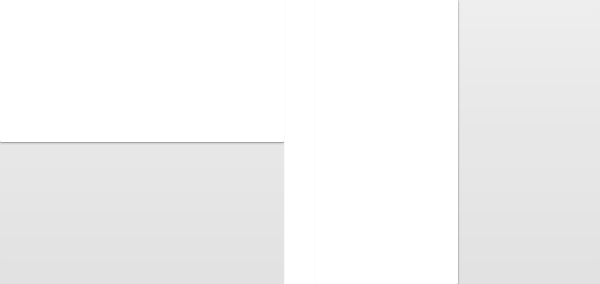
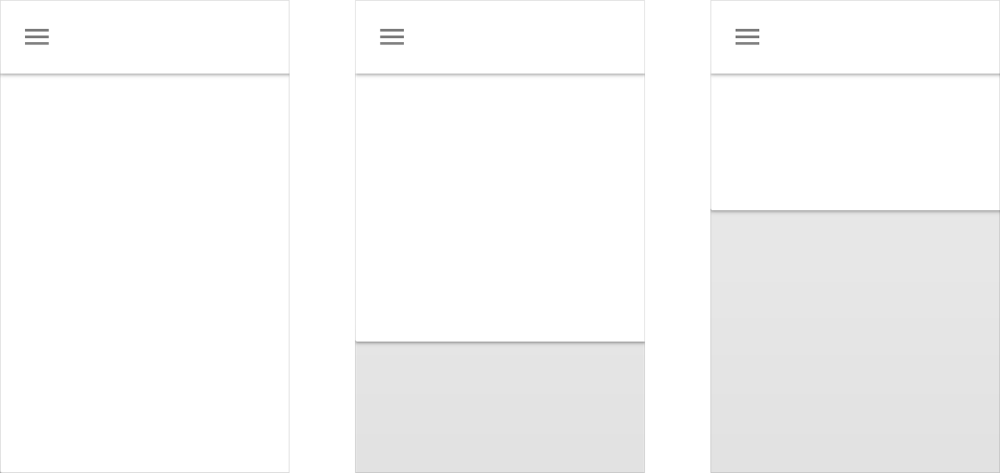
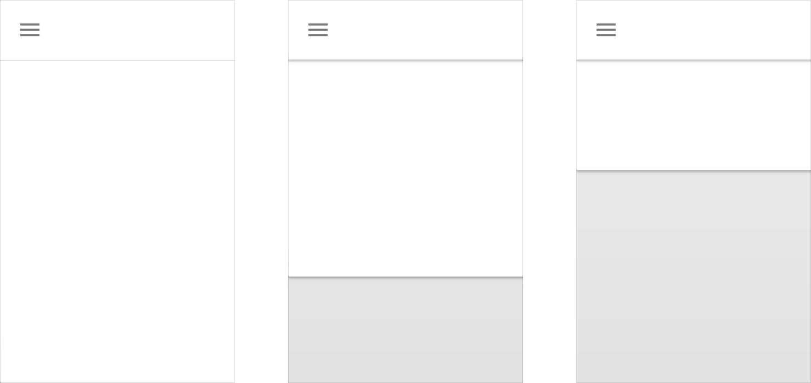
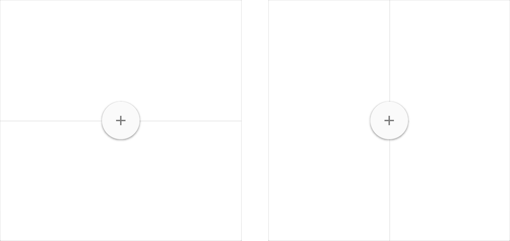
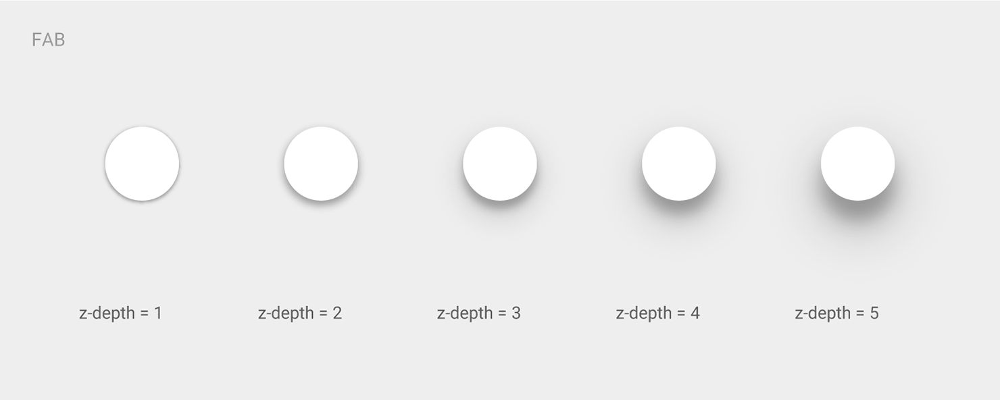
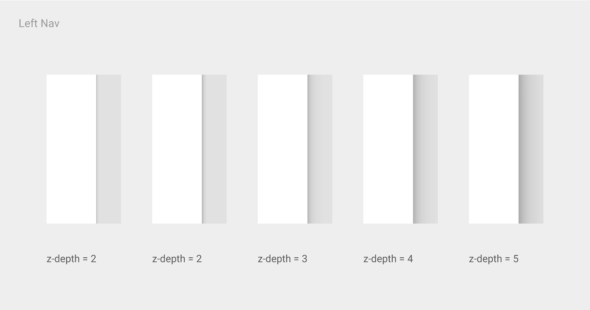
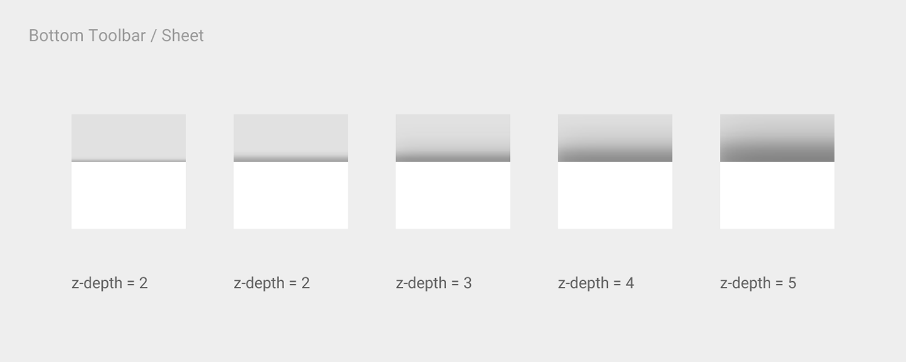

# 原則

Material design的根本都是來自現實世界中的印刷設計，像是頁面的基線以及網格結構。這種排版都是被設計給跨不同屏幕尺寸並且便於UI的開發，最終的目的是要做出可伸縮的應用程式。

排版規範也強烈建議Apps擁有一致且使用相同的視覺元素、網格架構以及間距，在不同的平台以及屏幕尺寸皆是如此。架構以及視覺的一致性可以幫助使用者有條理的認識各式產品，提供用戶更高水準的熟悉且舒適環境。

在深入的了解排版細節之前，請思考Material Design是一種基於紙張特性的設計。了解紙的特徵以及細節是很重要的。

## 紙的工藝

**在Material Design，應用程式的所繪製像素就像是在一張紙上**，紙擁有平坦的背景顏色以及大小，可以用在各種用途，典型的排版是由多張紙組成。

系統可能有一些元素，像是狀態或者捲軸，那些不存在於紙上。比較好的思考就是這些系統元素是被顯示在顯示器玻璃的背面，它是和表面的應用程式是分離的，且是顯示在下方。

### 紙的排列

在兩張紙共用一個全長的面上都會產生**接縫**。而兩張紙的連接也是靠這接縫，而且接縫通常會一起移動。

**階層**是兩個不同Z軸的紙張所交疊而形成，且兩紙張通常是獨立的移動。

### 紙的工具欄

**工具欄**是一個長條狀且顯示在紙上的焦點，用於展示各種功能。這些功能通常在於工具欄的左右側。導航功能的顯示於左側(收合選單、向上箭頭)，而功能被運用在內容的則是顯示在右側。

在工具欄左右側的功能，絕對不能被其他的紙張隔開。因此，工具欄可以限制它的寬度小於紙張的全寬。

> **Do.**
>
> 限制它的寬度小於紙張的全寬。

> **Don't.**
>
> 絕對不允許被額外的紙張隔開。

工具列經常因頁面動作影響下方顯示主要內容的紙，當紙在工具列下方捲動時，工具列形成一個點阻止紙張的進入，防止它通過到另外一端。

工具欄一樣可以與其他的紙產生接縫，隨後向上抬起形成了階層，這樣的變異被稱為**瀑布**(waterfall)。

另外，工具欄依然可以維持其接縫，讓兩張紙在屏幕上同時**推移**。

最後，另一張紙也能在移動時，覆蓋在工具欄上方。

工具欄有一個標準的高度，但也能夠更高。當在更高的情況下，功能選單也同時需要固定在工具欄的頂或底部。

在位置固定時工具欄可以動態的改變高度，在縮放的時候將截取他們最大及最小(標準)的高。

### 浮動動作

浮動的動作是一個圓形紙樣，它是從工具欄分離出來的。

浮動動作表示一個前上下的轉換行為。如果有紙組成是階層，浮動動作紙樣能夠跨過這一個階層。

如果內容的紙張是由接縫組成的，浮動動作紙樣也能跨過一個接縫。

絕不要用裝飾接縫只是來固定一個浮動動作紙樣。

## 響應式的原則

當建立一個跨裝置的排版，我們的網格行為結合了固定、黏行以及流體的方法。

這裡我們有一些簡單的樣式規範需要去遵循：

1. 尊重人的常態行為
2. 更大的屏幕 ≠ 更多的認知容量
3. 線的長度應該能夠被削減。
4. 賬戶與角的距離
5. 將內容遠離邊界：允許空白，別將自己限制於工具欄的錨點。

要使用這樣的方法對應不同等級的階層，像是屏幕與卡片的差距。

以下的樣板套用了格線規則來展示響應式效果。

> [樣板](http://material-design.storage.googleapis.com/downloads/Layout_Desktop_Whiteframe.ai)

## 維度

DPS是深度的單位，就像在X軸和Y軸。但是，它是比較有用的思考範圍內的Z-空間，而不是元素的優先級在絕對的，固定的位置而言。

深度的測量單位是dps，就像是X與Y軸，當然它也能夠想像成元素的優先值。相較於元素絕對位置與固定位置的Z軸，dps也比較能夠理解優先順序。

### 概念模型

高層次的每個應用程式都必須考慮不同空間及容器。

This means that pieces of paper in one app do not interleave in z-space with paper in another app.

It also means that actions and items are isolated to an app: for example, swiping to dismiss a list item in one app will not cause that list item to traverse the space of another unrelated app.

Containers allow multiple apps to be in view simultaneously, for example, in multiple browser tabs.

Within a specific app, most elements are relatively positioned according to major and minor steps along the Z-axis. For example, a button’s focus state is a minor step, while its pressed state is a major step.

Other elements have a fixed priority within the app’s z-space, meaning they always appear above or below other elements, regardless of those items’ relative position along the z-axis. For example, the floating action button always appears above content and toolbars, regardless of how many sheets of paper may be in use by the app.

System elements, such as the status bar and system dialogs, exist in a separate system space above and below all app containers.

Depending on context, system elements may not be present in an app (for example, in Lights Out mode), but the system space establishes the relative priority of system elements when they do exist. This ensures, for example, that a system dialog box always appears above the current app.

### Layout considerations

Depth is not ornament.

Think in terms of element priority within z-space, not absolute position.

Depth within an app should communicate hierarchy and importance, and help focus users’ attention to the task at hand.

### Shadows

Shadows consist of two layers: a top shadow for depth and a bottom shadow for definition.

> *翻譯：[Casper](https://www.facebook.com/chihcheng.wang.3)*