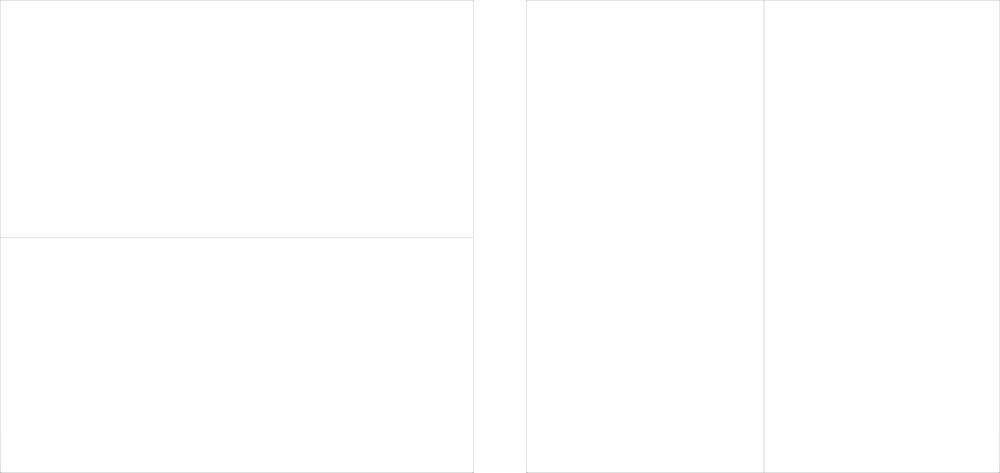
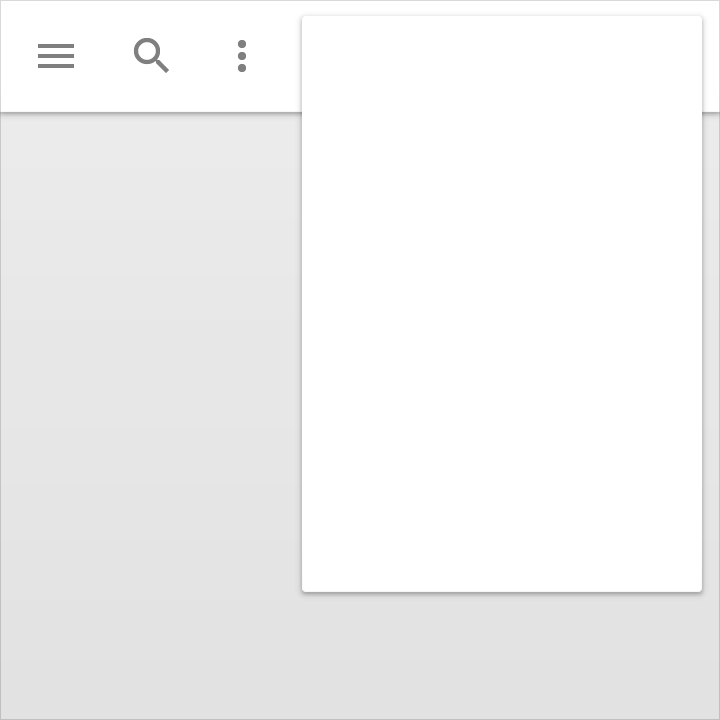
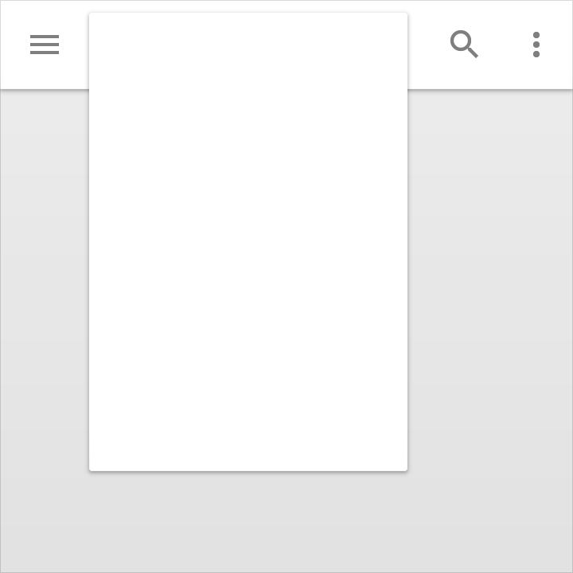
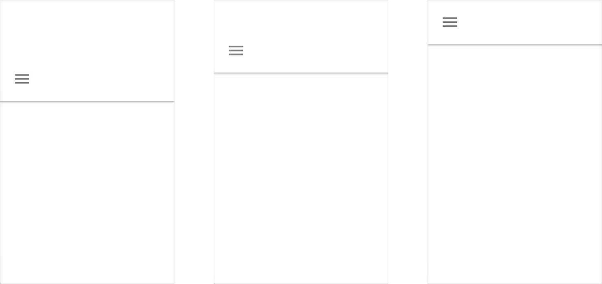
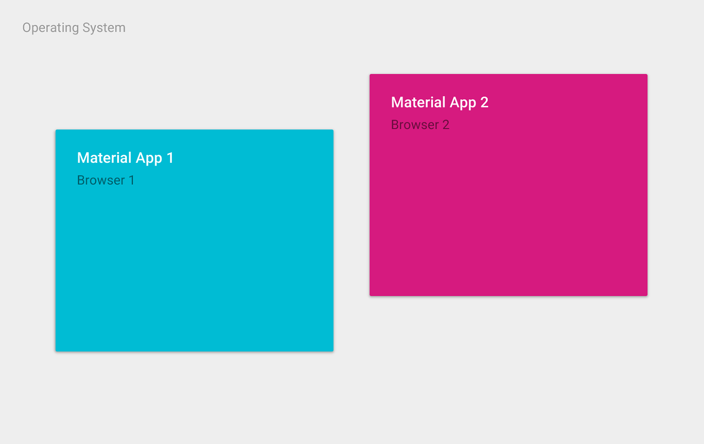
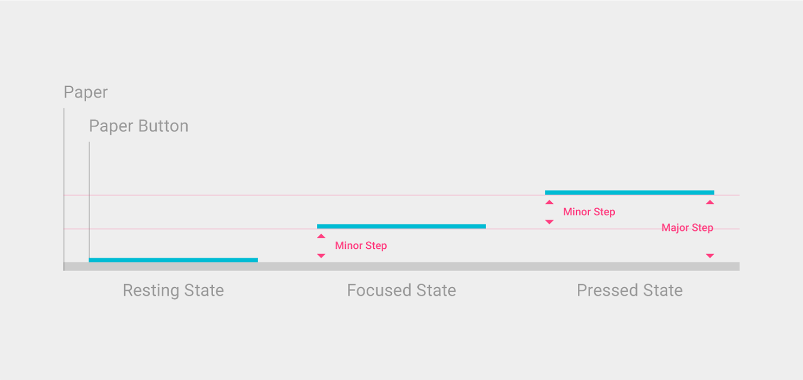
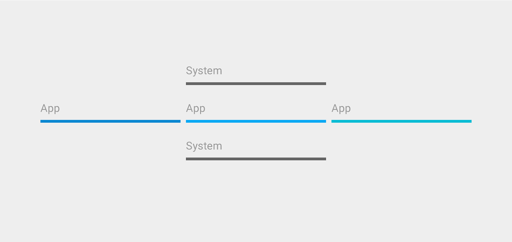
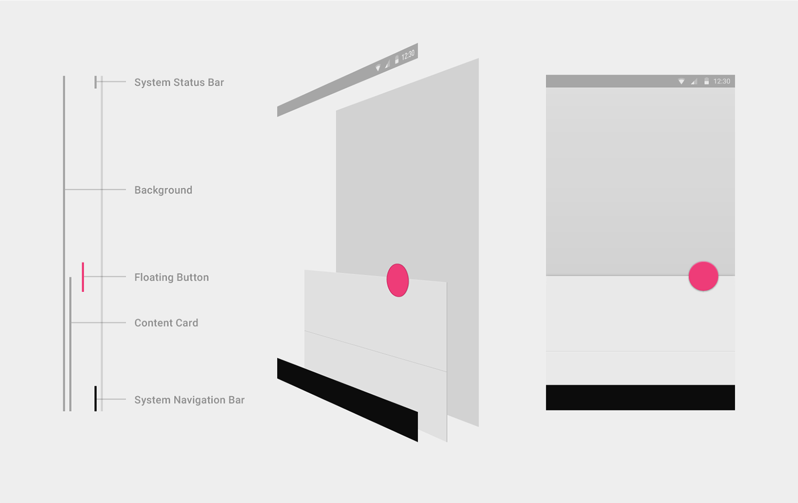
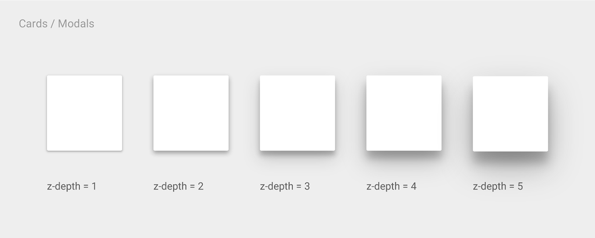
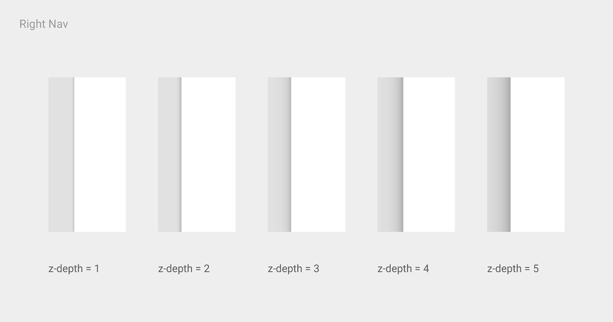

# 原則

Material design的根本都是來自現實世界中的印刷設計，像是頁面的基線以及網格結構。這種佈局都是被設計給予不同屏幕尺寸且便於UI的開發使用，最終的目的是要做出可伸縮的應用程式。

佈局規範也強烈建議Apps擁有一致且使用相同的視覺元素、網格架構以及間距，且在不同的平台以及屏幕尺寸皆是如此。架構以及視覺的一致性可以幫助使用者有條理的認識各式產品，提供用戶更高水準的熟悉且舒適環境。

在深入的了解佈局細節之前，請思考Material Design是一種基於紙張特性的設計。了解紙的特徵以及細節是很重要的。

## 紙的工藝

**在Material Design，應用程式的所繪製像素就像是在一張紙上**，紙擁有平坦的背景顏色以及不同尺寸，可以用在各種用途，典型的佈局是由多張圖紙組成。

系統可能有一些元件，像是狀態列或者捲軸，那些不存在於紙上。比較好的思考方式：就是這些系統元素是被顯示在顯示器玻璃的背面，它是和表面的應用程式是分離的，且是顯示在下方。

### 圖紙的排列

在兩張圖紙等分一個全長的面上都會產生**接縫**。而兩張圖紙的連接也是靠這接縫，而且接縫通常會一起移動。

**階層**是兩個不同深度的圖紙所交疊而形成，且兩紙張通常是獨立的移動。

### 紙的工具列

**工具列**是一個長條狀且顯示在圖紙上的焦點，用於呈現各種功能。這些功能通常在於工具列的左右側。導航功能會顯示於左側(收合選單、向上箭頭)，而內容操作的功能則是顯示在右側。

工具列左右側的功能，絕對不能被其它的圖紙隔開。因此，工具欄可以限制它的寬度小於紙張的全寬。

> **Do.**
>
> 限制它的寬度小於紙張的全寬。

> **Don't.**
>
> 絕對不允許被額外的圖紙隔開。

工具列經常因頁面動作影響下方顯示主要內容的圖紙，當圖紙在工具列下方捲動時，工具列形成一個點防止圖紙通過到另外一端。

工具欄一樣可以與其他的圖紙產生接縫，隨後向上抬起形成了階層，這樣的變異被稱為**瀑布**(waterfall)。

另外，工具欄依然可以維持其接縫，讓兩張紙在屏幕上同時**推移**。

最後，另一張圖紙也能在移動時，覆蓋在工具欄上方。

工具列通常有一個標準的高度，但也能夠更高。當在更高的情況下，功能選單也同時需要固定在工具列的頂或底部。

在位置固定時工具列可以動態的改變高度，在縮放的時候將截取他們最大及最小(標準)的高。

### 浮動操作

浮動的操作是一個圓形紙樣，它是從工具欄分離出來的。

浮動操作表示一個上下的轉換行為。如果圖紙組成是有階層的，浮動操作紙樣也能夠跨過這一個階層。

如果內容的圖紙是由接縫組成的，浮動操作紙樣也能跨過一個接縫。

絕不要用裝飾性的接縫，只是來固定一個浮動操作紙樣。

## 響應式的原則

為了建立一個跨裝置的佈局，我們的網格結合了固定、黏著以及流體的方法。

這裡我們有一些簡單的樣式規範需要去遵循：

1. 尊重人的常態行為
2. 更大的屏幕 ≠ 更多的認知容量
3. 線的長度應該能夠被削減。
4. 賬戶與角落的距離
5. 將內容遠離邊界：允許空白，別將內容呈現限制於工具欄的錨點。

要使用這樣的方法對應不同階層的尺寸，像是屏幕與卡片這樣的落差。

以下的樣板套用一些格線規則來展示響應式效果。

> [樣板](http://material-design.storage.googleapis.com/downloads/Layout_Desktop_Whiteframe.ai)

## 維度

深度的測量單位是dps，就像是X與Y軸，當然它也能夠想像成元素的優先值。相較於元素絕對位置與固定位置的Z軸，dps也比較能夠理解優先順序。

### 概念模型

高層次的每個應用程式都必須考慮不同空間及容器。

一個應用程式圖紙與其他應用程式圖紙，兩者並不會交錯於Z空間。

動作以及項目會分別在另一個應用程式，舉個例來說，在一個應用程式拖離一個選單項目時，並不會使另一個不相關應用程式進入畫面空間。

容器允許同時多個應用程式顯示在畫面上，像是多個瀏覽器標簽。

在特定的應用程式中，大多元素的位置都是依據主要及次要的關係。例如，一個按鈕在被關注的狀態是次要的步驟，而當它被按下時就是主要的步驟。

其他元素有一個固定的優先級的應用程序的Z-空間內，這意味著它們總是出現上面或下面的其他元素，無論這些項目'沿z軸的相對位置。例如，浮動操作按鈕總是出現上面的內容和工具欄，無論張紙多少可能正在使用的應用程序。

在應用程式內，部分的元素有固定的優先層級，不論這些物件的Z軸為何，它們總是會顯示在其他元素上方或是下方。舉例來說，先前所提到的浮動按鈕，不論應用程式有多少的圖紙，按鈕總是顯示在內容之上的工具欄。

系統的元件，像是狀態列還有系統提示，他們所存在的區域是所有應用程式的上或下方(深度位置)。

根據目前的狀態，系統元件不一定要呈現在畫面上(如在畫面關閉的時候*(Lights Out mode)*)，但當它們存在時，系統原件還是屬於優先於其他元素。總而言之，系統的提示框還是還是會高於目前運作的應用程式。

### 佈局的注意事項

深度並不只是裝飾。

試著去思考物件之間的相對優先層級，而不是絕對層級。

應用程式深度會與使用者溝通有重要的關係，這將會幫助使用者注意到他想要執行的工作。

### 陰影

陰影是由兩個不同層級的圖紙產生：而陰影的強度是由兩者之間的深度所定義出來。

> *翻譯：[Casper](https://www.facebook.com/chihcheng.wang.3)*