# Errors

Errors are instances where an app fails to complete what is expected. Errors happen when:

- The app does not understand user input.
- The system or app fails.
- A user intends to run incompatible operations concurrently.

Try to prevent errors through good design. Make your app understand the user, rather than making the user have to understand the app. When an error occurs, communicate clearly about what is happening and how a user can quickly resolve it. Save and preserve as much state as possible, especially when the user has input content.

As with all feedback, prioritize which messages are most important, communicate through content states to avoid extraneous elements on screen, and be consistent with screen placements within and across form factors.

## User input errors
Give context for user input errors to help users fix them. Politely let users know as soon as possible that they have made an error that they need to correct. Don’t let them submit a long form before telling them they made an error. Disable a form submission button if errors are detected. If the error can only be found after the user has submitted a form, be clear about what went wrong and what the user specifically needs to do to fix it.

### Text field input  

Helper text may appear at any time before, during, or after user interaction. Error text should not appear before user interaction with the field. Helper text may transform into error text if the user inputs incorrect text.  

Do not slow down users with too much text on screen. Not every text field needs helper and/or error text.

If the text field can have an error below it, it should have an additional 16dps of padding below it to account for the error field.

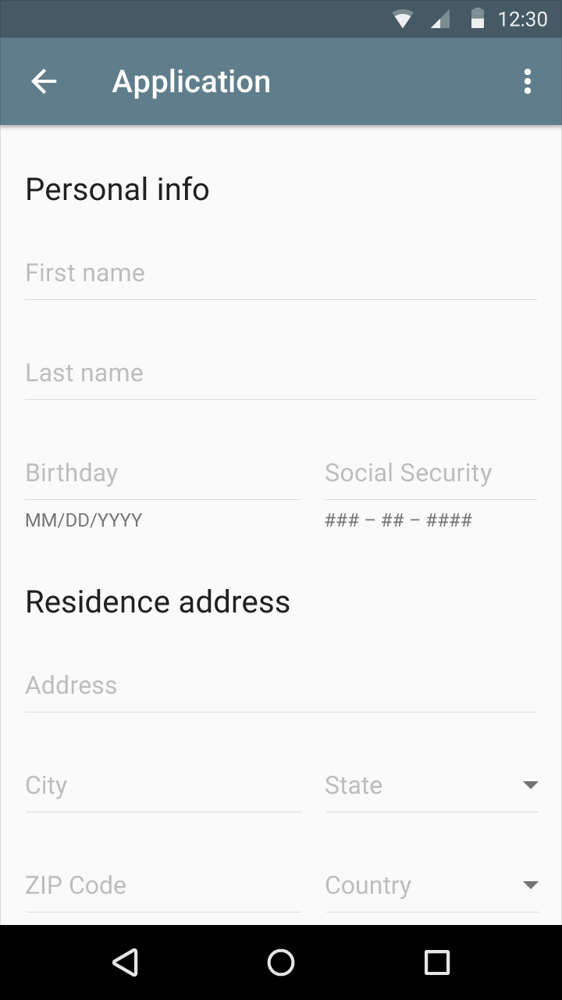

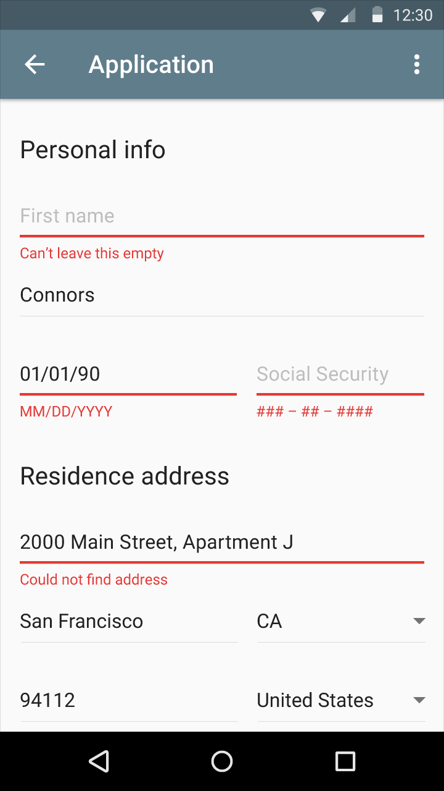

#### Light

- Error font is Roboto Regular 12sp
- Hint and helper text is #000000 with 38% alpha

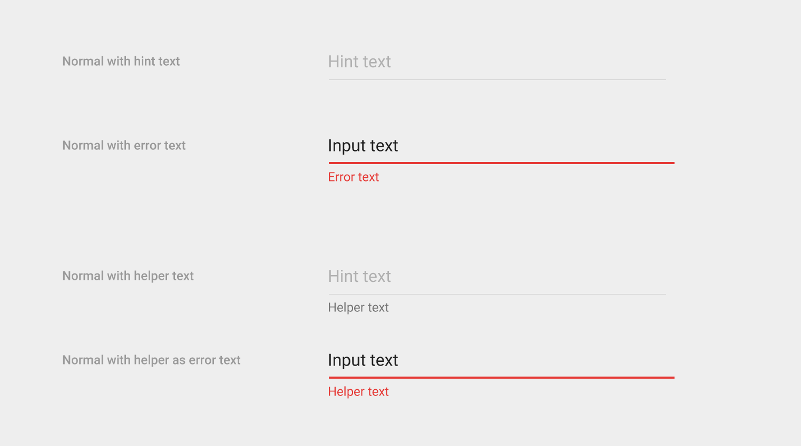

#### Dark

Error font is Roboto Regular 12sp
Hint and helper text is #FFFFFF with 30% alpha

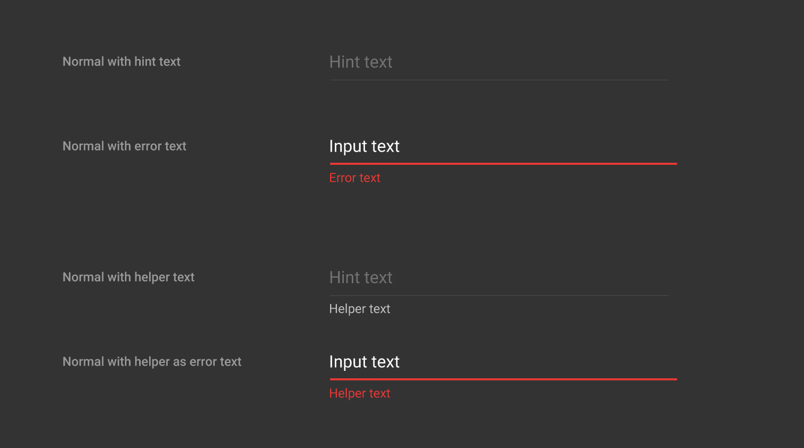

#### Helper and error text

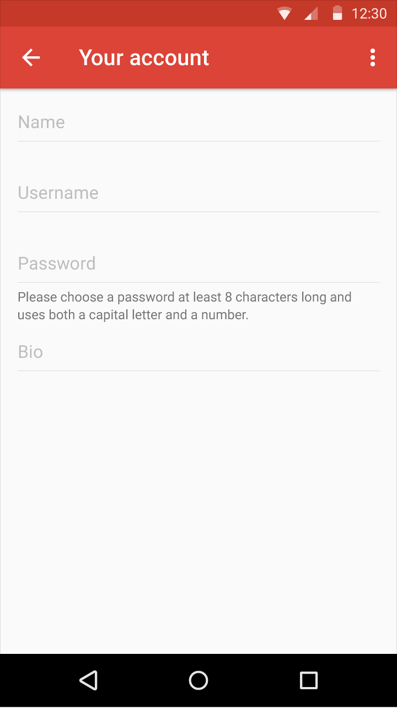

#### Error with floating text label

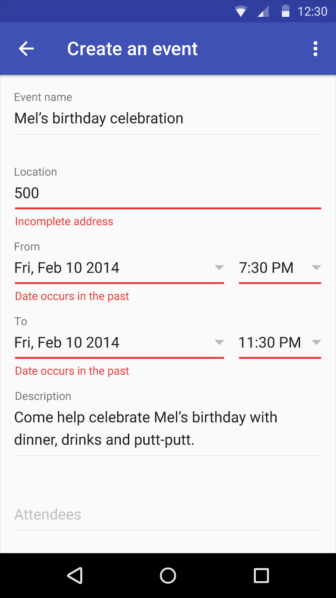

#### Text field input - Over/under character or word count

Counter may be displayed before, during, and after user interaction with the field. Consider not displaying the counter until the user is approaching the limit. Counter fields should have additional 16dps of padding below it.

- Counter font is Roboto Regular 12sp

#### Single line with character counter

#### Multi line with character counter

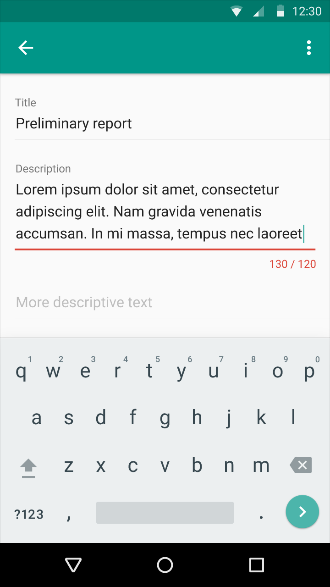

### Incompatible values

Incompatible value errors should be displayed during or after user interaction with the text field that triggers the error.

If two or more fields have incompatible inputs, the text field and error message below each field should indicate a fix is needed. An additional message should be added at the top of the form or screen summarizing the fixes needed and any additional explanation.

#### Errors detected after attempted form submission

The form should reload with scroll position at the top of the form, where the error messages are consolidated. Error messages for individual fields may be resolved as the user works through the form.

### Incomplete form

Incomplete form errors should be displayed after a user has sufficiently advanced through the form to indicate they have skipped the field. If unable to detect user progress through the form, display the error after the user has attempted to submit the form.

If fields in a form are left empty, the text field and error message below each field should indicate the error.

#### Multiple errors in a form before submission

It is sufficient to individually label error messages as the user works through the form.

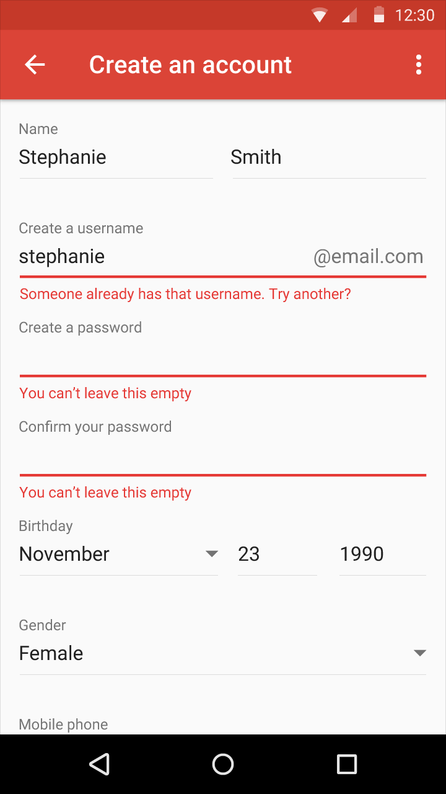

### Single line list error

## App errors
App errors are failures that occur regardless of user input.

### General app error

While an error is in progress, an app should continue to display its activity/loading indicators until the failure state is reached and the app error is displayed.

If a feature is not available, it may be represented within the UI. Not every error requires a new component to pop up.

If possible, give your user an action that will help them address the error. Don’t let them get stuck.

> Alert dialog: app feedback about an error that is blocking normal operation  

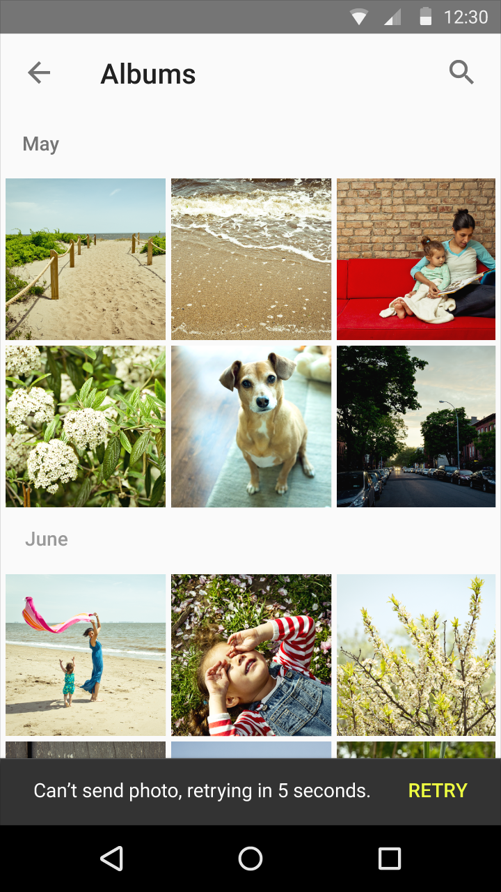

> Snackbar: app feedback about a peripheral error. Snackbars are transient, don't use them for critical, persistent, or bulk errors.

### Sync error/failure to load

A key part of designing an app is determining how screens will present content. A subset of that is determining what each screen should do when its regular content can't be shown. Examples include:

- A screen that normally presents a list of items, but no items exist yet.
- A screen that normally shows search results, but the current search yielded zero results.
- A screen that normally shows cloud-based content, but can't right now because of an unknown error.

These types of scenarios are called empty states. Although they're not the norm, they're important to design well because users may already be disappointed from encountering something unexpected.

When sync is down or content has failed to load, the user should be able to interact with as much of the rest of the app as possible.

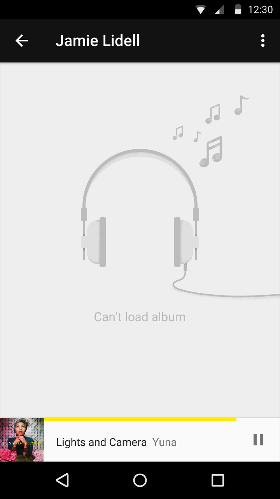

> Empty state for the screen/content being loaded.

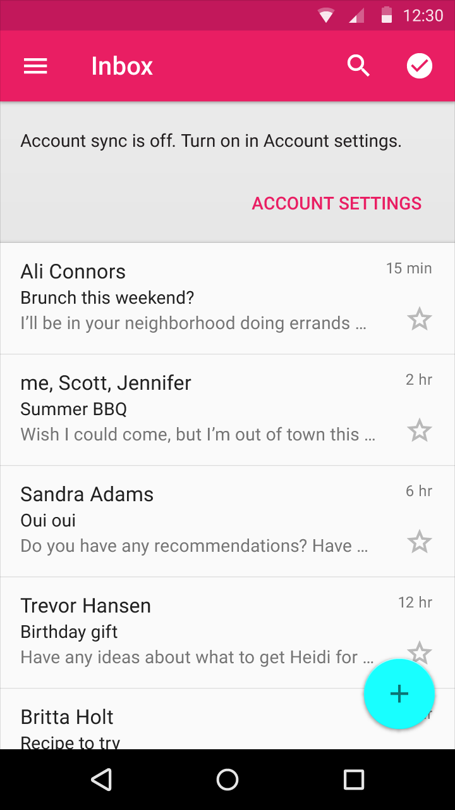

> Container/component specific error with action.

### Connectivity

When connectivity is down, the user should be able to interact with as much of the rest of the app as possible.

If appropriate, present a link to help a user accomplish their task. Only offer links that you can actually support. For example, don't offer an option like "Try again" in cases where you can already detect that the operation will fail.

> Snackbar with action to retry

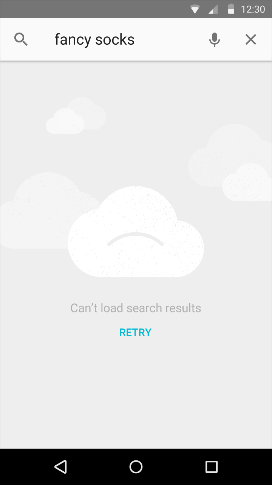

> Empty state for a screen only available online

## Incompatible state errors

Incompatible state errors occur when users attempt to run operations that conflict, such as making a call while in airplane mode or taking a screenshot from a restricted work account. Try to avoid letting users putt themselves into these situations by clearly communicating the states they are selecting and the implications for the rest of their experience. When these errors are triggered, do not imply that they are the user’s fault.

#### General incompatibility

Be clear about why the error is occurring and where it originates.  

Example:

- Screenshots and premium features are not allowed while in a restricted mode.

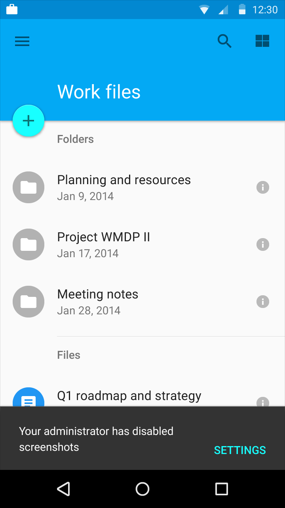

> Snackbar + Special mode indicator

#### Offline by choice

Consider displaying an unintrusive but persistent indicator when users are in these states.

Examples:

- Placing a call while in airplane mode
- Music availability while offline

> Snackbar

> Indicator that device has been placed into airplane mode.

### Permission requested

If your app requires user permission granted before proceeding along a workflow, consider working the permission request into the app flow instead of treating it as an error.

If permissions are necessary before the first run of an app, consider how they might fit into your app’s warm welcome.

Examples:

- An app’s permissions have changed.
- In-app purchases have been disabled.

> Dialog
