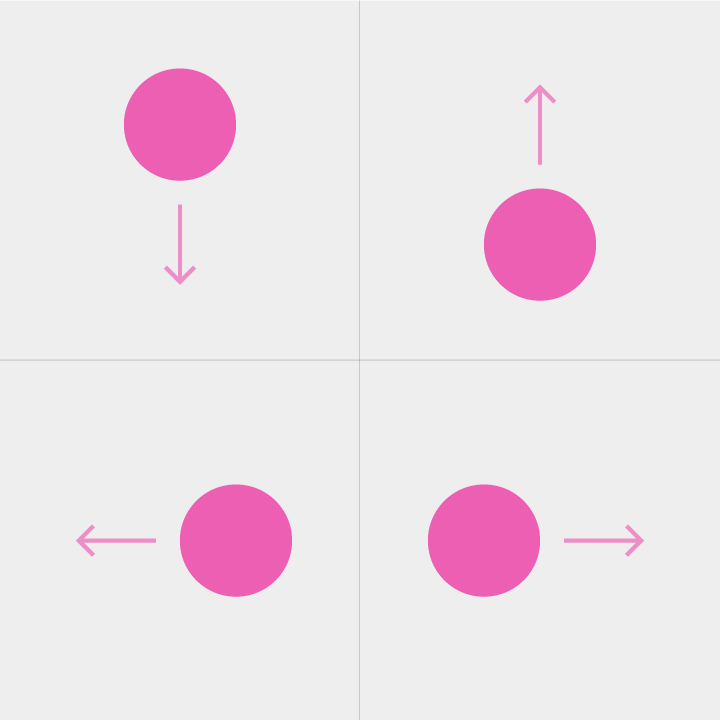
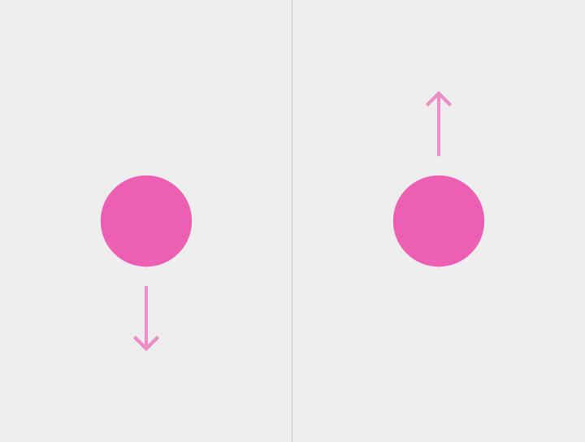

# Gestures

## Gestures

Gestures are divided into **Touch Mechanics** (what your fingers do on the screen) and **Touch Activities** (context-specific results of specific gestures in the user interface). This is because a single touch mechanic (touch) may have multiple results depending on context (tap, cancel, enable/disable lights out), and a single touch activity (zoom in) may be achieved through multiple touch mechanics (pinch open, double touch, double-touch drag, etc.)

Note that Drag, Swipe, and Fling gesture activities are covered in their own section due to their highly contextual results.

### Touch mechanics

Touch mechanics is what the user's fingers do on the screen.
 

> **Touch**
>
> One-finger press, lift
>
> Example: Select

 
> **Double touch**
>
> Two-finger press, lift, 1-finger press, lift
> 
> Example: Zoom in

 
> **Drag, Swipe, or Fling**
>
> One-finger press, move, lift
>
> Example: Dismiss, scroll, tilt

 
> **Long-press drag**
>
> One-finger press, wait, move, lift
> 
> Example: Pick up and move, select multiple items
> Long press is not used to display a contextual menu.

 
> **Double-touch drag**
>
> One-finger press, lift, one-finger press, drag, lift
>
> Example: Zoom in, zoom out

> **Pinch open**
>
> Two-finger press, move outwards, lift
>
> Example: Zoom in

> **Pinch closed**
>
> Two-finger press, move inwards, lift
>
> Example: Zoom out

> **Two-finger touch**
>
> Two-finger touch
>
> Example: Zoom out
 

> **Two-finger drag, swipe, fling**
> 
> Two-finger press, move, lift
> 
> Example: Select multiple items, pan, tilt
 

> **Two-finger long-press**
> 
> Two-finger press, wait, lift
> 
> Example: uncommon
 

> **Two-finger long-press drag**
> 
> Two-finger press, wait, move, lift
> 
> Example: Pick up and move

> **Two-finger double touch**
> 
> 2-finger press, lift, 2-finger press, lift
> 
> Example: Zoom out

 

> **Rotate**
>
> 2-finger press, simultaneously orbit both fingers around center point, lift
>
> Example: Rotate content, such as a map

### Touch Activities

Context-specific results of specific gestures in the user interface.

###Tap

Activates a screen element, like a button.

Touch mechanics: Touch

### Cancel or Escape 

Cancels or escapes out of the current task, as in dialogs or menus.

Touch mechanics: Touch

### Enable/Disable lights out

Hides or shows a view’s chrome.

Touch mechanics: Touch

### Drag or Swipe or Fling
See the following section for distinctions between Scroll, Reveal upon scroll, Pan, Dismiss, Swipe to refresh, Edge swipe, Paging swipe, Overscroll collapse, Menu open, and Tilt.

Touch mechanics: Drag, Swipe, or Fling

### Data selection (when nothing is selected)

Selects additional elements while in selection mode. Can use any combination of subsequent one- or two-finger gestures. 

Touch mechanics: Touch, two-finger touch 

### Data multi-selection drag
Reveals selection box that originates from point of gesture initiation. Height and width can be adjusted based on finger position. Final selection is based on selection box dimensions upon finger(s) lifting. 

Touch mechanics: Two-finger swipe or drag, long-press drag with no items selected

### Pick up and move
Affects the selected item or items. Can be used to:

- Rearrange data within a view
- Move an item into a container or onto a target
- Reorder items in a list or a card collection

Touch mechanics: Two-finger long-press drag, long-press drag on selected item 

### Zoom in

Scales up content. 

Touch mechanics:

- Double-touch
- Double-touch drag (down)
- Pinch open

### Zoom in to fit

For nested views, scales up the smallest targetable view.

Touch mechanics: Double-touch

### Zoom out

Scales down content. 

Touch mechanics:

- Double-touch at maximum zoom
- Double-touch drag (up)
- Pinch closed
- Two-finger touch
- Two-finger double touch

### Expand

Expands collapsed content. 

Touch mechanics: Pinch open

### Collapse

Collapses expanded content.

Touch mechanics: Pinch closed

### Rotate

Rotates the targeted content.

Touch mechanics: Rotate

### Drag, Swipe or Fling

Because the activity performed by a swipe gesture can vary greatly based on context, this section describes some of the major swipe gesture patterns and their differences.

Gesture velocity (from least to most) is the main distinction between Drag, Swipe, and Fling. Depending on context of use, gesture velocity can produce different results:

- **Drag:** Fine gesture, slower, more deliberate, controlled, typically has an on-screen target
- **Swipe:** Gross gesture, faster, typically has no on-screen target
- **Fling:** Gross gesture, no on-screen target

A swipe becomes a fling based on ending velocity and whether the affected element has crossed a threshold.

Generally, gesture velocity impacts whether the action is immediately reversible once crossing that threshold: a Drag maintains contact with the element, and reversing the gesture will drag the element back across the threshold; a fling imparts velocity and removes contact with the element while it crosses the threshold, preventing a reversal.

### Scroll

Vertical or horizontal swipe in content body.

Scroll amount varies based on velocity of gesture: drag (slow) vs. swipe vs. fling (fast)

Generally:

- Scroll directions are mutually exclusive
- Applied to content at 100% scale
 

### Reveal upon scroll

Reversing the scroll direction in a content area can have an additional effect of immediately revealing hidden in-app elements. E.g., scrolling up in Chrome shows the Omnibox.

Dismiss in-app elements by resuming original scroll direction.

 
### Pan

Omnidirectional, 1 or 2 fingers

Generally applied to:

- Unbounded content (maps)
- Content that is larger than the screen height or width (zoomed in web page or photo)

2-finger pan gesture, when transitioning from another 2-finger gesture (e.g., pinch zoom or rotate) such as in Maps, will result in **2-finger pan**.

2-finger pan gesture as the initiating gesture will result in **tilt**.

Drag is typically used with Pan.

Fling will maintain gesture velocity, resulting in a significant pan of the content along the direction of the fling gesture.

 
### Dismiss

Originates on a swipeable element such as a list item or card.

Orthogonal to direction of scrolling.

Gesture is typically horizontal, with symmetrical actions

The Dismiss gesture is committed based on crossing a threshold.

 
### Swipe to refresh

Available at index zero of a list, or at the content origination edge of an empty container.

Generally vertical and in a downward direction.

 
### Edge swipe

A swipe that originates outside of the screen. Invokes out-of-context content, that is, content separate and distinct from the current view.

If no edge swipe action is defined, an Edge swipe gesture can default to a Paging swipe.

The Edge swipe gesture is committed based on crossing a threshold.

 
### Paging swipe

An on-screen, in-content swipe that reveals additional, related off-screen content.

Don’t use paging swipes when individual elements are swipeable. Gesture reveals one page/tab per paging swipe.

Paged content may be >100% zoom, in which case an in-content swipe will **Pan** to an edge of the content, and an additional in-content swipe will**Page**.

See also: **Overscroll collapse**

The Paging swipe gesture is committed based on crossing a threshold.

 
### Overscroll collapse

Navigate up in hierarchy.

Paging swipe at the top or bottom of scrolling content to navigate to Parent content.

The Overscroll collapse gesture is committed based on crossing a threshold.

 
### Menu Open

Drag originating from a menu or picker reveals a menu. Upon lift, the highlighted menu option is selected.

Menu appears upon touch

Drag is used with **Menu open**.

 
### Tilt

Tilts 3D content forward or backward 

When transitioning from another 2-finger gesture (e.g., pinch zoom or rotate) such as in Maps, will result in **2-finger pan**.

Drag is used with **Tilt**.

