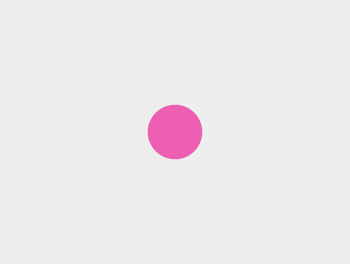
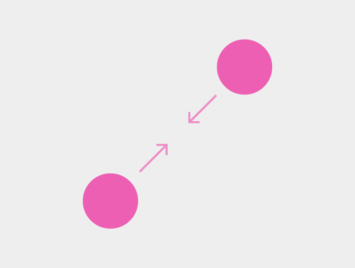
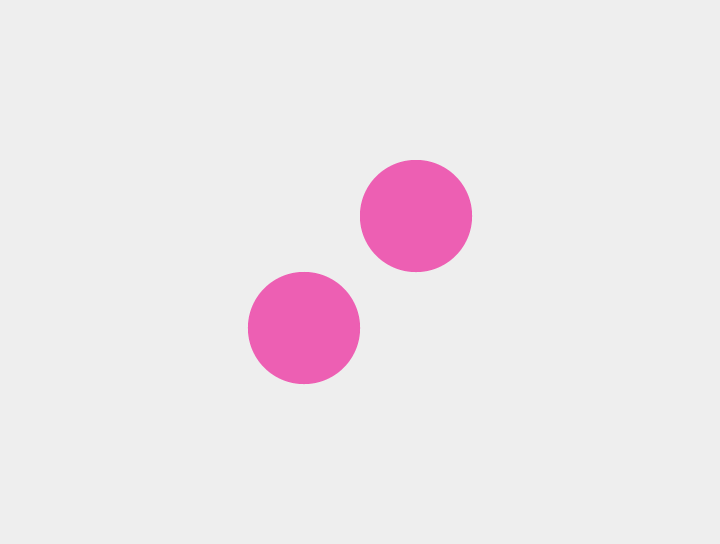
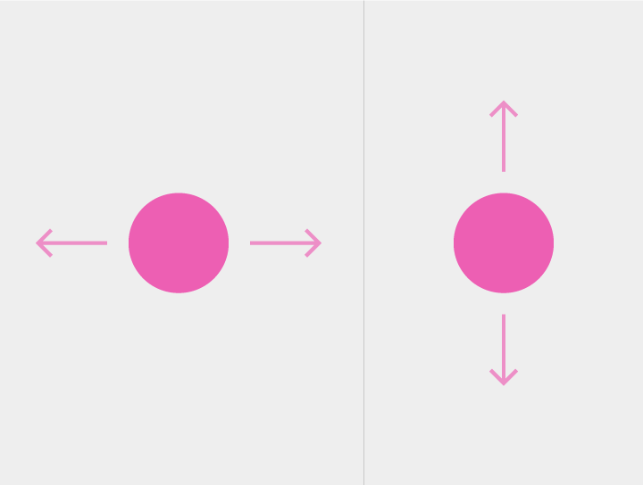
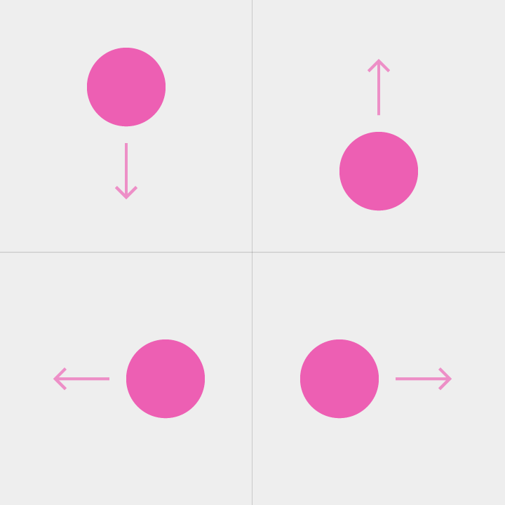
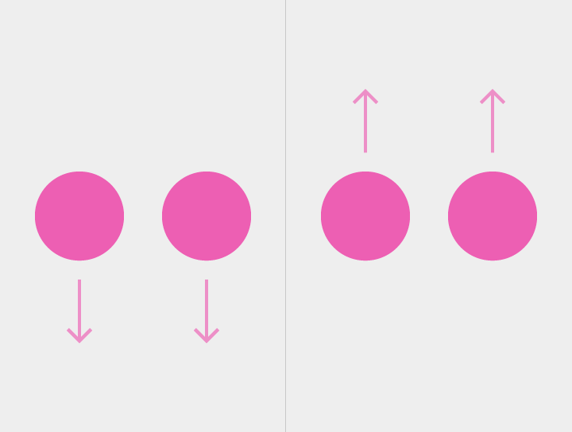

# 手勢

## 手勢

手勢又分為觸控手法 **觸控手法 Touch Mechanics** (你的指頭在螢幕上所做的) 和 **觸控行動 Touch Activities** (在使用者界面上特定手勢所產生的特定內容). 這是因為觸控手法可能有仰賴內容上（輕敲、取消、增加／拿掉）的多重結果，而單一觸控行動（拉近）可能會帶動多重的觸控手法（像是捏pinch地打開、雙重觸碰、雙重觸碰曳拉等等）。

注意曳拉(drag)、揮過(swipe)、丟擲(fling)的手勢行動會隨著前後之間的高度關係在它們自己的區域轉換。

### 觸控手法Touch Mechanics

觸控手法是使用的手指在螢幕上所做的事。
 

> **點擊**
>
> 一指頭去按、提起
>
> 舉例：選擇

 
> **雙重點擊**
>
> 兩指頭去按、提起，一隻指頭壓、提起
> 
> 舉例：推近

 
> **曳拉(drag)、揮過(swipe)、丟擲(fling)**
>
> 一指頭去按、移動、提起
>
> 舉例：去除、滾動、傾斜移動

 
> **長按**
>
> 一指頭去按、等待、移動、提起
> 
> 舉例：拿起然後移動、選擇多重項目

 
> **雙重點擊、拉**
>
> 一指頭去按、提起，一隻手指去壓、曳拉、提起
>
> 舉例：推近、拉遠

> **捏地打開**
>
> 兩指頭去按、往外移動、提起
>
> 舉例：推近

> **捏地關起**
>
> 兩指頭去按、往內移動、提起
>
> 舉例：拉遠

> **兩指頭點擊**
>
> 兩指頭去按、提起
>
> 舉例：拉遠
 

> **兩指頭曳拉、揮過、丟擲**
> 
> 兩手指去按、移動、提起
> 
> 舉例：選擇多重項目、搖 pan、傾斜移動
 

> **兩指頭長按**
> 
> 兩指頭長按、等待、提起
> 
> 舉例：不常見
 

> **兩指頭長按、曳拉**
> 
> 兩指頭按、等待、提起
> 
> 舉例：拿、移動

> **兩指頭雙重點擊**
> 
> 兩指頭按、提起、兩指頭按、提起
> 
> 舉例：拉遠

 

> **旋轉**
>
> 兩指頭按、同時環繞兩指之間的中心點、提起
>
> 舉例：環繞內容，像是地圖

### 觸控行動Touch Activities

使用者界面上特定的手勢所產生的特定結果

### 輕敲Tap

啟動螢幕上的元素，像是按鈕。

觸控手法：點擊

### 取消或跳出Cancel or Escape

當在對畫框或選單中，取消或跳出目前的所執行的任務

觸控手法：點擊

### 增加／拿掉

藏起或秀出chrome的樣子

觸控手法：點擊

### 曳拉、揮過、丟擲

看看以下部分是這些不同動作的區別，滾動、在上面滾動
、搖搖、消除、揮過以重新來過、邊界的揮動、頁面的揮
動、整體頁面的滾動以跳出、打開選單及傾斜移動。

觸控手法：曳拉、揮過、丟擲

### 資料選擇（當還沒選擇時）

選一個元素

觸控手法：長按、兩指頭點擊 

### 資料選擇（當項目已選定時） 

當處於選擇模式裡時，選擇額外的元素。可以運用任何連
續性一或二指頭手勢的組合。

觸控手法：點擊、兩指頭點擊

### Data multi-selection drag

揭露起源於手勢開始點的選擇模組（盒子），可以指頭位
置為基準來調整高度與寬度，而最後的選項考量則是以選
擇盒子的維度基準，來做指頭提起動作的考量。

觸控手法：兩指頭滑動、曳拉、在無項目被選定之下長按
並曳拉。

### 拿起並移動

影響已選定的單一或多個項目，可以被用來：

- 重新排列視線內的資料
- 移動一個項目到集合處或標的上
- 重新排序清單上或集點卡（集合卡）上的清單

觸控手法：兩指頭長按並曳拉、長按並曳拉已選定項目 

### 推近

放大內容

觸控手法：

- 雙重點擊
- 雙重點擊並曳拉（往下）
- 捏地打開

### 推近以符合

嵌入性的視窗，放大最小的標的視窗

觸控手法：雙重點擊

### 拉遠

縮小內容

觸控手法：

- 在最大的視窗中，雙重點擊
- 雙重點擊並曳拉（往下）
- 捏地關起
- 兩指頭點擊
- 兩指頭雙重點擊

### 拓展

拓展摺疊的內容

觸控手法：捏地打開

### 摺疊

摺疊拓展的內容

觸控手法：捏地關起

### 環繞

環繞標的的內容

觸控手法：環繞

### 曳拉、揮、擲

因為揮的手勢非常以內容為基礎，因此這裡的部分會說明一些主要關於揮的手勢及其差異處。手勢的速度（從最慢到最快）是曳拉、揮、擲之間最主要的區隔。基於使用的前後脈絡、手勢速度將產生不同的結果。

- **曳拉：** 細微的手勢、較慢的、較刻意的、受控制的，典型上有螢幕上的標的
- **揮：** 大手勢、較快的，典型上沒有螢幕上的標的
- **擲：** 擲：大手勢、無螢幕上的標的

揮的動作，將基於結束的速度及受影響的元素是否穿過臨界點，以成為擲的動作。

一般來說，手勢的速度將衝擊行動是否能在穿過臨界點時反轉過來：一個曳拉會保持與元素的接觸；而反向的手勢將會把元素拉回來；當穿過臨界點、避免反轉時，擲的動作將賦予速度及拿開與元素間的接觸。

### 滾動

在內文中垂直或水平地揮

基於手勢的速度，滾動的量有很多種：曳拉（慢）、揮、擲（快）

一般來說：

- 滾動方向是共同單一的
- 運用到100％比例的內容
 

### 根據滾動的揭露

在內文區域中反向滾動可以有一個立即叫出隱藏在App裡元素的額外效果，例如：往上滾動Chrome會秀出Omnibox。

照原本方向滾動則能關掉在app裡的元素。

 
### 刷（pan）

各個方向，一或兩指頭

一般應用於：

- 無邊際的內文（地圖）
- 比螢幕的寬或高還要大的內文（可拉近看的網頁或照片

兩指頭刷的手勢，當從另外兩指頭手勢過渡來此時（舉例：捏地推近、拉遠或是旋轉）像是在地圖裡，將會用到**兩指頭來刷**。

當在起始手勢時，兩指頭刷的手勢會成為 **傾斜移動**。

曳拉在典型上會用刷。

擲的動作，擲會維持手勢的速度，其導因於一個內文顯著刷的動作並連同擲的手勢一起。

 
### 消除

起源於一個可揮動的元素，像是一個清單的項目或卡片。
與滾動的方向呈直角狀。

手勢在典型上以對稱的動作呈水平方向。

消除的手勢以穿越臨界點來表示。

 
### 揮動以更新

可用於清單零的指標上、或在內文開始的空白處。

一般來說會以垂直或往下的方向來表示。

 
### 邊緣揮動

一個揮的動作起源於螢幕的外圍，可叫出內文外的內文，換句話說，叫出與目前視窗之內文分開與不同區隔的部分。

如果沒有邊緣揮動的動作被定義，一個邊緣揮動手勢可以解釋成頁面的揮動。

邊緣揮動的手勢以穿越臨界點來表示。

 
### 頁面揮動

一個在螢幕上、內文中的揮動顯露出額外與螢幕外相關的內容。

當個別元素均可揮動時，不要使用頁面揮動。手勢將顯示出各頁面揮動間的頁面或標籤。

頁面內文可能會大於視窗的100%，而在內文裏面的**揮動**將會刷出內文本身的邊界，而額外的內文揮動將會超出**範圍**。（gesture裡的原文要確認一下）

See also: **滾動外的重疊**

頁面揮動的手勢以穿越臨界點來表示。

 
### 滾動外的重疊

層級式的導覽。

以在頂端或底端滾動內文的頁面揮動來導覽母子內文。

滾動外的重疊手勢以穿越臨界點來表示。

 
### 打開選單

曳拉選單或挖掘者顯示的選單
在作出提起的手勢之下，重點式的選項將被選定。

曳拉被用來當做打開**選單**。

 
### 傾斜移動

傾斜3D的內文向前或向後。

當從兩指頭手勢（例如：捏地推進、拉遠或旋轉）過場到像是在地圖中時，將會用到**兩指頭刷動**。

曳拉被用來**傾斜移動**。

