# Navigation drawer

The navigation drawer is a common pattern found in Google apps.  The navigation drawer slides in from the left. It follows the keylines and metrics for lists.

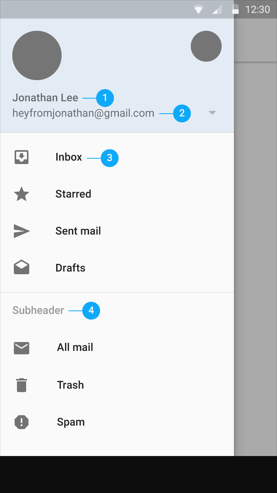

> **Typography**
>
> 1. Roboto Medium, 14sp, #FFFFFF
> 2. Roboto Regular, 14sp, #FFFFFF
> 3. List item: Roboto Medium, 14sp, 87% #000000
> 4. Subheader: Roboto Medium, 14sp, 54% #000000. Aligns to the 16dp keyline.

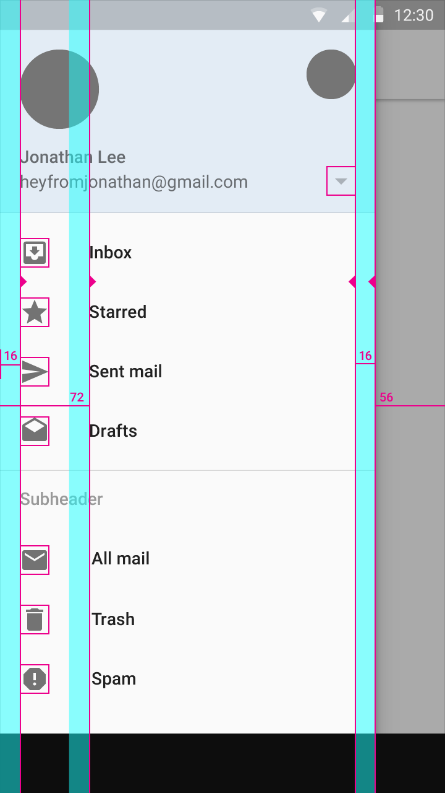

> **Vertical keylines and horizontal margins**
>
> Vertical keylines for icons are at 16dp from the left and right edges of the side nav and are 54% #000000.
>
> Content associated with an icon or avatar aligns 72dp from the left edge of the side nav.
> 
> The width of the side nav is equal to the width of the screen minus the height of the action bar, or in this case 56dp from the right edge of the screen.
>
> Use 16dp horizontal margins on mobile.

> **Vertical spacing**
> 
> 1. 24dp
> 2. 56dp
> 3. 8dp
> 4. 48dp
> 
> Add 8dp padding at the top and bottom of every list grouping. One exception is at the top of a list with a subheader, because subheaders contain their own padding.

## Elevation

The nav drawer spans the full height of the screen and the drawer is behind the status bar.

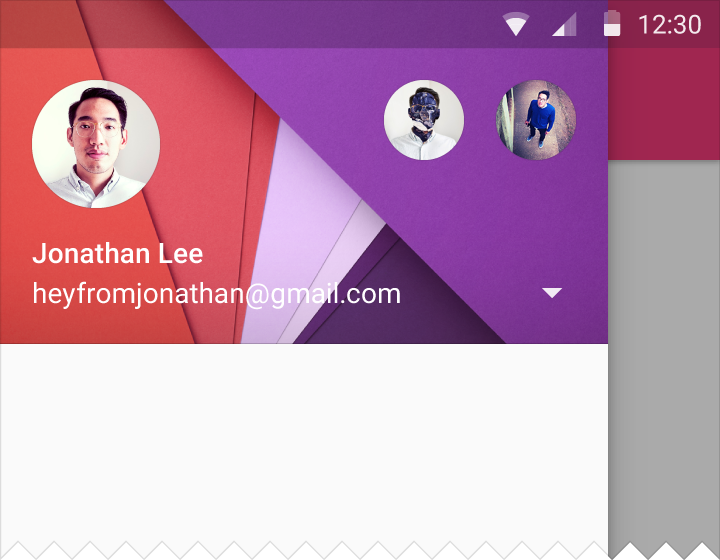

> Nav drawer on Android

## Selection state

After a list item is selected, that item becomes the app’s primary color or #000000 100% to clearly indicate selection. The touch ripple also becomes a highlight, to further indicate selection.

If this color the touch ripple/highlight doesn’t provide enough contrast with your primary color, use a darker tint of the primary color.

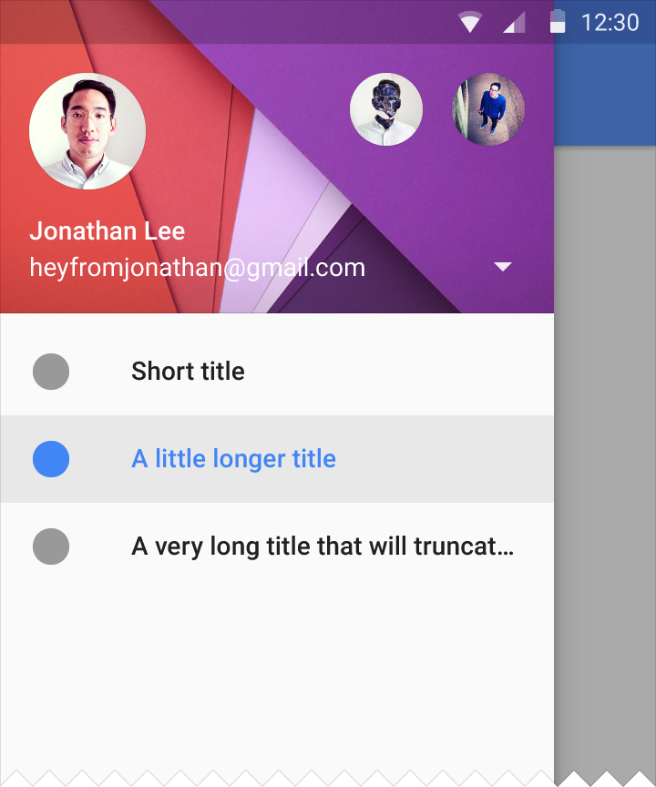

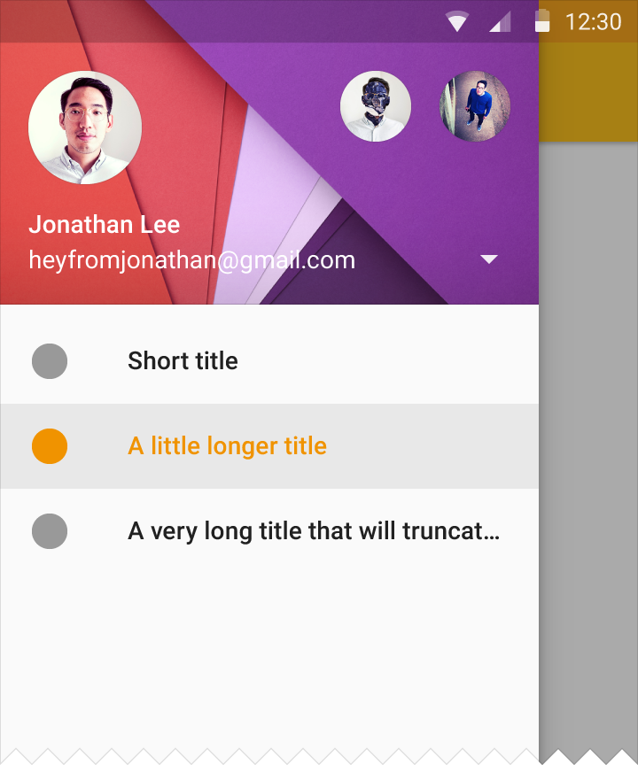

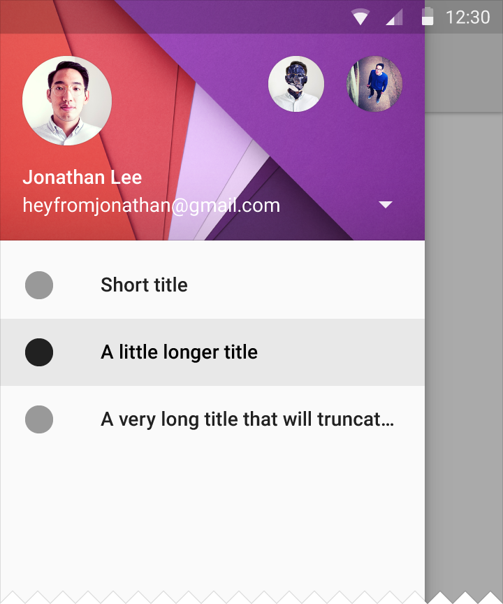

## Dividers

All dividers in the nav drawer are full-bleed inside the panel. There is also an 8dp padding above and below the divider.

> Context

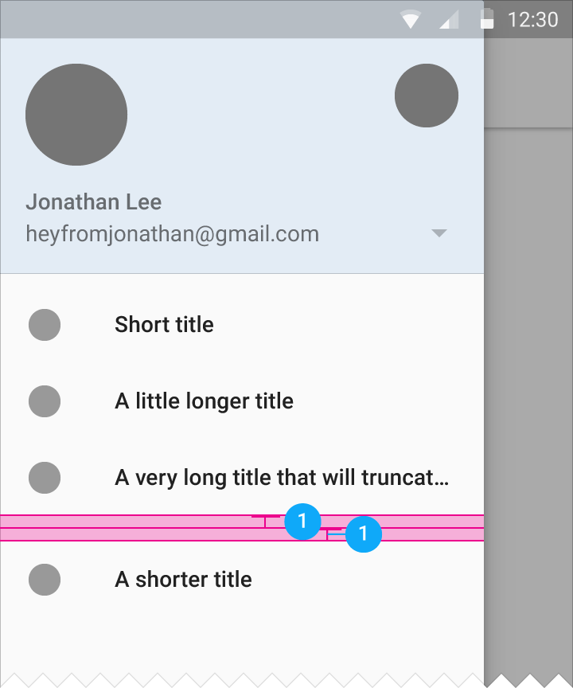

> 8 dp vertical spacing

## Scrolling

The navigation drawer can scroll like any normal view would.

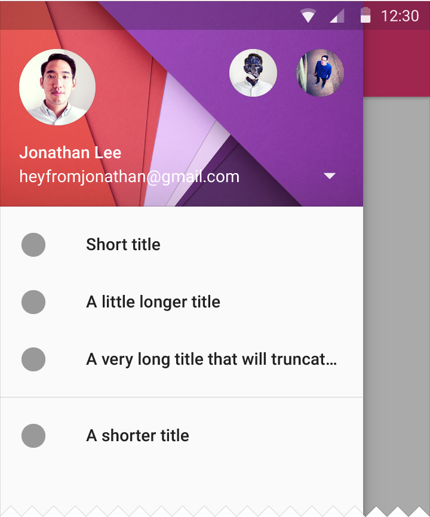

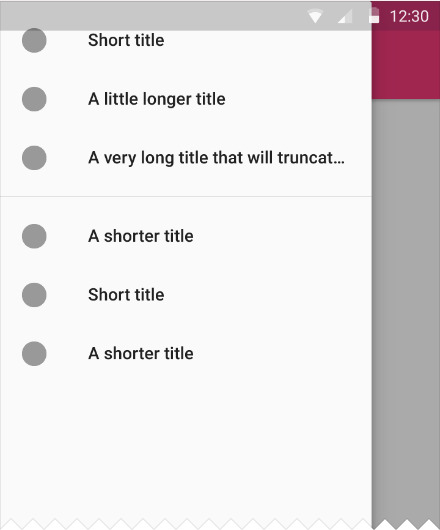

## Settings and support

Settings and support are located at the bottom of the scrolling list, in-line with the rest of the list content.

If the list of content in the navigation drawer is very long, the two options can be pinned to the bottom of the navigation drawer on a surface with a higher elevation. This surface is present only while at the top of the list; any other scroll position will immediately result in dismissing the surface and placing the options at the end of the list, in-line with the rest of the list content. The navigation drawer retains its scroll position when closed and reopened.

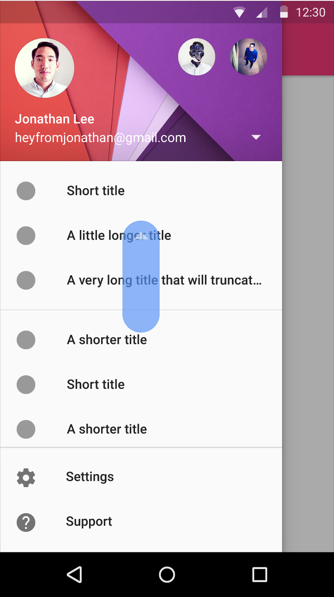

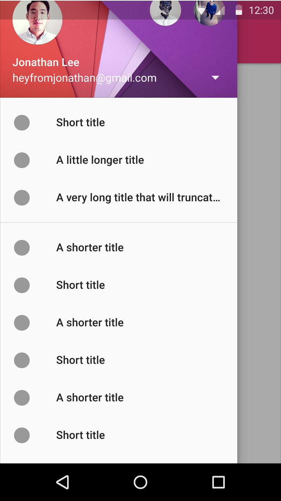

If the list doesn’t scroll, the settings and support items will appear at the end of the list and are not pinned.

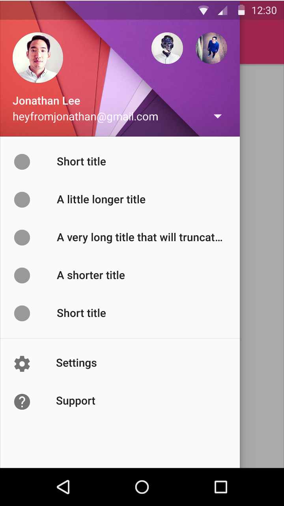
