# 促進式指令

## 浮起式指令鈕

浮起式指令鈕是促進式指令的一個特別的例子。他們會以在使用者界面中圓形浮起的圖示來區別，並且有關於變形、開始及轉換矛點的特定動作行為。

這裡有兩種浮起式指令鈕：預設的尺寸與小尺寸，而這只能被用來跟其他螢幕上的元素創造視覺的連續性。
 
 
 

### 相關的內容

不是每個螢幕都需要浮起式指令鈕。浮起式指令鈕必須是應用程式裡的主要動作。在螢幕的左邊，主要的動作是去觸碰並打開藝廊裡的圖片，所以不需要浮起式指令鈕。而在右邊，主要動作是附加檔案，將浮起式指令鈕放在這裡是適合的。

 
> 請這麼做

 
> 請這麼做

試著只使用一個浮動按鈕在每個畫面，因為他是畫面上最突出的按鈕。

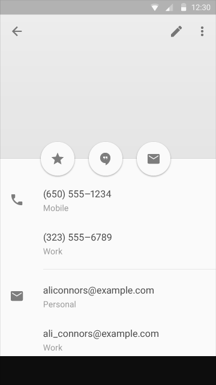

> 別這麼做
 
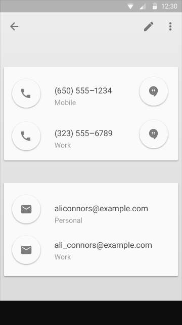

> 別這麼做

不要（請勿）將浮起式指令鈕放在對話框中，要使用扁平鈕。

> 請這麼做
 

> 別這麼做

不要將浮起式鈕放在側面搖曳處，這樣會讓使用者從原本想要完成的任務中分心。側面搖曳處是拿來導覽用的。
 
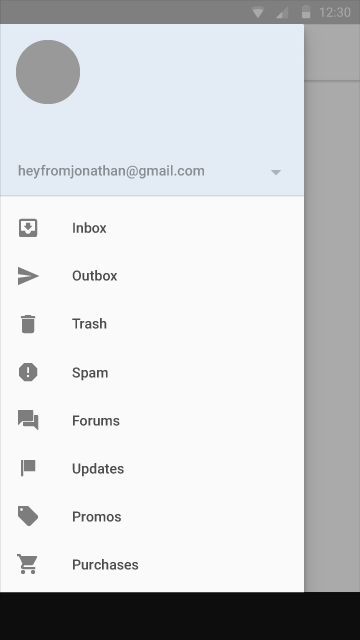

> 請這麼做
 

> 別這麼做

不要讓浮起式鈕跟下拉式選單重疊到。

> 請這麼做

> 別這麼做

### 相關的指令

將總覽（overflow）指令功能放在總覽選單的工具列中而不是放在浮起式指令鈕。

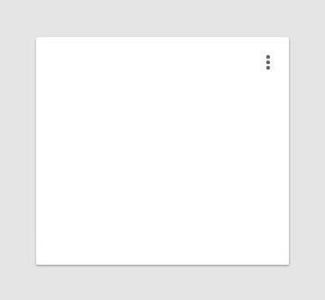

> 請這麼做

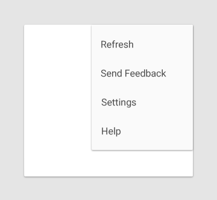

> 請這麼做

 
> 別這麼做

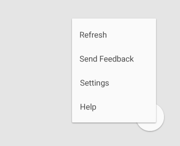

> 別這麼做

如果此應用程式的標識是附加檔案，則浮起式指令鈕可以在被觸控到時變形為後續的相關動作。

> 請這麼做

 
> 請這麼做

然而，如果一組動作在觸控到「與按鈕不相干的浮起式指令鈕」以及「其不自然的動作延伸 」之後出現，此動作應該會進入總覽選單中。

> 別這麼做

 
> 別這麼做

如果浮起式鈕便行為工具列，那麼工具列則必須包含相關的動作。在這個例子中，此按鈕讓使用者選擇欲加入的媒體樣式。

 
> 請這麼做

> 請這麼做

不要讓浮起式鈕變形為不相干或是令人感到困惑的工具列。

 

> 別這麼做

 
> 別這麼做

一個浮起式指令鈕可以包含聯絡人們的清單。

> 請這麼做

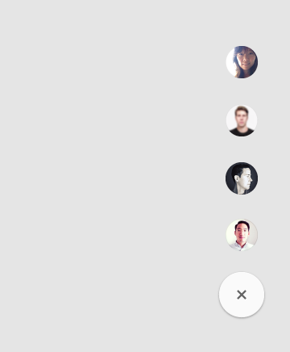 

> 請這麼做

不應該包含不相干的動作。

 
> 別這麼做

 
> 別這麼做

### 品質

讓浮起式指令鈕變成更正面的動作，像是創造、喜愛、分享、導航、探索。

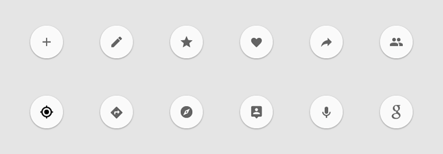

> 請這麼做

一般來說，避免使用浮起式指令鈕作為破壞性的動作，像是存檔或垃圾桶；不特定的動作；警示或錯誤；有限性的任務，像是剪下文字；或是掌控應該放在工具列的部分，像是字體大小的控制或是改變字型顏色。浮起式指令鈕不能包含在應用程式的圖示列中或像是「通知」的狀態列資訊。不要將標誌圖示或其他的元素層層堆疊在浮起式指令按鈕上方。

 
> 別這麼做

持續地使用圓形的圖示以不讓使用者感到困惑。

 

> 請這麼做

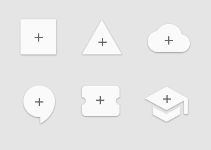

> 別這麼做

不要讓浮起式指令鈕彈起

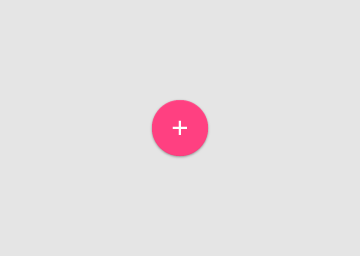
 
> 請這麼做

 
> 別這麼做

### 放置

一個浮起式指令鈕可以被放置於「以主要行距為規則」或「應用程式延伸的列」之上。

 
> 請這麼做

 
> 請這麼做

一個浮起式指令鈕可以放在下方或一個延伸的頁面。

 
> 請這麼做

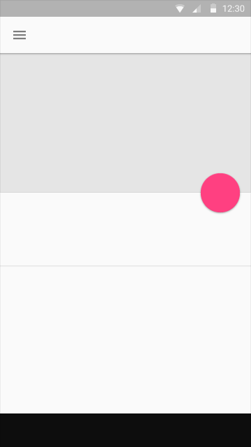
 
> 請這麼做

一個浮起式指令鈕不應該浮在一個隨意的地方，注意當把浮起式指令鈕至於工具列時，它可能會重疊到或覆蓋到其他觸控的標的。

 
> 別這麼做

 
> 別這麼做

一個浮起式指令鈕可以放在延伸頁面的上方。

 
> 請這麼做

一個浮起式指令鈕可以被放在工具列或頁面裡的結構性元素（只要它不要檔到其他的元素）上。

 
> 請這麼做

一個浮起式指令鈕可以被放在頁面的邊緣。

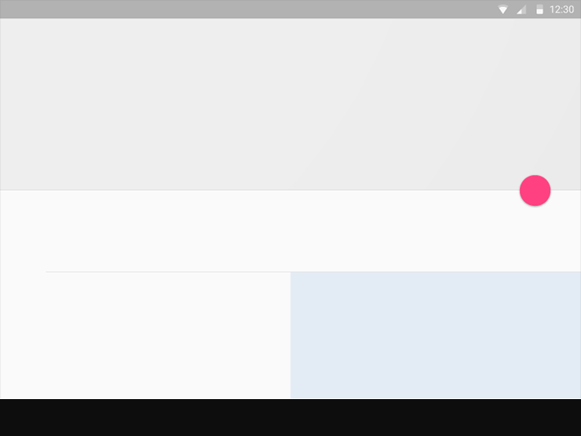
 
> 請這麼做

不要放超過一個以上的浮起式指令鈕在每個螢幕中。
 

> 別這麼做

不要將浮起式指令鈕放在搖曳處裡面或是搖曳處上面。

 
> 別這麼做

不要將浮起式指令鈕當成螢幕上的每個元素。

 
> 別這麼做

不要讓橫幅擋到浮起式指令鈕。
 

 
> 請這麼做

 
> 別這麼做

> *翻譯： [Frances](https://www.facebook.com/Francishuang1224)*
