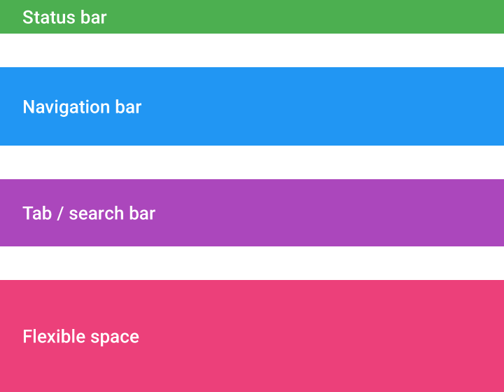
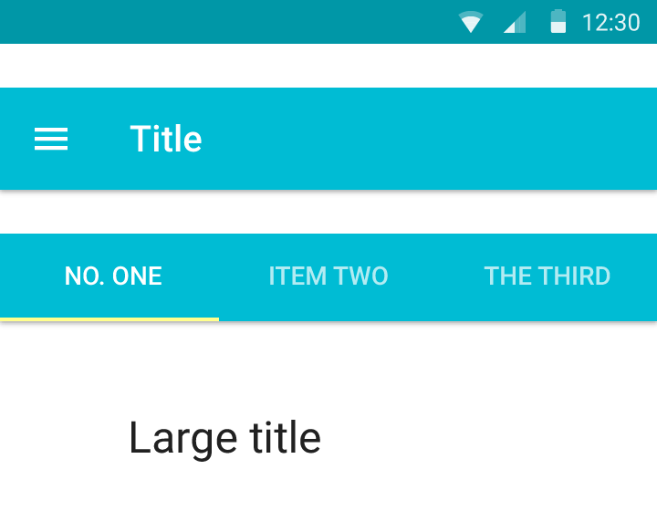
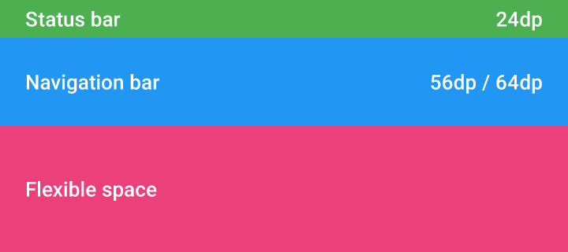
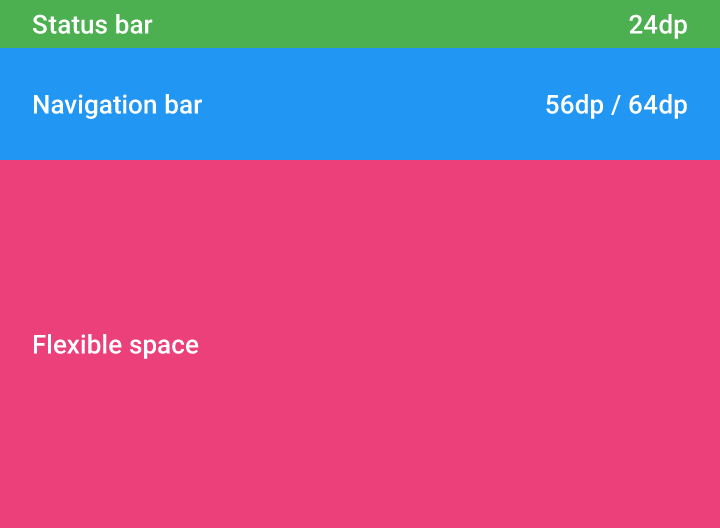

# Scrolling techniques

## Scrolling

### Based on blocks

When designing scrolling behavior, it is helpful to think in blocks. This is just a mental model and won’t be represented with any visual affordance.

These are the main four blocks for app bars that help with the scrolling structure:

- Status bar: 24dp
- Navigation bar: 56dp on mobile and 64dp on tablet and desktop.
- Tab bar/search bar: 48dp
- Flexible space: space to accommodate a desired aspect ratio for images or extended app bars.

### Standard app bar

The standard app bar height is 56dp on mobile and 64dp on larger screen sizes. There are two options when it comes to scrolling.

1. The app bar can scroll off screen with the content and come back when the user reverse- scrolls.
2. The app bar can stay fixed at the top and let the content scroll under it.

<video controls="" width="360" height="640">
<source src="//material-design.storage.googleapis.com/publish/v_1/quantumexternal/0B0NGgBg38lWWV2x1WF9Wb29NX2c/patterns-scrollingtech-scrolling-070801_Standard_AppBar_xhdpi_003.webm" type="video/webm">
<source src="//material-design.storage.googleapis.com/publish/v_1/quantumexternal/0B0NGgBg38lWWbGpsUDgxN1VwX0U/patterns-scrollingtech-scrolling-070801_Standard_AppBar_xhdpi_003.mp4" type="video/mp4">
</video>

### Tabs

The standard app bar can be extended to include tabs or a search box. Using the blocks as a mental model is helpful when determining the scrolling behavior. In this case, you have two options:

1. The navigation bar scrolls off and the tab bar stays anchored at the top.
2. The app bars stays in place and the content scrolls under it.

<video controls="" width="360" height="640">
<source src="//material-design.storage.googleapis.com/publish/v_1/quantumexternal/0B0NGgBg38lWWV2x1WF9Wb29NX2c/patterns-scrollingtech-scrolling-070801_Standard_AppBar_xhdpi_003.webm" type="video/webm">
<source src="//material-design.storage.googleapis.com/publish/v_1/quantumexternal/0B0NGgBg38lWWbGpsUDgxN1VwX0U/patterns-scrollingtech-scrolling-070801_Standard_AppBar_xhdpi_003.mp4" type="video/mp4">
</video>

### Tabs

The standard app bar can be extended to include tabs or a search box. Using the blocks as a mental model is helpful when determining the scrolling behavior. In this case, you have two options:

1. The navigation bar scrolls off and the tab bar stays anchored at the top.
2. The app bars stays in place and the content scrolls under it.

<video controls="" width="360" height="640">
<source src="//material-design.storage.googleapis.com/publish/v_1/quantumexternal/0B0NGgBg38lWWUXVCVVhKUFdFQnM/patterns-scrollingtech-scrolling-070801_TabBar_xhdpi_003.webm" type="video/webm">
<source src="//material-design.storage.googleapis.com/publish/v_1/quantumexternal/0B0NGgBg38lWWU0RhQy1ab3FWOWM/patterns-scrollingtech-scrolling-070801_TabBar_xhdpi_003.mp4" type="video/mp4">
</video>

### Flexible space

The app bar is flexible and can be extended to accommodate larger typography or images. To extend the app bar, add a flexible space block.

1. The flexible space shrinks until only the navigation bar is left. The title should also shrink into place to become a 20sp title in the navigation bar. When scrolling all the way back, the flexible space and the title grow into place again.
2. The whole app bar scrolls off. When the user reverse-scrolls, the navigation bar returns anchored to the top. When scrolling all the way back, the flexible space and the title grow into place again.

<video controls="" width="360" height="640">
<source src="//material-design.storage.googleapis.com/publish/v_1/quantumexternal/0B0NGgBg38lWWcFhaV1hiSlB4aFU/patterns-scrollingtech-scrolling-070801_Flexible_Space_xhdpi_003.webm" type="video/webm">
<source src="//material-design.storage.googleapis.com/publish/v_1/quantumexternal/0B0NGgBg38lWWUGZzYXdKZWpDNWM/patterns-scrollingtech-scrolling-070801_Flexible_Space_xhdpi_003.mp4" type="video/mp4">
</video>

### Flexible space with image

To use images in the app bar, you can use flexible space to accommodate the desired aspect ratio. In this example, the aspect ratio is 4:3. When scrolling, the content pushes up the image so that the flexible space shrinks. The last 20% of the image’s flexible space is tinted with the primary color for the app.

<video controls="" width="360" height="640">
<source src="//material-design.storage.googleapis.com/publish/v_1/quantumexternal/0B0NGgBg38lWWZ1F2b1pUOGFiZHc/patterns-scrollingtech-scrolling-070801_Flexible_Space_with_Image_xhdpi_002.webm" type="video/webm">
<source src="//material-design.storage.googleapis.com/publish/v_1/quantumexternal/0B0NGgBg38lWWWHR2eG5ITnZlMmM/patterns-scrollingtech-scrolling-070801_Flexible_Space_with_Image_xhdpi_002.mp4" type="video/mp4">
</video>

