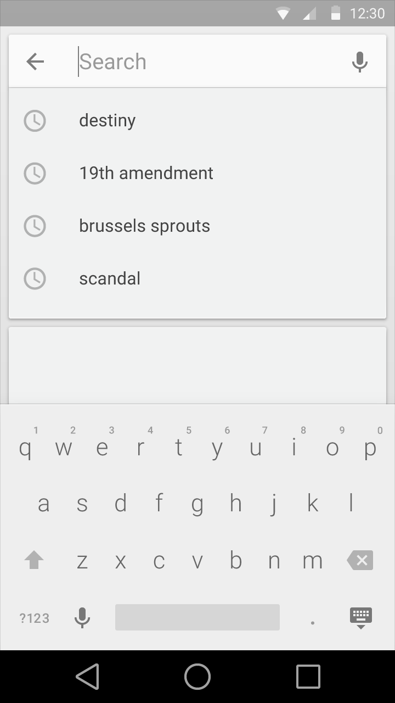
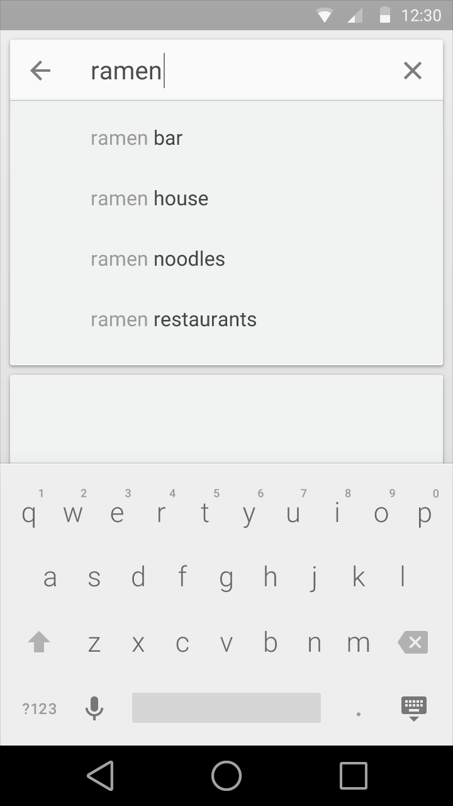
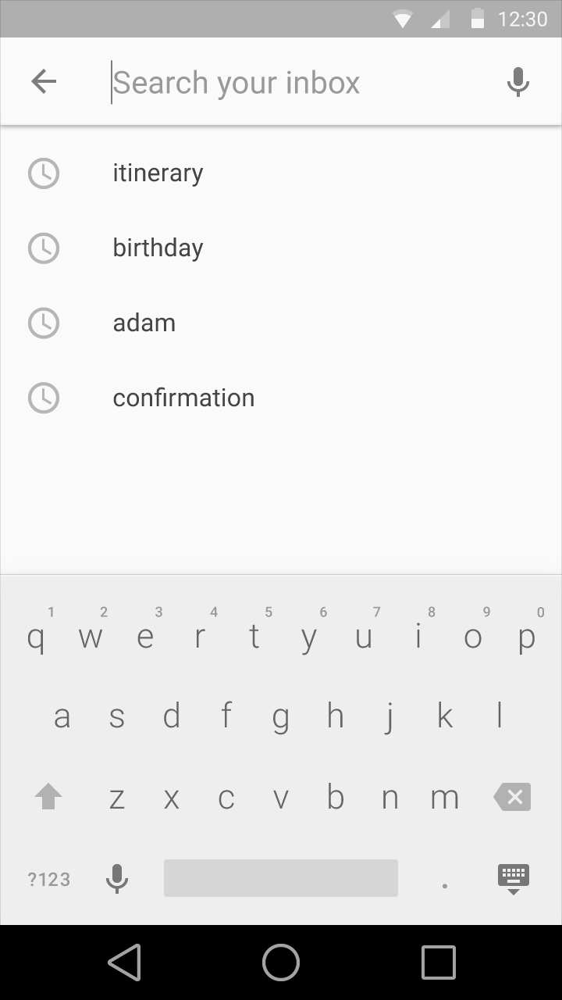
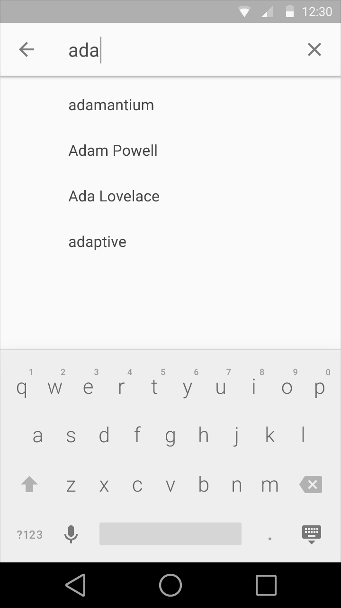

# Search

## In-app search

When an app supports large amounts of information, users expect to be able to quickly locate particular content by searching.

In its most basic form, a search involves:

- Opening a search text field
- Entering and submitting a query
- Displaying a set of search results

However, the search experience can be made significantly more gratifying by including some enhancements:

- Enabling voice search
- Providing historical search suggestions based on recent user queries, even before a query has been started
- Offering auto-completed search suggestions that match actual results in your application data

There are two major patterns for in-app search: **persistent search** and **expandable search.**

## Persistent Search

Persistent search is appropriate when search is the primary focus of your app.

The search text field is presented within an inset search box, ready to receive focus.

The user can touch the microphone action to initiate a voice search.

> When the search text field is focused, the search box expands to present historical search suggestions. If needed, the onscreen keyboard will also appear. Choosing any of the suggestions submits the search. Touching the up arrow releases the focus from search, dismissing suggestions and the onscreen keyboard.

> As the user begins to enter a query, the search suggestions shift to auto-completion.
>
> The ‘x’ action in the search box clears the query.
>
> Choosing a suggestion or pressing the return key submits the search.

> When displaying search results, the search box remains visible but is not focused by default. The onscreen keyboard is dismissed so more results can be shown onscreen.
> 
> Search results are formatted as cards to match the inset appearance of the search box. This styling accommodates different types of search results.

## Expandable Search

Expandable search is appropriate when search is not the primary focus of your app.

Instead of displaying a search text field, a search action (denoted by the magnifying glass icon) is presented within a toolbar.

> Touching the search icon causes the toolbar to transform, clearing other content and displaying a search text field. If voice search is supported, the microphone icon will also appear.
> 
> The search text field automatically receives focus, and, if needed, the onscreen keyboard will appear. Historical search suggestions can be shown beneath the toolbar, replacing the content previously shown there. Choosing any of the suggestions submits the search.
> 
> Touching the up arrow closes the search mode, and restores the original presentation of the toolbar.

> As the user begins to enter a query, the search suggestions shift to auto-completion.
>
> The ‘x’ action in the search box clears the query.
> 
> Choosing a suggestion or pressing the return key submits the search.

> When displaying search results, the search version of the toolbar remains visible but is not focused by default. The onscreen keyboard is dismissed so more results can be shown onscreen.
>
> Search results, like the suggestions from the previous steps, appear in the main body of the page beneath the toolbar.

