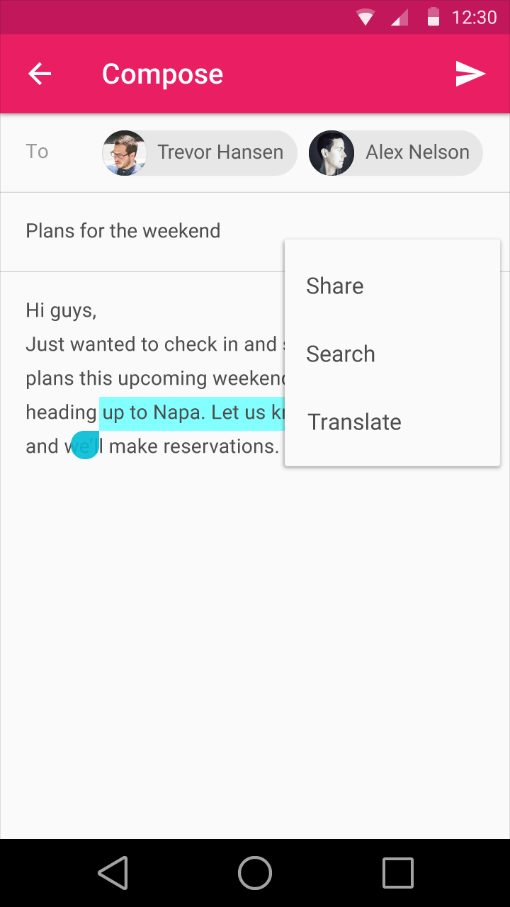
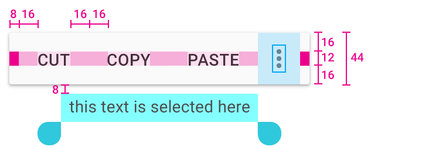

# Selection

## Item Selection

### Item Selection

Support for multi-selection is strongly recommended for list and grid containers. However, this is not required if the only actions available are valid for a single selection (like a list of phone numbers, where calling is the only action), or if the context is strongly biased toward direct, single-item manipulation (like moving icons on Android’s home screen.)

Both long-press and two-finger touch may be extended by a drag gesture to select multiple items when initiating selection. Other items between the beginning and end points of the drag will be included in the selection. On desktop, a simple drag originating outside the bounds of all items may also be used to initiate multi-selection (for example, beginning a drag in the left margin of a list, and extending down and to the right to select items from that list.)

Once an initial selection is made, it can be altered through a number of user actions:

- Touch on an unselected item to select it, or on a selected item to unselect it.
- Shift+touch/click on an item to extend selection to that 
item and all items between it and the original selection.

## Text selection

Text selection is indicated by highlighting the bounds of the selected text.

On mobile platforms, a selection handle is added to both the beginning and end of the selection. Standard actions related to the text appear in a popup menu that is ideally positioned immediately above (but ideally not overlapping) the selection.

Text selection handles
 

 
Text selection - Light theme

 
Text selection - Dark theme

Popup menus for Cut, Copy, Paste, and More appear above the selection area. When the user selects the More button, the popup will collapse toward the icon and the overflow menu items will grow, centered from the icon area. Font for text selection menu text is Roboto Medium 14 sp, all caps.
 
 

 

 
Text selection is effectively a single-select context, as the selection must be one contiguous block. However, the bounds of the selection may be altered following selection through a number of user actions:

- Dragging during the initial selection to expand the selection.
- Dragging on either of the selection handles to expand or reduce the selection.
- Touching or clicking repeatedly within the selection to expand it (single word > paragraph > all)
- Keyboard shortcuts:
	- Shift+Left/Right Arrow for character-by-character
	- Shift+Up/Down Arrow for line-by-line
	- Ctrl/Command+A to select all
 