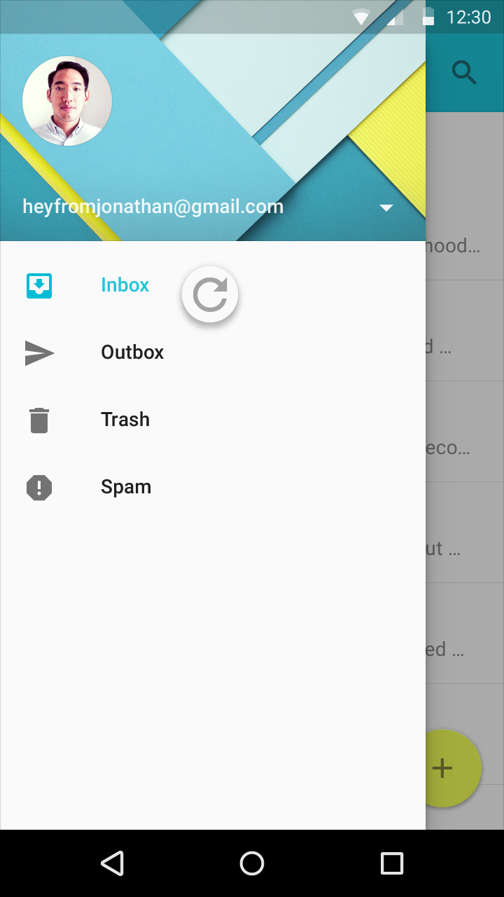
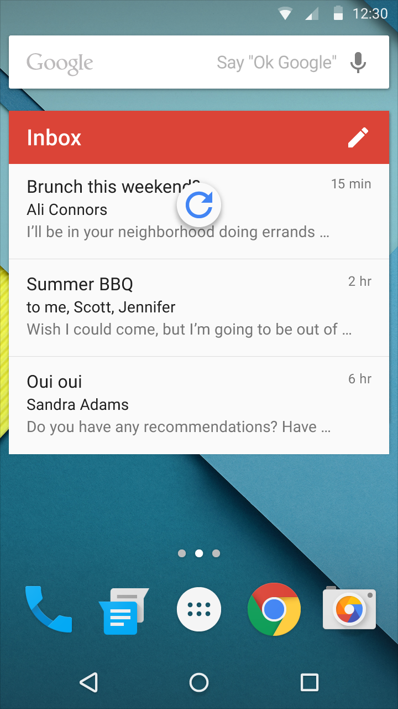

# Swipe to refresh

## Swipe to refresh

### Updating content

There are two methods for updating content in an app. The preferred method is to automatically update content using [sync](http://developer.android.com/training/sync-adapters/index.html). Syncing is a process by which an app periodically and automatically keeps its content seamlessly up to date, so users always have the freshest content. Syncing is preferred because it doesn’t require user action, and users have the confidence that they’re always looking at the most recent content.

The other method for updating content is to use a manual refresh. Refresh requires users to initiate content updates via an action or a swipe to refresh gesture. Refresh can be used to supplement syncing, for example, when checking for new mail in a Gmail account, or updated notifications in Google+. An explicit refresh action enables users to refresh content while maintaining their current scroll position.

### Swipe to refresh

Swipe to refresh is a [swipe gesture](http://www.google.com/design/spec/patterns/gestures.html#gestures-gestures) available at the beginning of lists, grid lists, and card collections where the most recent content appears (Index 0). Typically, this gesture is available at the top of content collections, but it can also be at the bottom (for example, in chat applications). It’s best to utilize this gesture with dynamic content that has frequent updates and that emits from a consistent location, where users have a high probability of seeing new content after initiating the gesture.

Be aware that changes may not be immediately obvious to users when the swipe to refresh gesture is used in applications and views that can change significantly or are completely replaced upon refresh. For example, the refresh may non-sequentially delete, reorder, modify, and insert items or only change off-screen items.

<video controls="" width="360" height="640">
<source src="//material-design.storage.googleapis.com/publish/v_1/quantumexternal/0B8v7jImPsDi-emowalNnNloyODQ/070601_swipeToRefresh_xdpi_v10b.webm" type="video/webm">
<source src="//material-design.storage.googleapis.com/publish/v_1/quantumexternal/0B8v7jImPsDi-c2oyLU9wdFlkcTQ/070601_swipeToRefresh_xdpi_v10b.mp4" type="video/mp4">
</video>

Swipe to refresh should not be used in the following situations:

> Don't.
>
> Navigation drawers (if present in an app) contain navigation destinations, not dynamic content.

> Don't.
>
> Home screen widgets should update content automatically.

> Don't.
>
> Pannable content, like in maps, have no primary direction or content origin from which users can presume the swipe to refresh gesture will originate.

### Refresh indicator positioning and behavior

The refresh indicator resting position is always centered horizontally relative to the refreshing content.

> Do.

> Don't.

> Don't.

The refresh indicator resting position is always located near the top of the refreshing content.

The y-axis resting position of the refresh indicator can be adjusted so that its location is visually harmonious with the underlying layout. For example, the indicator may fall on a material edge or grid line, but it should always be near the top of the refreshing content.

> Do.

> Don't.

The refresh indicator remains visible until the refresh activity completes and any new content is visible, or the user navigates away from the refreshing content.

The refresh indicator appears only in conjunction with a refresh gesture or action. Sync does not display a refresh indicator.

<video controls="" width="360" height="640">
<source src="//material-design.storage.googleapis.com/publish/v_1/quantumexternal/0B8v7jImPsDi-WVZuSVBKbUc2bDQ/070601_posSwipeYes_xdpi_v07a.webm" type="video/webm">
<source src="//material-design.storage.googleapis.com/publish/v_1/quantumexternal/0B8v7jImPsDi-Q2lQWWtLTGhrOXM/070601_posSwipeYes_xdpi_v07a.mp4" type="video/mp4">
</video>

> Do.

<video controls="" width="360" height="640">
<source src="//material-design.storage.googleapis.com/publish/v_1/quantumexternal/0B8v7jImPsDi-TGhDY0hxcVJ4Q28/070601_posSwipeNo_xdpi_v07a.webm" type="video/webm">
<source src="//material-design.storage.googleapis.com/publish/v_1/quantumexternal/0B8v7jImPsDi-N002cDVnVFV1RFE/070601_posSwipeNo_xdpi_v07a.mp4" type="video/mp4">
</video>

> Don't.

### Refresh indicator transitions

When another surface is positioned in z-space above the material containing the refreshing content, the refresh indicator translates from underneath the surface and is clipped until it is fully visible.

When the material containing the refreshing content is positioned in z-space either above every other surface or seamed with a coplanar surface, the refresh indicator scales up in size as it translates.

When a content refresh is initiated via an action in the app bar or overflow menu, the refresh indicator scales up in its final resting position.

<video controls="" width="360" height="171">
=<source src="//material-design.storage.googleapis.com/publish/v_1/quantumexternal/0B8v7jImPsDi-QWV6MDk4Tkp5VWc/070601_scaleOverApp_xdpi_v06a.webm" type="video/webm">
=<source src="//material-design.storage.googleapis.com/publish/v_1/quantumexternal/0B8v7jImPsDi-UGhMUlVXUVhnVzQ/070601_scaleOverApp_xdpi_v06a.mp4" type="video/mp4">
=</video>

<video controls="" width="360" height="640">
<source src="//material-design.storage.googleapis.com/publish/v_1/quantumexternal/0B8v7jImPsDi-MHhEMDBickE4MGc/070601_scaleCopApp_xdpi_v07a.webm" type="video/webm">
<source src="//material-design.storage.googleapis.com/publish/v_1/quantumexternal/0B8v7jImPsDi-aTZvSzFsSnV5ckk/070601_scaleCopApp_xdpi_v07a.mp4" type="video/mp4">
</video>

Refreshing content that is coplanar with another surface.

<video controls="" width="360" height="640">
<source src="//material-design.storage.googleapis.com/publish/v_1/quantumexternal/0B8v7jImPsDi-TXBQVFo1X242anc/070601_clipped_xdpi_v04a.webm" type="video/webm">
<source src="//material-design.storage.googleapis.com/publish/v_1/quantumexternal/0B8v7jImPsDi-WDVrVjFoMjIxekU/070601_clipped_xdpi_v04a.mp4" type="video/mp4">
</video>

Refreshing content that is below another surface in z-space.

<video controls="" width="360" height="640">
<source src="//material-design.storage.googleapis.com/publish/v_1/quantumexternal/0B8v7jImPsDi-MnJ6UEZCalhRUWM/070601_scaleInApp_xdpi_v06b.webm" type="video/webm">
<source src="//material-design.storage.googleapis.com/publish/v_1/quantumexternal/0B8v7jImPsDi-TlZNZ0U2dFpfZHM/070601_scaleInApp_xdpi_v06b.mp4" type="video/mp4">
</video>

Refreshing content via app bar action.

### Implementation details

As the refresh indicator translates and/or scales into view, the circular spinner fades in while rotating.

To ensure users intentionally initiate a refresh using the swipe to refresh gesture, the refresh indicator must pass a threshold before the app will begin to refresh. This threshold is indicated through a number of cues: the circular spinner reaches 100% opacity, the rotation of the circular spinner slows down, and the rate of translation of the refresh indicator slows down.

Completing the gesture at any point after passing the threshold will initiate the refresh action.

Reversing the gesture past the threshold will cancel the initiation of the refresh action.

