# Imagery

圖像不只是裝飾。圖像是一個幫助你傳遞和差異化你的產品的強大工具。大膽、生動、有目的的圖像有助於吸引使用者。

不論心情是壓抑且緩和的或者是明亮且多彩的，以下的原則和最佳實作可以幫助你成功地整合圖像並且賦予你的應用程式生命，適用於任何品牌形象。

## 原則

當使用圖片和影像來提升用戶體驗，建議選擇可以傳達個人相關的、資訊和喜悅，這些原則可以幫助傳遞你的產品的圖像涵義。

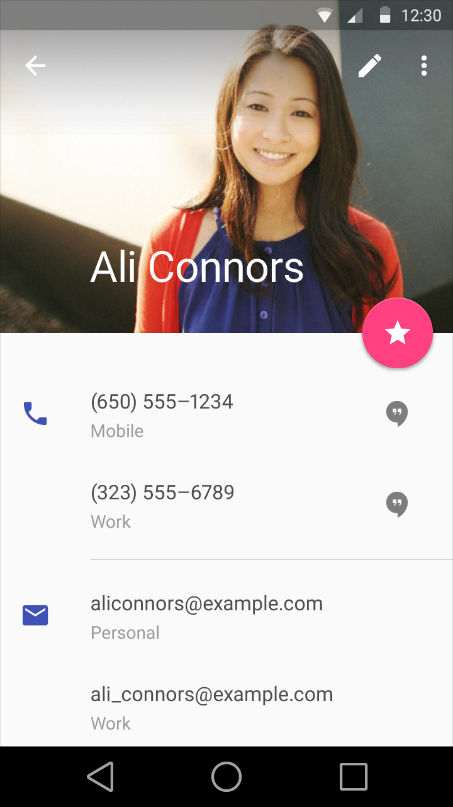

> **個人相關**
>
> 一個聰明的應用程式會有可以準確反映內文和使用者所居住的世界。

> **內含訊息**
> 傳達特定的信息，加速並促進理解。

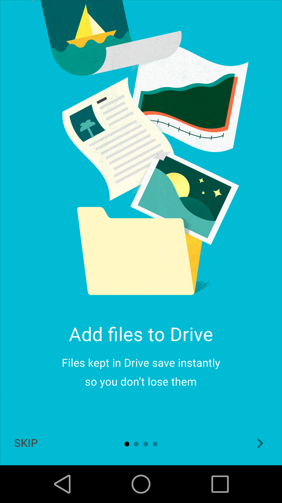

> **喜悅**
>
> 具有美感的體貼想法與合適的內文，可以讓你產品感覺是特殊的並且和你的使用者感受相關，藉此使你的使用者覺得愉快。

### 善用上下文

統合邏輯以確保圖像是動態、生動的，上下文易理解，以及上下文有相關性。能預測的視覺效果顯示了傳達的層級，大幅改善使用者體驗。

### 3D思維

別害怕以色彩和文字疊層遮掩或提示到整合的英雄圖像與小圖示。

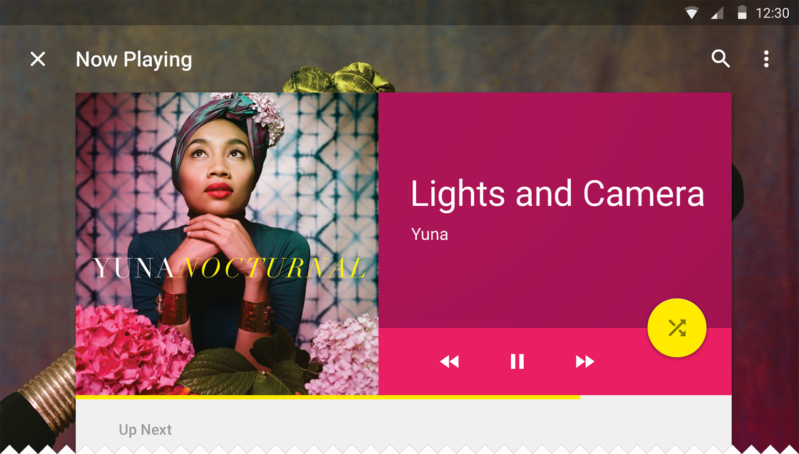

## 最佳實踐

### 使用各種不同媒介

這兩張圖和攝影可以使用在同一個產品中。攝影自動地意味著一定程度的特殊性，應該用來展示特定的對象和故事。插圖是一個在攝影可能無法有效表達意念的情形下，卻能有效地展現概念和隱喻的方式。

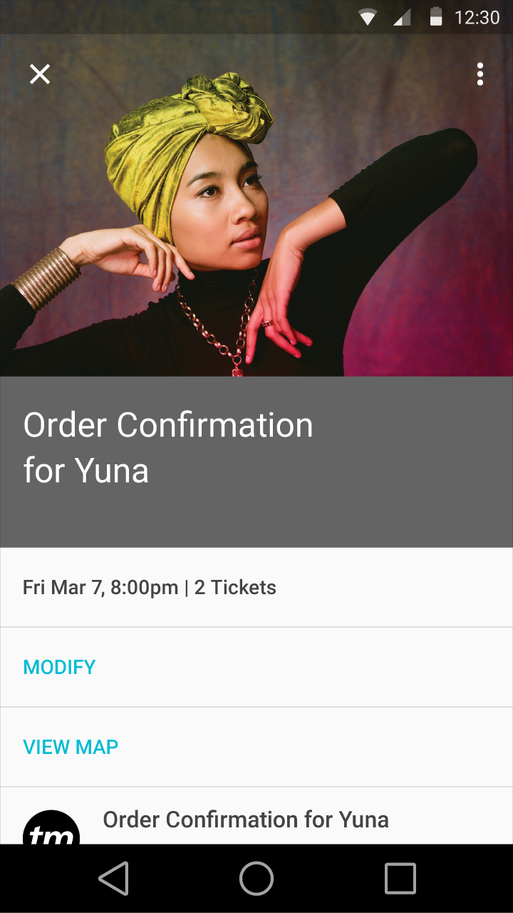

> 能這麼做
> 
> 對於明確的實體，首先使用攝影來表達。

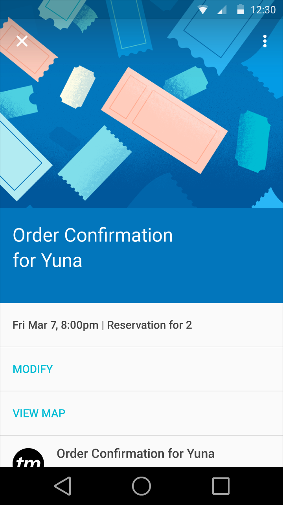

> 能這麼做
> 
> 當所有的特殊性不可用或不適用，使用插畫能清楚傳達應用程式情報，同時也提供了對於內容的立即了解。

> 能這麼做
>
> 對於特定的概念，使用特定的照片。

> 不能這麼做
>
> 不要預設當成是文字的圖片庫

### 遠離圖庫

用圖像來傳達一種獨特的聲音和體現創意的卓越。

對於特定的實體或品牌的內容，用具體的意象。
對於較抽象的內容，多一些敘述內容。
照片圖庫和拼貼畫面並不能傳達內容的額外資訊或暗示。

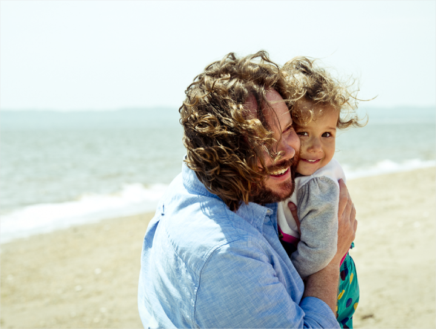

> 能這麼做

> 不能這麼做

### 聚焦一個重點

使用具有焦點、且有標誌性意義的圖像。聚焦範圍從單一實體到全體組合。確保用一個難忘的方式將清晰的概念傳達給使用者。

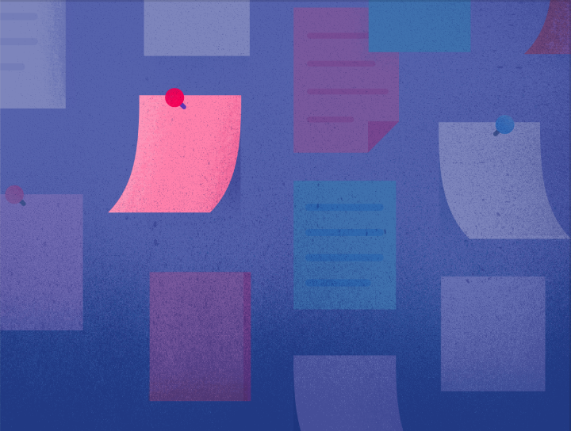

> 能這麼做
>
> 讓意思可以立刻被辨別。

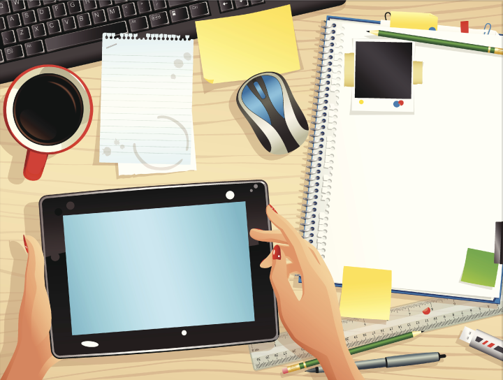

> 不能這麼做
>
> 不要讓使用者尋思圖像中要表達的意思。

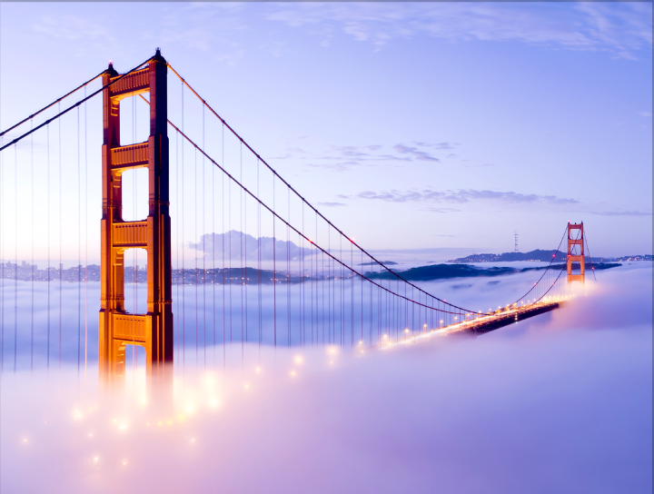

> 能這麼做
>
> 具有最強力傳達能力的圖像，包含了少量地具有意義的元素和最少的使人分心的元素。

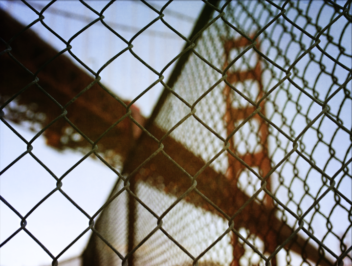

> 不能這麼做
> 
> 當重點被模糊掉了，圖像的傳達能力的特質也就消失了。

> 能這麼做
>
> 一個清晰的重點在第一眼就傳遞了整個概念。

> 不能這麼做
>
> 失去了重點讓圖像毫無意義。

### 創造一個故事

營造一個讓人身歷其境的故事和一個對內容的感覺來讓應用程式人性化。透過視覺化的故事來定義一個情緒。令人有所啟發的？陰沉的？歡樂的？

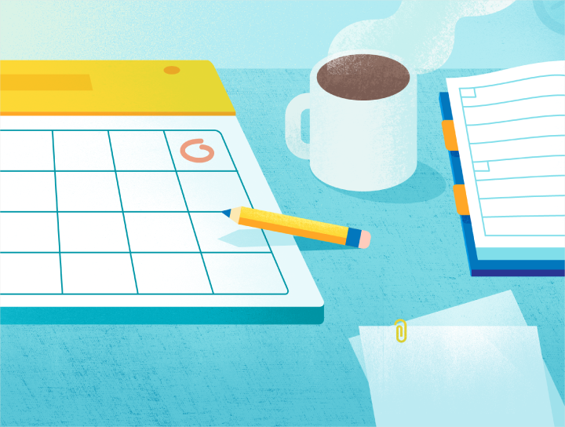

> 能這麼做
>
> 一個可以說故事的影像是非常有趣而且可以傳遞訊息的。

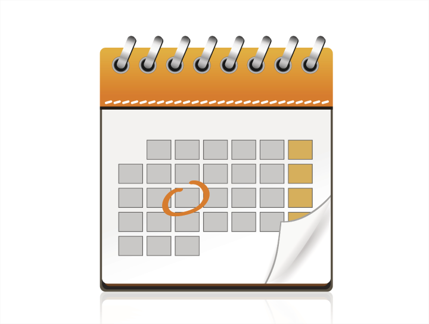

> 不能這麼做
>
> 一個沒有故事的影像喪失了可以傳遞情緒、品牌和內容的機會。

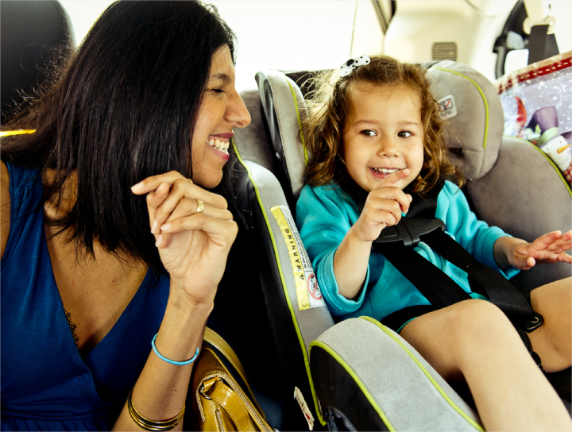

> 能這麼做
>
> 適當地與內容相連結的概念更有效地傳送你的訊息與品牌。

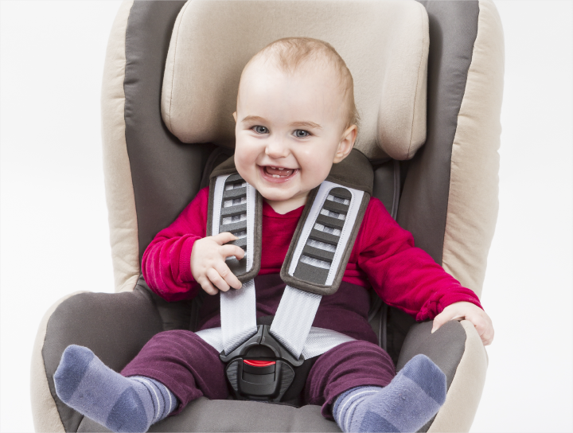

> 不能這麼做
>
> 一個與內容無關的呈現方式是無趣的。

### 不要過度加工

保留圖像的原始完整性。
不要施加沉重的濾鏡或高斯模糊效果，
尤其是為了要隱藏圖片解析度太差。

> 能這麼做

> 不能這麼做

> 能這麼做

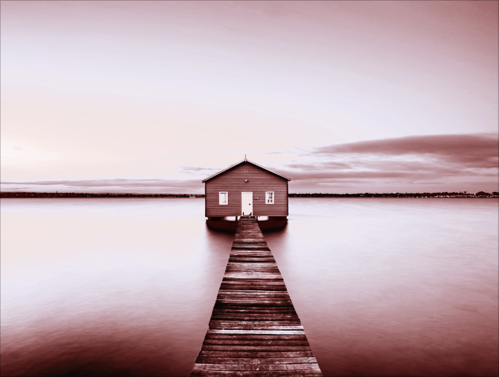

> 不能這麼做

## 使用者介面統合

### 解析度

請確保您的圖像的大小適應各種發佈此產品的平台、裝置。
使用的框架注重高畫質圖像。理想情況下，不應該會出現像素化。測試合適的大小以及比率支援各種設備。

> 能這麼做
>
> 適當大小的圖樣

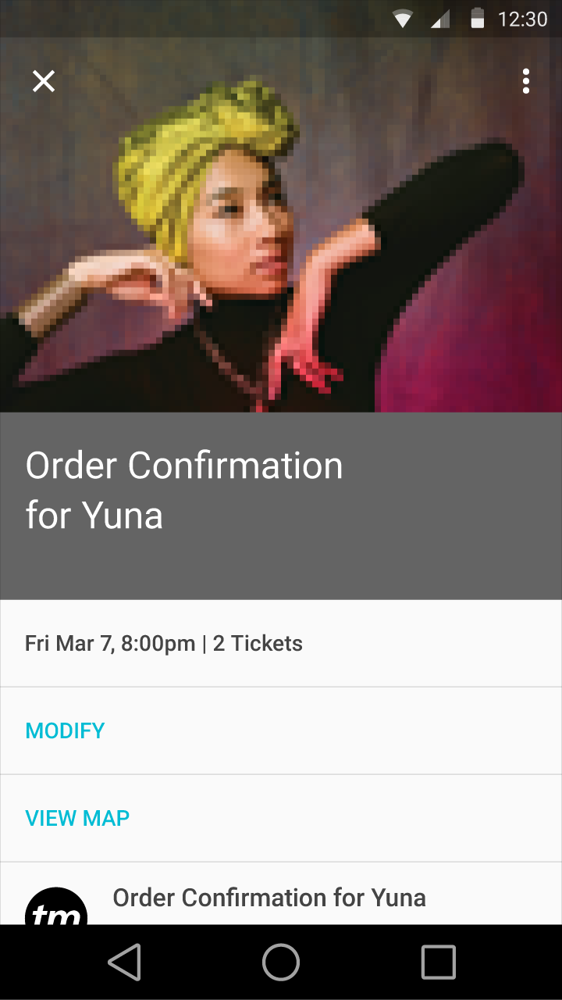

> 不能這麼做
> 
> 解析度太差的圖像

### 縮放大小

使用替換的縮放大小來創造視覺重要性的層級。

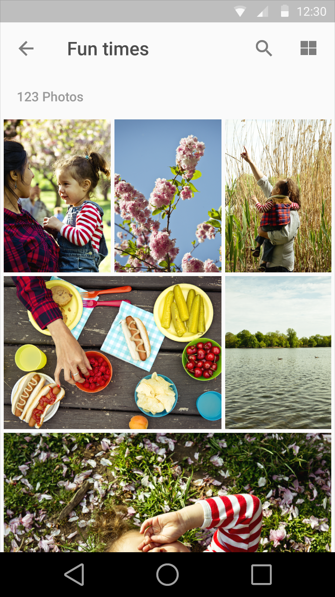

> 在一個畫廊內容中，引入各種尺寸的略縮圖來傳達內容層次結構。

> 推薦在同一個生態圈中使用各種容器。

### 凸顯文字

為了使文字清晰的顯示在圖像上方，添加文字保護的紗。

> 能這麼做
>
> 取決於不同內容，深的紗的不透明度應當在20％-40％、淺的紗應當在40％-60％最為理想。

> 不能這麼做
> 
> 不要用太厚重的陰影來保護文字，導致圖片晦暗。

> 能這麼做
>
> 對於較大的區塊，如果要凸顯文字，請保護特定區域，而不是籠罩整個圖像。

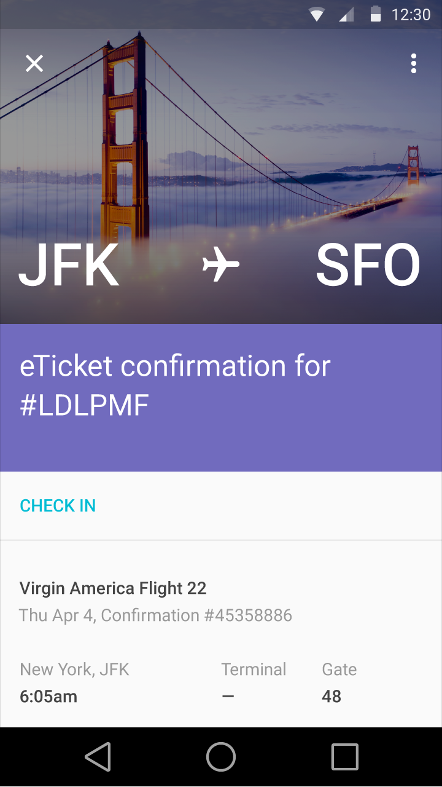

> 不能這麼做
>
> 不要將整張圖像套上一層遮罩。

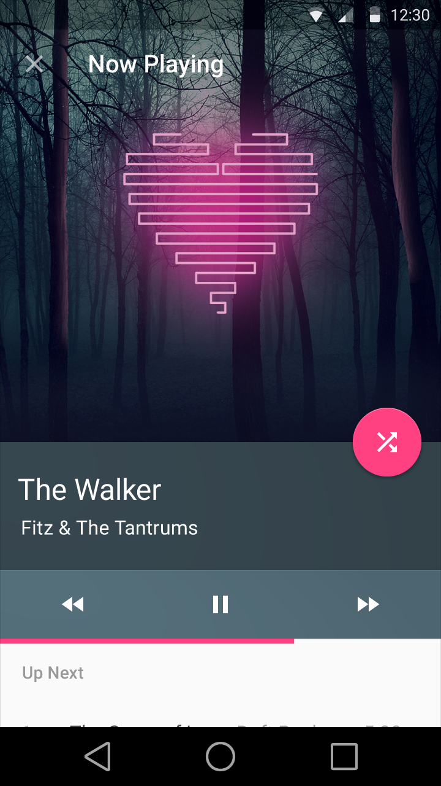

> 能這麼做
>
> 顏色疊加跟文字保護不同，可以用來作為設計元素。當創建補色疊加，從並列的顏色樣本來創建一個統一的調色板以及顯示內容的意象。

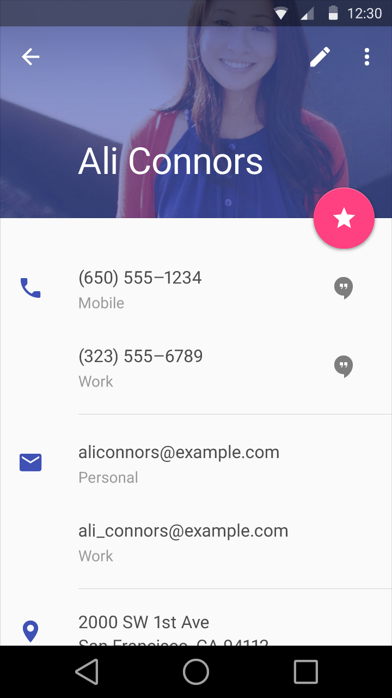

> 不能這麼做

### 頭像跟略縮圖

頭像和縮略圖代表的實體或內容，無論是從字面上通過攝影或概念。一般來說，它們是點擊進入內容主要畫面的目標。

頭像可被用於表示人。對於個人頭像，提供個性化的選擇。由於用戶可以選擇不進行個人化頭像，提供令人愉快的預設頭像。 當與一個特定的標誌使用，替身也可以用來表示品牌。

縮略圖暗示更多的信息讓用戶一窺內容，並協助導航。縮略圖讓你可以在狹小的空間置放圖片。

> 頭像使一個應用程式感覺更個人化，且佔用最小空間。

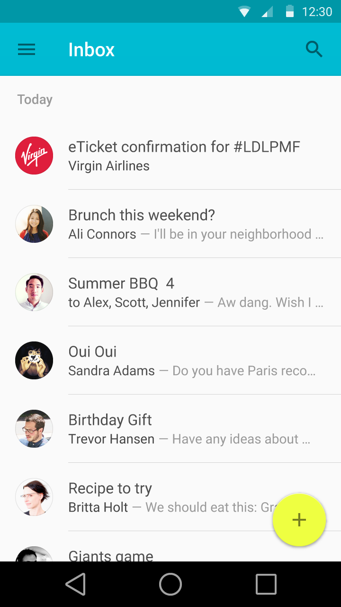

> 一個企業形象的頭像，一目了然地傳達企業形象。

### 英雄形象

英雄形象圖片，通常是擺放在突出位置，如橫幅在畫面的頂部。他們為拉攏使用者，提供了與上下文有關的內容，或加強了品牌意念。

> **特徵圖像**
>
> 特徵圖像是在異類佈局中重要而基本的焦點。

> **英雄形象集合**
>
> 整合的英雄圖像建立了一個設置在不同的版面內文片段中。他們不是主要的焦點。

### 畫廊

畫廊內的圖像是將有著類似格式的強烈視覺化英雄圖像，其放在grid中或者以單獨一張影像作顯示。

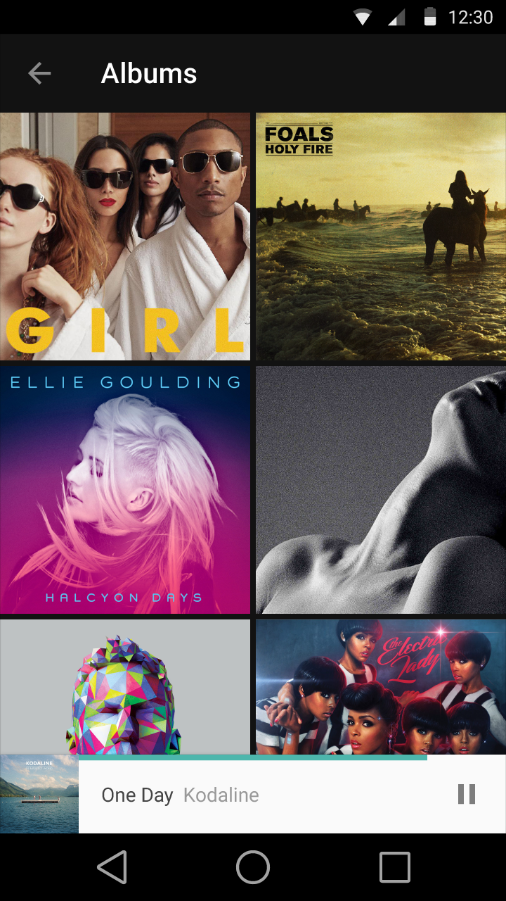

> **圖片網格**

> **畫廊圖片**

> *翻譯： Tillonter*
>
> *校稿： [陳世能](https://www.facebook.com/shihneng.chen)*
