# Imagery

在material design，影像，無論插圖或攝影的構造，都是沒有做作的、神奇的、但從來沒有產量過剩的情形。
風格是樂觀的、令人愉快和誠實的。實質性、質地、深度、意想不到的色彩運用，以及應用程式內容的強調。
圖像的原則支持目的性，有想法，以及漂亮的使用者介面。

## 原則

當使用插圖和攝影來提升用戶體驗，建議選擇表達個人相關信息和喜悅的圖像。

> **個人相關**
>
> 使用令人回味的影像，建立與應用程序的情感聯繫。

> **內含訊息**
> 傳達特定的信息讓使用者便於理解，創造一個智能的感覺經驗。

> **樂趣情境**
>
> 使用讓使用者愉悅且意想不到但訊息相關的圖像，使對方覺得不可思議、並不謀而合。

### 應用程式內容

統合邏輯以確保圖像是動態、生動的，上下文易理解，以及上下文有相關性。能預測的視覺效果顯示了傳達的層級，大幅改善使用者體驗。

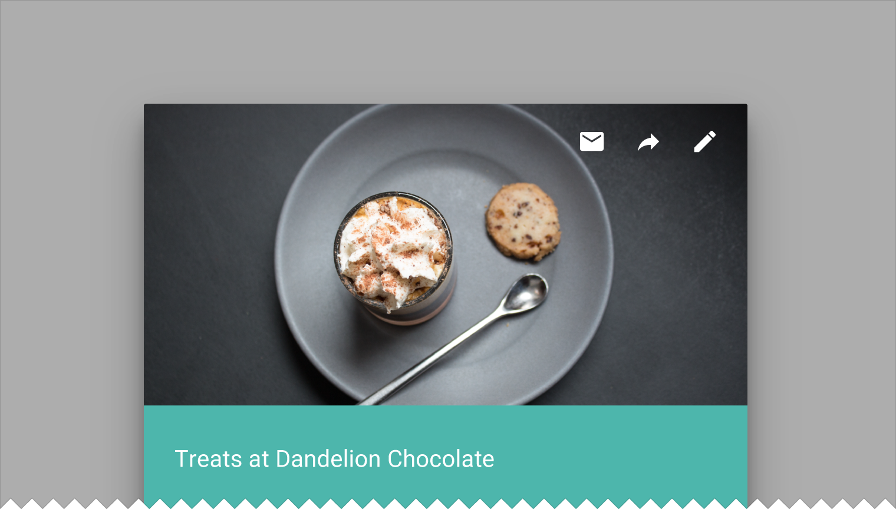

### 3D思維

別害怕以色彩和文字疊層遮掩或提示到整合的英雄圖像與小圖示。

## 最佳實踐

### 使用各種不同媒介

這兩張圖和攝影可以使用在同一個產品中。攝影直覺意味著一定程度的特殊性，應該用來展示個別、實質和故事。
插圖則是有效的代表概念，以及隱喻特殊的圖像中的距離感。

> 能這麼做
> 
> 對於明確的實體，使用第一眼能注意到的照片表示。

> 能這麼做
> 
> 當所有的特殊性不可用或不適用，使用插畫能清楚傳達應用程式的情報，在使用者一覽易理解的內容時。

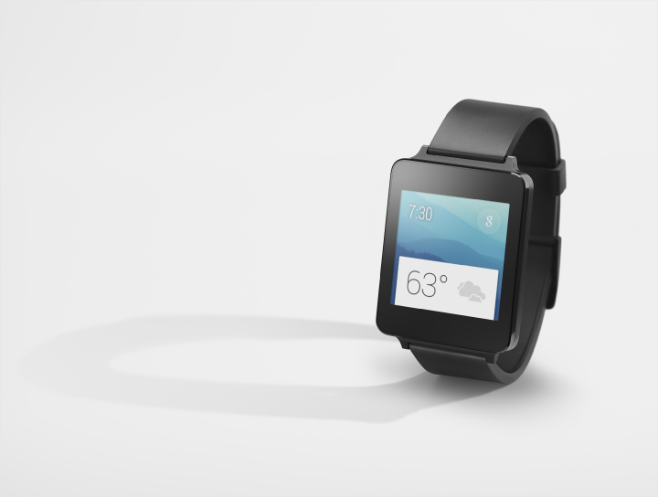

> 能這麼做
>
> 如果你用照片來傳達一個概念、發展研究，甚至是隱喻以及片段。

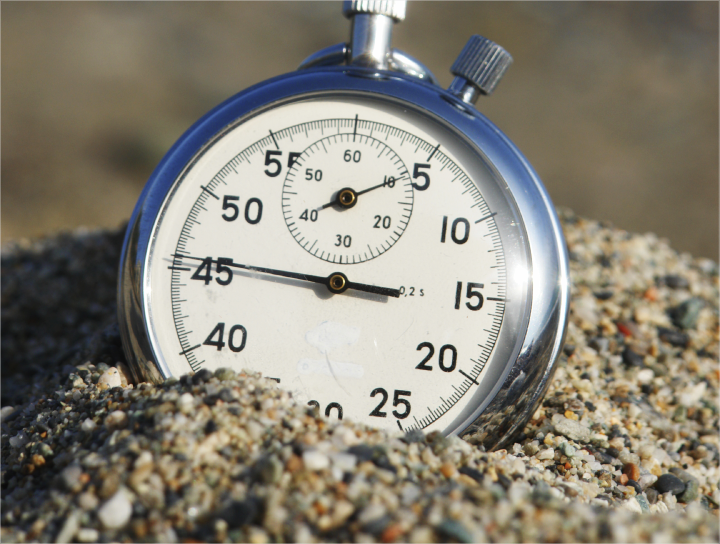

> 不能這麼做
>
> 不要預設當成是文字的圖片庫

### 遠離圖庫

用圖像來傳達一種獨特的聲音和體現創意的卓越。

對於特定的實體或品牌的內容，用具體的意象。
對於較抽象的內容，多一些敘述內容。
照片圖庫和拼貼畫面並不能傳達內容的額外資訊或暗示。

> 能這麼做

> 不能這麼做

### 聚焦一個重點

使用具有焦點、且有標誌性意義的圖像。聚焦範圍從單一實體到全體組合。確保用一個難忘的方式將清晰的概念傳達給使用者。

> 能這麼做

> 不能這麼做

> 能這麼做

> 不能這麼做

> 能這麼做

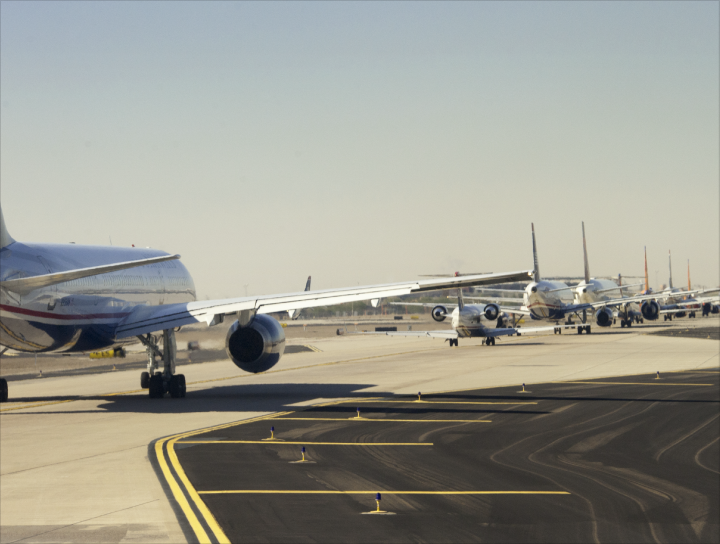

> 不能這麼做

### 創造一個故事

營造一個有故事背景以及內容的感覺。

> 能這麼做

> 不能這麼做

> 能這麼做

> 不能這麼做

### 不要過度加工

保留圖像的原始完整性。
不要施加沉重的濾鏡或高斯模糊效果，
尤其是為了要隱藏圖片解析度太差。

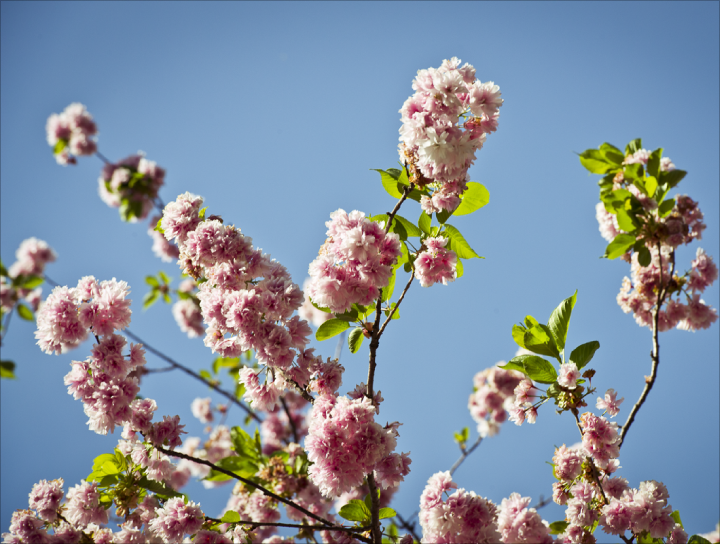

> 能這麼做

> 不能這麼做

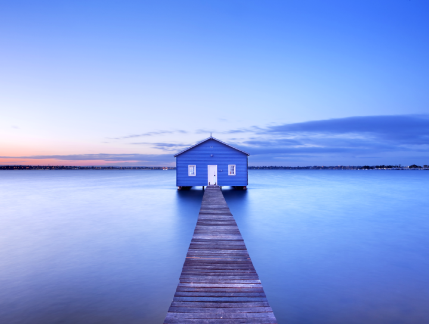

> 能這麼做

> 不能這麼做

## 使用者介面統合

### 決議

請確保您的圖像的大小適應各種發佈此產品的平台、裝置。
使用的框架注重高畫質圖像。理想情況下，不應該會出現像素化。測試合適的大小以及比率支援各種設備。

> 能這麼做
>
> 適當大小的圖樣

> 不能這麼做
> 
> 解析度太差的圖像

### 縮放大小

使用替換的縮放大小來創造視覺重要性的層級。

> 在一個畫廊內容中，引入各種尺寸的略縮圖來傳達內容層次結構。

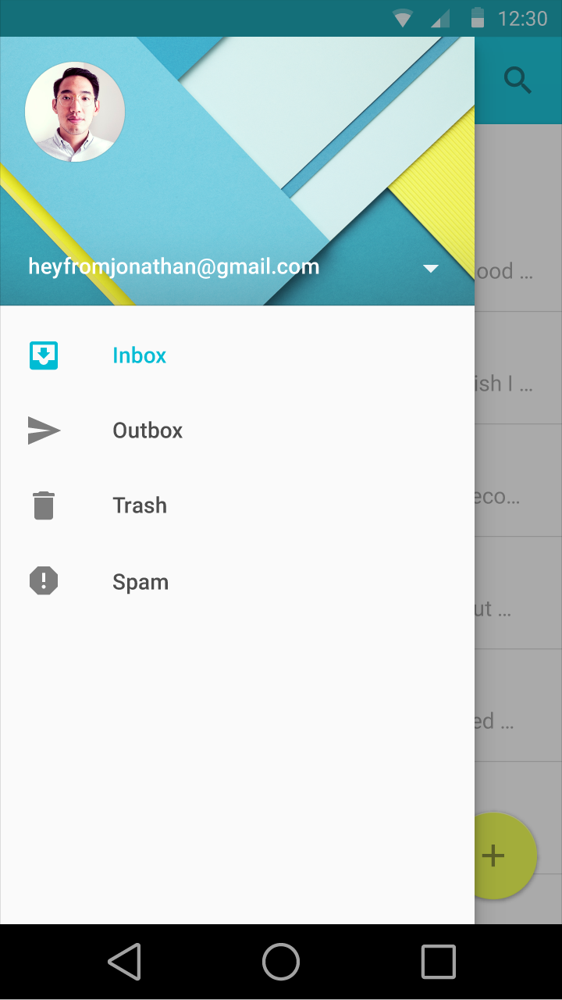

> 建議畫面有多種內容時使用同一種系統架構呈現。

### 凸顯文字

為了使文字清晰的顯示在圖像上方，添加文字保護的紗。

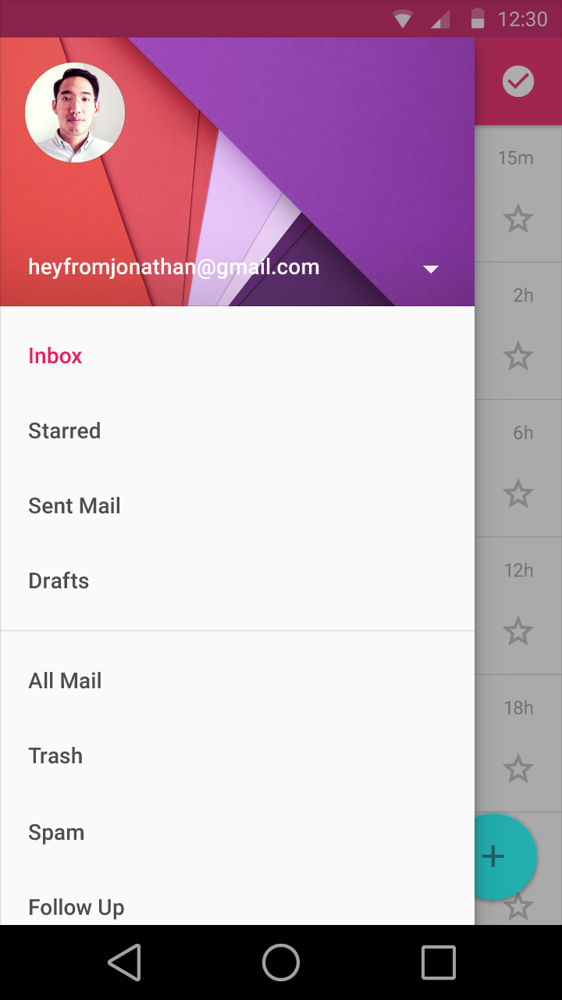

> 能這麼做
>
> 取決於不同內容，陰影的不透明度應當在20％-40％最為理想，光暈的理想範圍則在40％-60％不透明度。

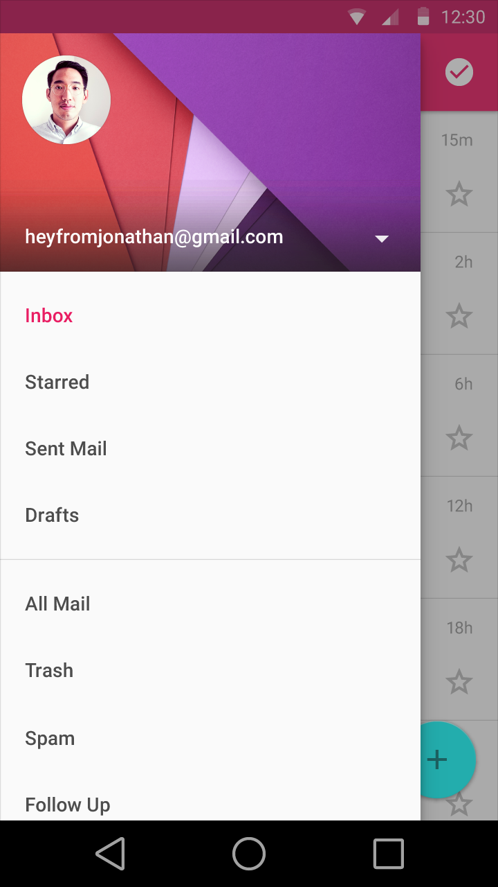

> 不能這麼做
> 
> 不要用太厚重的陰影來保護文字，導致圖片晦暗。

> 能這麼做
>
> 對於較大的區塊，如果要凸顯文字，請保護特定區域，而不是籠罩整個圖像。

> 不能這麼做
>
> 不要將整張圖像套上一層遮罩。

> 能這麼做
>
> 顏色疊加跟文字保護不同，可以用來作為設計元素。當創建補色疊加，從並列的顏色樣本來創建一個統一的調色板以及顯示內容的意象。

> 不能這麼做

### 頭像跟略縮圖

頭像和縮略圖代表的實體或內容，無論是從字面上通過攝影或概念，通過例證。一般來說，它們是影響主視圖與實體內容的目標。

化身可被用於表示人。對於個人頭像，提供個性化的選擇。由於用戶可以選擇不進行個人化頭像，提供令人愉快的默認值。
當與一個特定的標誌使用，替身也可以用來表示品牌。

縮略圖暗示更多的信息讓用戶一窺內容，並協助導航。縮略圖讓你可以在狹小的空間置放圖片。

> 化身使一個應用程式感覺更多人使用，且佔用最小空間。

> 一個企業形象的略縮圖，一目了然了傳達企業形象。

### 英雄形象

英雄形象圖片，通常是擺放在突出位置，如橫幅在畫面的頂部。他們為拉攏使用者，提供了與上下文有關的內容，或加強了品牌意念

> **特徵圖像**
>
> 特徵圖像是在異類佈局中重要而基本的焦點。

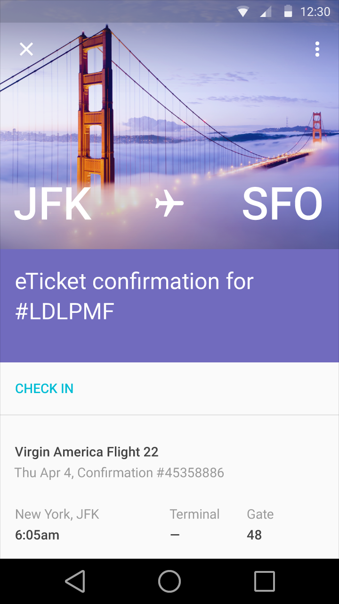

> **英雄形象集合**
>
> 整合的英雄圖像建立了一個設置在不同的版面內文片段中。他們不是主要的焦點。

### 畫廊

畫廊內的圖像是強烈的英雄形象圖片，每個圖像都使用grid系統均勻的佈置，作為一張圖的單一形象，

> **圖片網格**

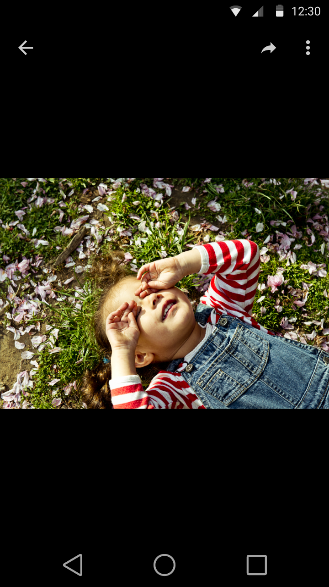

> **畫廊圖片**

> *翻譯： Tillonter*
>
> *校稿： [陳世能](https://www.facebook.com/shihneng.chen)*
