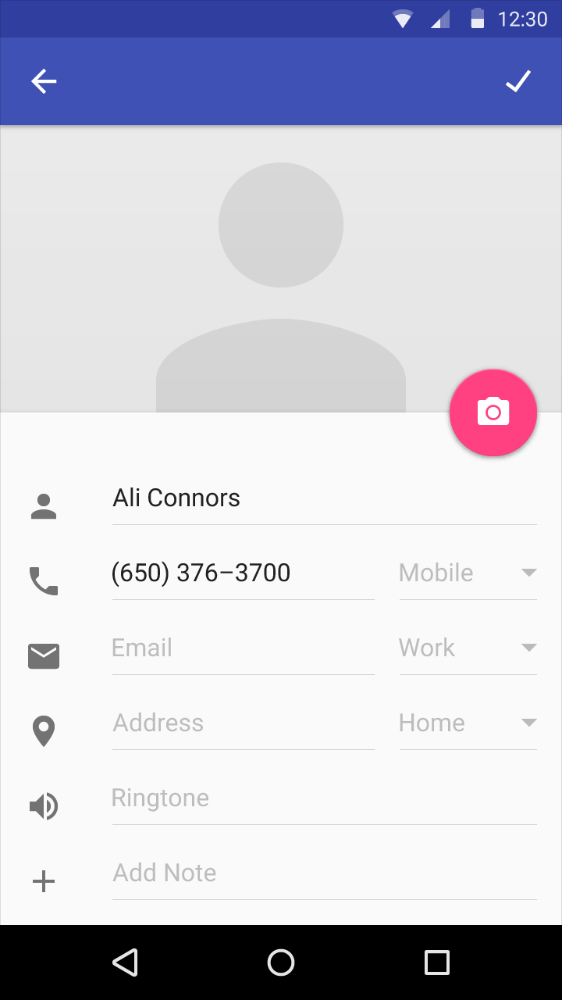
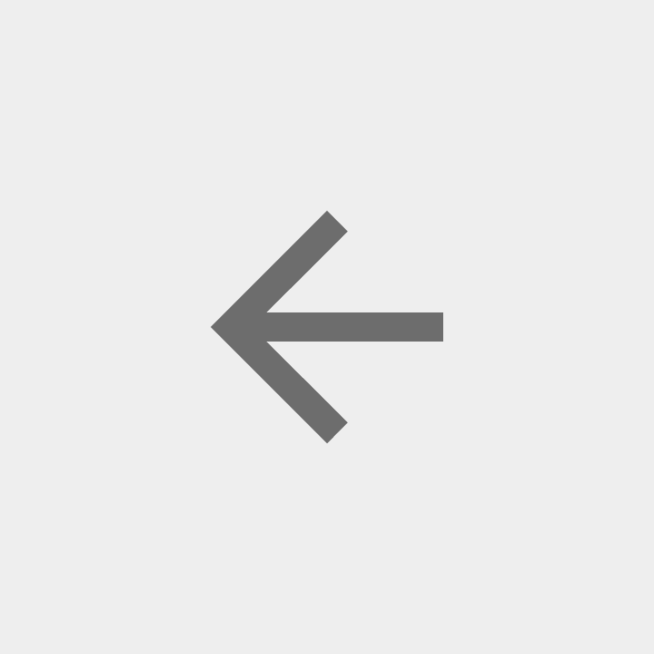
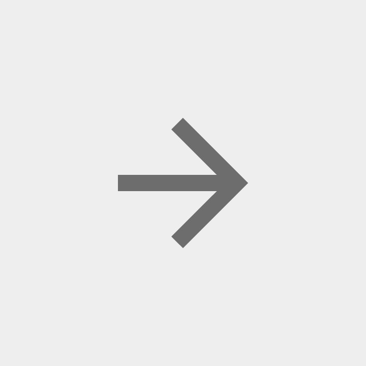
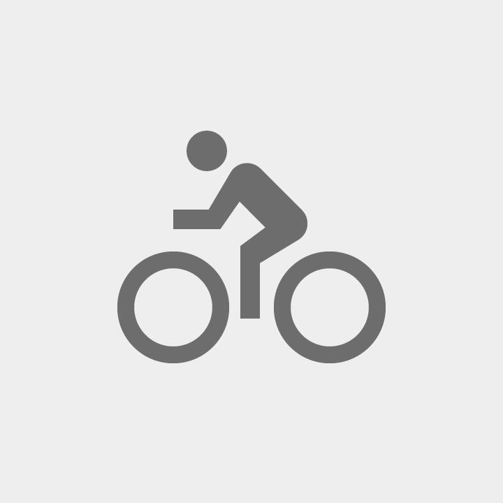
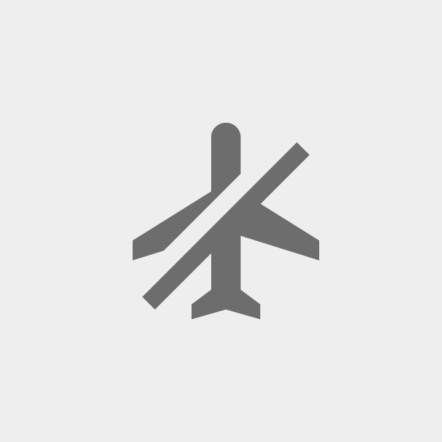
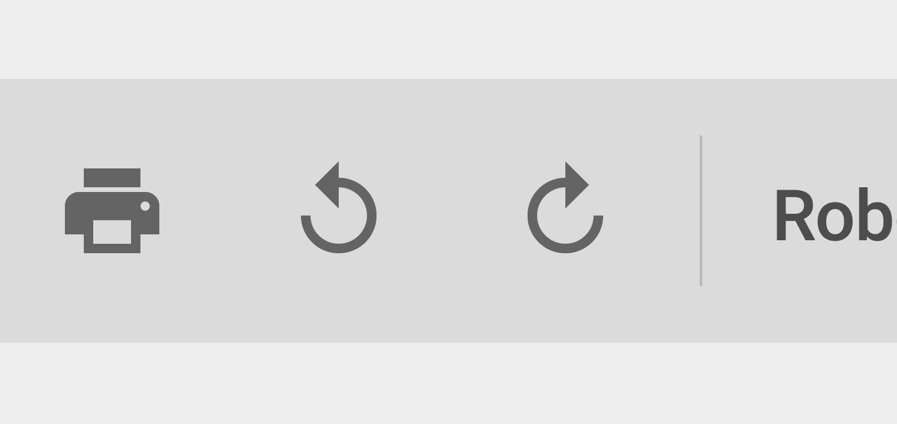

# 雙向性

一個設計良好的應用程式支援雙向性，這個意思是說它可以輕易的轉換成由右向左（RTL）、由左向右（LTR）書寫及閱讀的語言體制。由右向左的語言體制包含了阿拉伯語、希伯來語和波斯語。

雙向性影響的不止是文字，也影響了格式與圖示。

## 使用者界面鏡像概述

RTL和LTR主要的差異是時間的方向。對於使用RTL體制語言的讀者來說，時間是從右邊移動到左邊。這些用戶期待使用者界面也從右邊向左邊流動以準確的反應時間的方向。

鏡像式的變化使用者界面從LTR到RTL或是反過來從RTL到LTR，這邊指的包括應用程式的格式與圖像元素。

一個RTL的格式是LTR格式的鏡像。圖示在文字區塊的右邊。導航用按鈕排序反了過來，『前一頁』按鈕位於右邊。

提示了特定方向的圖示以鏡像方式處理，如說話者圖示。其他圖示故意不做鏡像處理，比如說相機與勾選圖示。

> 使用LTR使用者界面的範例

> 使用RTL使用者界面的範例

## RTL鏡像準則

依據這些準則來鏡像處理文字、格式與圖示來支援RTL使用者界面。

RTL使用者界面的原則就是時間是從右邊流向左邊。『向前』指向左邊、『向後』指向右邊。

需要做鏡像處理的最重要圖示是向前與向後按鈕。

### 何時做鏡像處理

作為導航的向前與向後按鈕顛倒了過來。

> LTR向後按鈕

> RTL向後按鈕

> LTR向前按鈕

> RTL向後按鈕

一個表示向前的動作的圖式應該要被鏡像處理。

> 一個LTR的自行車往前移動方向指向右方

> 一個RTL的自行車往前移動方向指向左方

其他的事項更為細微。舉例來說，一個在圖像上使用斜線來表達關閉狀態的圖示，在LTR使用者界面上，斜線是從左上到右下；在RTL使用者界面上，斜線是從右上到左下。

> LTR下的關閉飛航模式狀態

> RTL下的關閉飛航模式狀態

在這個圖片中，斜線做了鏡像處理。飛機本身指向了上方，所以不需要做特別處理。

一個右方有著滑桿的音量圖示應該要被鏡像處理。滑桿應該要從右到左，音波應該從右邊出現。

> LTR下的音量控制滑桿

> RTL下的喇叭音量圖示與滑桿做了鏡像處理

關於人們、頭像或臉孔的圖示應該被鏡像處理，尤其是當它們出現在靠近文字的地方時。人臉應該面向前方，朝向文字，而不是面向後方，避開文字。

這有時可以是非常細微的，像是一個或一組稍微轉向、偏開的臉孔。

> LTR下的群組圖示

> RTL下的群組圖示

有時候平面和環形的時間方向都以隱喻方式呈現在一個圖示中。比方說，Google Docs中重做和取消的按鈕都有著平面和環形的方向。

在LTR中，這些環形和平面的時間表達方式都指向了同一個方向，在RTL中則選擇顯示環形或者是平面方向。

> LTR下的文件內重做和取消按鈕

包含了文字顯示方式的圖示需要小心的鏡像處理。

文字在RTL中是靠右的。如果圖示中有在段落開頭有文字縮排、段落中有未完成的一行文字或者有一個不平整的右側，那它就需要被做鏡像處理。

> LTR下的聊天圖示

> RTL下的聊天圖示

### 何時不做鏡像處理

線性的時間表達在RTL中需要做鏡像處理，而**環形的**時間方向不需要。時鐘在RTL語言中依舊是瞬時中旋轉。時鐘圖示、還行的重整圖示或者順時鐘方向的進度圖示不應該做鏡像處理。

> 重整圖示

> 歷史圖示

某些表達實體物件的圖示在RTL的世界中也不是鏡像的。

舉例來說，實體的鍵盤在世界上每個地方看起來都一樣，所以它們不應該被鏡像處理。

> 鍵盤圖示

> 耳機圖示

有些圖是看起來好像是有方向性的，但是它們實際上是代表著一個人的右手拿著一個物體。

比方說，搜尋圖示一般來說它的手把位於右下方，這是因為大部份的人都是右撇子。

在RTL書寫的國家中，大部份的人也還是右撇子，所以這些圖是不應該做鏡像處理。

> 搜尋圖示

媒體回播按鈕和進度條不做鏡像處理。這些元素的LTR方向表示卡帶的方向而不是時間的方向。

## 其他本地化的考量

當考慮應用程式設計中的雙向性時，同時也要想想本地化應用程式的其他要素。

因為圖像元素中的文字也需要被本地化，所以試著已不需要文字的方式傳達概念。

數字也是文字。包含數字的圖示也需要為使用不同數字系統的語言做本地化。比如說，孟加拉語、馬拉地語和大部分的阿拉伯語系使用不同的數字形式。一個包含這些數字的圖示會需要重畫來遷就它們的形狀。

內文也很重要，甚至在LTR語系中也需要做鏡像處理。像是在Google Docs中的英文使用者界面中的英文文件編輯一段RTL段落，有編號的項目符號列表按鈕、縮排與不縮排都應該被鏡像處理來符合RTL，即使主要的使用者界面方式還是LTR。

